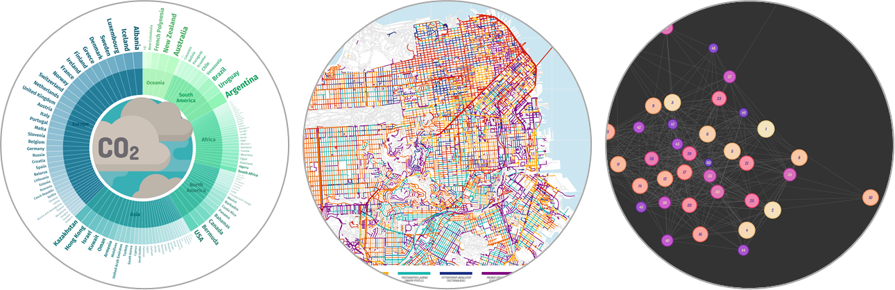

<h1 style="font-weight:normal" align="center">
  &nbsp;Hi, I'm Cédric! :wave:&nbsp;
</h1>

&nbsp;&nbsp;&nbsp;:link: [Blog][Blog]&nbsp;&nbsp;&nbsp;|&nbsp;&nbsp;&nbsp;:e-mail: [Email][Email]&nbsp;&nbsp;&nbsp;|&nbsp;&nbsp;&nbsp;:speech_balloon: [Twitter][Twitter]&nbsp;&nbsp;&nbsp;|&nbsp;&nbsp;&nbsp;:necktie: [LinkedIn][LinkedIn]

<!--
Quick Link
-->

[Twitter]:https://twitter.com/CedScherer
[LinkedIn]:https://www.linkedin.com/in/cedricpscherer/
[Email]:mailto:info@data-vizard.com
[Blog]:https://cedricscherer.netlify.com/
[Portfolio]:https://data-vizard.com/

**I am a computational ecologist by training and a data visualization designer by heart with more than 9 years of hypothesis-driven research experience and strong skills in data wrangling, statistical analysis, model development and data visualization.**

I am working as a scientifc researcher (PostDoc) in the [Department “Ecological Dynamics”](https://cedricscherer.netlify.app/top/about/) at the [Leibniz Institute for Zoo and Wildlife Research (IZW)](http://www.izw-berlin.de/welcome.html) in Berlin, Germany. Since the beginning of the year I have also been working successfully as a self-employed designer, consultant and instructor in the fields of data visualization and reproducible analysis. My favorite tool for all data-related tasks is [R](https://www.r-project.org/about.html), an open source, highly extensible language for statistical computing and graphics techniques. To visualize data I mainly utilize the package [`{ggplot2}`](https://ggplot2.tidyverse.org/) from the [`{tidyverse}` package collection](https://www.tidyverse.org/) including many more that I use on a daily basis for all kinds of data preparation and analysis.

### :paw_prints: Computational Ecology

As a computational scientist, I apply analytical and mechanistic modeling approaches to answer questions related to the movement ecology of animals and the dynamics of populations, communities and diseases in space and time. By using empirical and simulated data, I investigate how [disease dynamics are influenced by movement behavior](https://doi.org/10.1111/oik.07002), [landscape structure](https://besjournals.onlinelibrary.wiley.com/doi/full/10.1111/2041-210X.13076) and [seasonality](https://doi.org/10.1111/1365-2656.13070), how [disturbances affect stability measures of ecological communities](https://doi.org/10.1111/ele.13226) and how [birds respond to global change](https://doi.org/10.1016/j.ecolmodel.2015.07.005). In 2019, I was awarded my Ph.D. degree in Ecology (Dr. rer. nat.) at the [University of Potsdam](https://www.uni-potsdam.de/en/ibb.html) as part of the [BioMove](https://www.biomove.org/) research training group.

&nbsp;&nbsp;&nbsp;&rarr; Read my [publications](https://cedricscherer.netlify.app/top/pubs/) and more about my [projects](https://cedricscherer.netlify.app/top/projects/)

### :sparkles: Data Visualization

My passion for data, design and coding is a perfect combination not only for scientific but all types of data visualization. By contributing to challenges such as [TidyTuesday](https://github.com/Z3tt/TidyTuesday), [MakeoverMonday](https://github.com/Z3tt/MakeoverMonday), [Storytelling with Data](https://github.com/Z3tt/SWDchallenge) and the [30 Day Map Challenge](https://github.com/Z3tt/30DayMapChallenge), I am constantly strengthening my skills in design and reproducible data visualization with `{ggplot2}`. Thanks to frequent contributions as well as several personal and client projects,
my portfolio now includes visualizations for various purposes and is covering a wide range of topics and chart types.

&nbsp;&nbsp;&nbsp;&rarr; Have a look at my [dataviz portfolio](https://cedricscherer.netlify.com/top/dataviz/)
