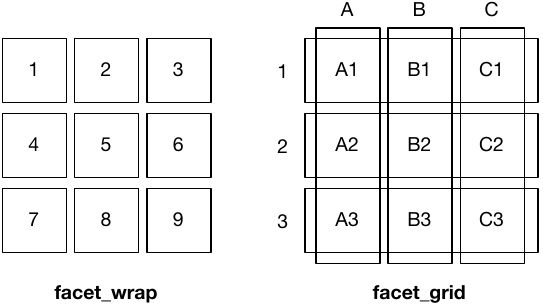

class: inverse, center
background-image: url("img/darklight_RichardStrozynski.jpg")
background-size: contain

<style>
a, a > code {
  color: #e2ac00;
  text-decoration: none;
}

.remark-slide-number {
  position: inherit;
}

.remark-slide-number .progress-bar-container {
  position: absolute;
  bottom: 0;
  height: 4px;
  display: block;
  left: 0;
  right: 0;
}

.remark-slide-number .progress-bar {
  height: 100%;
  background-color: #baa745;
}

.remark-inline-code { 
  color: #ebc500; 
}

.remark-code-line-highlighted { 
  background-color: #ffec89; 
}

.hljs-github .hljs {
  background: #ececec;
}
  
.pull-left {
  float: left;
  width: 50%;
}
.pull-right {
  float: right;
  width: 50%;
}

.corner {
  margin: 0;
  position: absolute;
  top: 65%;
  left: 80%;
  -ms-transform: translate(-40%, -40%);
  transform: translate(-40%, -40%);
}
</style>

```{r options, echo = F}
hook_source <- knitr::knit_hooks$get('source')
knitr::knit_hooks$set(source = function(x, options) {
  x <- stringr::str_replace(x, "^[[:blank:]]?([^*].+?)[[:blank:]]*#<<[[:blank:]]*$", "*\\1")
  hook_source(x, options)
})

knitr::opts_chunk$set(echo = TRUE, warning = FALSE, message = FALSE)
```

<br><br>
# **The Grammar of `{ggplot2}`**<br><font size=7 color="#a7a7a7">A graphics framework for elegant plotting in **`R`**</font>
<br><br><br><br>
### **Cédric Scherer**<br><font size=5 color="#a7a7a7">Leibniz Institute for Zoo and Wildlife Research Berlin</font><br><font size=4 color="#ccba56"><b>scherer@izw-berlin.de | cedricscherer.netlifiy.com | @CedScherer</b></font>
<br><br><br>
### <p align="right"><font size=3 color="#767676">Image by Richard Strozynski</font></p>

---
class: center, middle

<p style="text-align:center;">
<br><br>

### <font size=7>**`{ggplot2}`** is a system for declaratively creating graphics,<br>based on "The Grammar of Graphics" (Wilkinson, 2005).</font>
### <font size=6>You provide the data, tell **`{ggplot2}`** how to map variables to aesthetics,<br>what graphical primitives to use, and it takes care of the details.</font>

<font size="3" color="grey"><br><i>ggplot2 package description</i></font>

---
class: middle

# **Advantages of `{ggplot2}`**

* consistent underlying grammar of graphics (Wilkinson, 2005)  

* very flexible, layered plot specification  

* theme system for polishing plot appearance
  
* active and helpful community  
  (e.g. [community.rstudio.com](wwww.community.rstudio.com), [R4DS Learning Community](https://www.rfordatasci.com), [Twitter](https://twitter.com/search?q=%23ggplot2&src=typed_query))

---
class: inverse, center, middle

# **The `{ggplot2}` Showcase**

---
class: inverse

<p style="text-align:center;"><br><font color="lightgrey" size=3><i>Figure in Scherer et al. 2019 J. Anim. Ecol.</i></font>

---
class: inverse, center, middle

<p style="text-align:center;"><br><font color="lightgrey" size=3><i>Contribution to #MakeoverMonday</i></font>

---
class: inverse, center, middle

<p style="text-align:center;"><br>

<p style="text-align:center;"><br><font color="lightgrey" size=3><i>Contribution to #TidyTuesday</i></font>

---
class: inverse, center, middle

<p style="text-align:center;"><br>

<p style="text-align:center;"><br><font color="lightgrey" size=3><i>Contribution to #TidyTuesday</i></font>

---
class: inverse, center, middle

.pull-left[
<p style="text-align:center;"><br><font color="lightgrey" size=3><i>#TidyTuesday Contribution by Georgos Karamanis</i></font><br><font color="grey" size=2><i>(github.com/gkaramanis/tidytuesday)</i></font>
]

.pull-right[
<p style="text-align:center;"><br><font color="lightgrey" size=3><i>#TidyTuesday Contribution by Jake Kaupp</i></font><br><font color="grey" size=2><i>(github.com/jkaupp/tidytuesdays)</i></font>
]

---
class: inverse, center, middle

.pull-left[
<br><br>
<p style="text-align:center;"><br><font color="lightgrey" size=3><i>Bivariate Map by Timo Gossenbacher</i></font><br><font color="grey" size=2><i>(timogrossenbacher.ch/2019/04/bivariate-maps-with-ggplot2-and-sf)</i></font>
]

.pull-right[
<p style="text-align:center;"><br><font color="lightgrey" size=3><i>European Elections by Torsten Sprenger</i></font><br><font color="grey" size=2><i>(twitter.com/spren9er/status/1138000009306234880)</i></font>
]

---
class: inverse, center, middle

<p style="text-align:center;"><br><font color="lightgrey" size=3><i>Collection of BBC Graphics</i></font><br><font color="grey" size=2><i>(adapted from bbc.github.io/rcookbook)</i></font>


---
class: inverse, center, middle

.pull-left[
<p style="text-align:center;">
]

.pull-right[
<p style="text-align:center;">
]

<font color="lightgrey" size=3><i>Examples of the {gganimate} Package</i></font><br><font color="grey" size=2><i>(github.com/thomasp85/gganimate/wiki)</i></font>

---
class: inverse, center, middle

<p style="text-align:center;"><br><font color="lightgrey" size=3><i>Demonstration of the {rayshader} Package</i></font><br><font color="grey" size=2><i>(tylermw.com/3d-maps-with-rayshader)</i></font>

---
class: inverse, center, middle

# **The Setup**

---
## **The package**

<font size=5>**`{ggplot2}`** is a **data visualization package** for the statistical programming language **`R`**<br>
created by Hadley Wickham in 2005.

```{r, eval = F}
install.packages("ggplot2")
library(ggplot2)
```

--
<br><font size=4>**`{ggplot2}`** is part of the [**`{tidyverse}`**](https://blog.rstudio.org/2016/09/15/tidyverse-1-0-0/), a set of packages that work in harmony to manipulate and explore data.

```{r, eval = F}
install.packages("tidyverse")
library(tidyverse)
```

<font size=4>**`{tidyverse}`** contains **`{ggplot2}`**, **`{dplyr}`**, **`{tidyr}`**, **`{readr}`**, **`{purrr}`**, **`{tibble}`** and some more packages.

---
## **The data**

We use data from the *National Morbidity and Mortality Air Pollution Study* (NMMAPS),<br>filtered for the city of Chicago and the timespan January 1997 to December 2000.

```{r data, echo = -2}
chic <- readr::read_csv("https://raw.githubusercontent.com/Z3tt/ggplot-courses/master/data/chicago-nmmaps.csv")
chic$season <- factor(chic$season, levels = c("Spring", "Summer", "Autumn", "Winter"))
chic$year <- factor(chic$year, levels = as.character(1997:2000))
tibble::glimpse(chic)
```

<font size="4" color="grey">For more details about the data set check Roger Peng's book [Statistical Methods in Environmental Epidemiology with R](http://www.springer.com/de/book/9780387781662). 

---
class: inverse, center, middle

# **The Structure of `{ggplot2}`**<br><font size=6 color="#a7a7a7">"The Grammar of Graphics"</font>

---
## **The Structure of `{ggplot2}`**

<br>

1. **Data** <font color="grey"> →  The raw data that you want to visualise</font>

2. **Layers: `geom_` and `stat_`** <font color="grey"> →  The geometric shapes and statistical summaries representing the data</font> 

3. **Aesthetics `aes()`** <font color="grey"> →  Aesthetic mappings of the geometric and statistical objects</font>  

4. **Scales `scale_`** <font color="grey"> →  Maps between the data and the aesthetic dimensions</font>

5. **Coordinate system `coord_`** <font color="grey"> →  Maps data into the plane of the data rectangle</font>
  
6. **Facets `facet_`** <font color="grey"> →  The arrangement of the data into a grid of plots</font>
  
7. **Visual themes `theme() and theme_`** <font color="grey"> →  The overall visual defaults of a plot</font>

---
class: inverse, center, middle

# **1. Data<br><font size=6>`ggplot()`</font>**

---

```{r libraries, echo = F}
library(tidyverse)
extrafont::loadfonts(device = "win", quiet = T)
theme_set(theme_bw(base_size = 18, base_family = "Roboto"))
```

### **1. Data: `ggplot()`**

We need to specify data and the two variables we want to plot as **`aes`**tethics of the **`ggplot()`** call:

.pull-left[
```{r structure-data-vars, eval = F}
ggplot(data = chic, #<<
       mapping = #<<
         aes( #<<
          x = date, #<<
          y = temp #<<
        ) #<<
      ) #<<
```
There is only an empty panel because<br>**`{ggplot2}` doesn't know *how* it should plot the data**.
]

.pull-right[
```{r plot-structure-data-vars, ref.label="structure-data-vars", echo = F}
```
]

---
### **1. Data: `ggplot()`**

We need to specify data and the two variables we want to plot as **`aes`**tethics of the **`ggplot()`** call:

.pull-left[
Since almost every **`ggplot()`** takes the same arguments (**`data, mapping = aes(x, y)`**),<br>we can also write:

```{r structure-data-vars2, eval = F}
ggplot(chic, aes(date, temp)) #<<
```
]

.pull-right[
```{r plot-structure-data-vars2, ref.label="structure-data-vars2", echo = F}
```
]

---

### **1. Data: `ggplot()`**

We need to specify data and the two variables we want to plot as **`aes`**tethics of the **`ggplot()`** call:

.pull-left[
Since almost every **`ggplot()`** takes the same arguments (**`data, mapping = aes(x, y)`**),<br>we can also write:

```{r structure-data-vars3, eval = F}
ggplot(chic, aes(date, temp))
```

... or add the **`aes`**thetics outside the **`ggplot`** function:

```{r structure-data-vars4, eval = F}
ggplot(chic) +
  aes(date, temp) #<<
```
]

.pull-right[
```{r plot-structure-data-vars4, ref.label="structure-data-vars4", echo = F}
```
]

---
class: inverse, center, middle

# **2. Layers<br><font size=6 color = "grey">`geom_*()` and `stat_*()`</font>**

---
### **2. Layers: `geom_*()` and `stat_*()`**

<font size=4>By adding one or multiple layers we can tell **`{ggplot2}`** *how* to represent the data.<br>
There are lots of build-in geometrics elements (**`geoms`**) and statistical transformations (**`stats`**):

<p style="text-align:center;"><font color="grey" size=2><i>Adapted from ggplot2.tidyverse.org/reference/</i></font></p>

<font size=2>... and several more in extension packages, e.g. **`{ggforce}`**, **`{ggalt}`**, **`{ggridges}`**, **`{ggrepel}`**, **`{ggcorrplot}`**, **`{ggraph}`**, **`{ggdendro}`** & **`{ggalluvial}`**.

---
### **2. Layers — Geometries: `geom_point()`**

We can tell **`{ggplot2}`** to represent the data for example as a **scatterplot**:

.pull-left[
```{r structure-geom-point, eval = F}
ggplot(chic, aes(date, temp)) +
  geom_point() #<<
```
]

.pull-right[
```{r plot-structure-geom-point, ref.label="structure-geom-point", echo = F}
```
]

---
### **2. Layers — Geometries: `geom_line()`**

... or a **line plot**:

.pull-left[
```{r structure-geom-line, eval = F}
ggplot(chic, aes(date, temp)) +
  geom_line() #<<
```
]

.pull-right[
```{r plot-structure-geom-line, ref.label="structure-geom-line", echo = F}
```
]

---
### **2. Layers — Geometries: `geom_area()`**

... or an **area plot**:

.pull-left[
```{r structure-geom-area, eval = F}
ggplot(chic, aes(date, temp)) +
  geom_area() #<<
```
]

.pull-right[
```{r plot-structure-geom-area, ref.label="structure-geom-area", echo = F}
```
]

---
### **2. Layers — Geometries: `geom_boxplot()`**

... or a **box and whiskers plot**:

.pull-left[
```{r structure-geom-box, eval = F}
ggplot(chic, aes(date, temp)) +
  geom_boxplot() #<<
```
]

.pull-right[
```{r plot-structure-geom-box, ref.label="structure-geom-box", echo = F}
```
]

---
### **2. Layers — Geometries: `geom_boxplot()`**

... or a **box and whiskers plot**:

.pull-left[
```{r structure-geom-box2, eval = F}
ggplot(chic, aes(date, temp)) +
  geom_boxplot() #<<
```

<br><font size=6><b>What's going on here?!</b></font>
]

.pull-right[
```{r plot-structure-geom-box2, ref.label="structure-geom-box2", echo = F}
```
]

---
### **2. Layers — Geometries: `geom_boxplot()`**

We need to specify the  variable as **categorial** (**`year`**), not as **continuous** (**`date`**):

.pull-left[
```{r structure-geom-box-fct, eval = F}
ggplot(chic, aes(year, temp)) + #<<
    geom_boxplot() 
```
]

.pull-right[
```{r plot-structure-geom-box-fct, ref.label="structure-geom-box-fct", echo = F}
```
]

---
### **2. Layers — Geometries: Using Multiple `geom_*()`**

Other layers can be added to an existing plot - a line and a rug representation for example:

.pull-left[
```{r structure-geom-rug, eval = F}
ggplot(chic, aes(date, temp)) +
  geom_point() +
  geom_line() + #<<
  geom_rug(sides = "r") #<<
```
]

.pull-right[
```{r plot-structure-geom-rug, ref.label="structure-geom-rug", echo = F}
```
]

---
### **2. Layers — Statistical transformations: `stat_summary()`**

A handful of layers with attention to the statistical transformation rather than the visual appearance:

.pull-left[
```{r structure-scale-stats-sum, eval = F}
ggplot(chic, aes(year, temp)) +
  geom_boxplot() +
  stat_summary( #<< 
    fun.y = mean, #<< 
    geom = "point" #<<
   ) #<< 
```
]

.pull-right[
```{r plot-structure-scale-stats-sum, ref.label="structure-scale-stats-sum", echo = F}
```
]

---
### **2. Layers — Statistical transformations: `stat_function()`**

**`stat_function()`** makes it easy to add a function to a plot, either continuous or discrete:

.pull-left[
```{r structure-stats-function, eval = F}
ggplot(tibble(x = c(-8, 8)), aes(x)) +
  stat_function(fun = dnorm) + #<<
  stat_function( #<<
    fun = dcauchy, #<<
    geom = "point", #<<
    n = 75 #<<
  ) #<<
```
]

.pull-right[
```{r plot-structure-stats-function, ref.label="structure-stats-function", echo = F}
```
]

---
### **2. Layers — Statistical transformations: `stat_ecdf()`**

You can also easily plot the empirical cumulative distribution function (ECDF) of a variable:

.pull-left[
```{r structure-stats-ecdf, eval = F}
ggplot(chic, aes(temp)) +
  stat_ecdf(geom = "step") #<< 
```
]

.pull-right[
```{r plot-structure-stats-ecdf, ref.label="structure-stats-ecdf", echo = F}
```
]

---
### **2. Layers — Statistical transformations: `stat_summary_hex()`**

With **`stat_summary_hex()`** data is divided into bins defined by **`x`** and **`y`** and then filled with values of **`z`**:

.pull-left[
```{r structure-stats-hex, eval = F}
ggplot(chic, aes(date, temp, z = o3)) +
  stat_summary_hex() #<< 
```
]

.pull-right[
```{r plot-structure-stats-hex, ref.label="structure-stats-hex", echo = F}
```
]

---
### **2. Layers — Statistical transformations: `stat_smooth()`**

You can directly add smoothed conditional means:

.pull-left[
```{r structure-stats-smooth, eval = F}
ggplot(chic, aes(date, temp)) +
  geom_point() +
  stat_smooth() #<< 
```
]

.pull-right[
```{r plot-structure-stats-smooth, ref.label="structure-stats-smooth", echo = F}
```
]

---
### **2. Layers — Statistical transformations: `stat_smooth()`**

You can directly add smoothed conditional means:

.pull-left[
```{r structure-stats-smooth2, eval = F}
ggplot(chic, aes(date, temp)) +
  geom_point() +
  stat_smooth() #<< 
```

By default this adds a **LOESS** (locally weighted scatterplot smoothing, **`method = "loess"`**) or a <br>**GAM** (generalized additive model, **`method = "gam"`**) depending on the number of data points<br>(GAM in case of ≥ 1000 observations).
]

.pull-right[
```{r plot-structure-stats-smooth2, ref.label="structure-stats-smooth2", echo = F}
```
]

---
### **2. Layers — Statistical transformations: `stat_smooth()`**

You can specify the fitting method and the formula:

.pull-left[
```{r structure-stats-smooth-gam, eval = F}
ggplot(chic, aes(date, temp)) +
  geom_point() +
  stat_smooth( #<<
    method = "gam", #<<
    formula = y ~ s(x, k = 100), #<<
    se = F #<<
  ) #<<
```

Other methods such as **`method = "lm"`** for linear regressions and **`method = "glm"`** for generalized linear models are available as well.
]

.pull-right[
```{r plot-structure-stats-smooth-gam, ref.label="structure-stats-smooth-gam", echo = F}
```
]

---
### **2. Layers — Statistical transformations: `stat_smooth()`**

You can specify the fitting method and the formula:

.pull-left[
```{r structure-stats-smooth-lm, eval = F}
ggplot(chic, aes(date, temp)) +
    geom_point() +
    stat_smooth(
        method = "lm", #<<
        formula = y ~ poly(x, 10), #<<
        se = F
    )
```
]

.pull-right[
```{r plot-structure-stats-smooth-lm, ref.label="structure-stats-smooth-lm", echo = F}
```
]

---
class: inverse, center, middle

# **3. Aesthetics<br><font size=6>`aes()`</font>**

---
### **3. Aesthetics: `aes()`**

Aesthetics of the geometric and statistical objects, such as 

* **position** via **`x`**, **`y`**, **`xmin`**, **`xmax`**, **`ymin`**, **`ymax`**, ...

--

* **colors** via **`color`** and **`fill`**

* **transparency** via **`alpha`**

--

* **sizes** via **`size`** and **`width`**

* **shapes** via **`shape`**  and **`linetype`**

--

<br> In general, everything which maps to the data needs to be wrapped in **`aes()`**<br>while static arguments are placed outside the **`aes()`**.

--

e.g.<br>
**`geom_point(aes(color = season))`** to color points based on the variable **`season`**<br>
**`geom_point(color = "grey")`** to color all points in the same color

---
### **3. Aesthetics: `aes(color/fill/alpha/size/shape)`**

This way, we can  enlarge all points and add some transparency:

.pull-left[
```{r structure-aes-size-alpha, eval = F}
ggplot(chic, aes(date, temp)) +
  geom_point(
    size = 4, #<<
    alpha = 0.2 #<<
  )
```
]

.pull-right[
```{r plot-structure-aes-size-alpha, ref.label="structure-aes-size-alpha", echo = F}
```
]

---
### **3. Aesthetics: `aes(color/fill/alpha/size/shape)`**

... and change the color and the shape based on **`season`** and **`year`**:

.pull-left[
```{r structure-aes-col-shape, eval = F}
ggplot(chic, aes(date, temp)) +
  geom_point(
    aes( #<<
      color = season, #<<
      shape = year #<<
    ), #<<
    size = 4,
    alpha = 0.2
  )
```
]

.pull-right[
```{r plot-structure-aes-col-shape, ref.label="structure-aes-col-shape", echo = F}
```
]

---
### **3. Aesthetics: `aes(color/fill/alpha/size/shape)`**

Alternatively, all **`aes`**thetics can be grouped together (and are then applied to all **`geoms`** and **`stats`**):

.pull-left[
```{r structure-aes-col-shape2, eval = F}
ggplot(
  chic, 
  aes(date, 
      temp,
      color = season, #<<
      shape = year) #<<
  ) +
  geom_point(
    size = 4,
    alpha = 0.2
  )
```
]

.pull-right[
```{r plot-structure-aes-col-shape2, ref.label="structure-aes-col-shape2", echo = F}
```
]

---
### **3. Aesthetics: `aes(group)`**

You can create subsets of the data by specifying a grouping variable via **`group`**:

.pull-left[
```{r structure-aes-group, eval = F}
ggplot(chic, aes(temp)) +
  stat_ecdf(
    aes(group = year), #<< 
    geom = "step"
  )
```

<br>However, for most applications you can simply specify the grouping using visual aesthetics<br>(**`color`**, **`fill`**, **`alpha`**, **`shape`**, **`linetype`**).
]

.pull-right[
```{r plot-structure-aes-group, ref.label="structure-aes-group", echo = F}
```
]

---
### **3. Aesthetics: `aes(group)`**

You can create subsets of the data by specifying a grouping variable via **`group`**:

.pull-left[
```{r structure-aes-group-col, eval = F}
ggplot(chic, aes(temp)) +
  stat_ecdf(
    aes(color = year), #<< 
    geom = "step"
  )
```

<br>However, for most applications you can simply specify the grouping using visual aesthetics<br>(**`color`**, **`fill`**, **`alpha`**, **`shape`**, **`linetype`**).
]

.pull-right[
```{r plot-structure-aes-group-col, ref.label="structure-aes-group-col", echo = F}
```
]

---
class: inverse, center, middle

# **4. Scales<br><font size=6>`scale_*()`</font>**

---
### **4. Scales: `scale_`**

One can use **`scale_*()`** to change properties of all the **aesthetic dimensions mapped to the data**.

--

<br>Consequently, there are **`scale_*()`** functions for all aesthetics such as:

* **position** via **`scale_x_*()`** and **`scale_y_*()`**

* **colors** via **`scale_color_*()`** and **`scale_fill_*()`**

* **transparency** via **`scale_alpha_*()`**

* **sizes** via **`scale_size_*()`**

* **shapes** via **`scale_shape_*()`**  and **`scale_linetype_*()`**

--

... with extensions (**`*`**) such as
* **`continuous()`**, **`discrete()`**, **`reverse()`**, **`log10()`**, **`squrt()`**, **`date()`**, **`time()`** for axes
* **`continuous()`**, **`discrete()`**, **`manual()`**, **`gradient()`**, **`hue()`**, **`brewer()`** for colors and fills
* **`continuous()`**, **`discrete()`**, **`manual()`**, **`ordinal()`**, **`identity()`**, **`date()`** for transparencies
* **`continuous()`**, **`discrete()`**, **`manual()`**, **`ordinal()`**, **`identity()`**, **`area()`**, **`date()`** for sizes
* **`continuous()`**, **`discrete()`**, **`manual()`**, **`ordinal()`**, **`identity()`** for shapes and linetypes

---
### **4. Scales: `scale_x_*()` and `scale_y_*()`**

For example, to change the titles of the axes...

.pull-left[
```{r structure-scale-axis, eval = F}
ggplot(chic, aes(date, temp)) +
  geom_point(aes(color = season)) +
  scale_x_date( #<<
    name = NULL #<<
  ) + #<<
  scale_y_continuous( #<<
    name = "Temperature (°F)" #<<
  ) #<<
```
]

.pull-right[
```{r plot-structure-scale-axis, ref.label="structure-scale-axis", echo = F}
```
]

---
### **4. Scales: `scale_x_*()` and `scale_y_*()`**

... and their properties such as the range, scaling, labels, and axis breaks:

.pull-left[
```{r structure-scale-axis2, eval = F}
ggplot(chic, aes(date, temp)) +
  geom_point(aes(color = season)) +
  scale_x_date(
    name = NULL, 
    limits = c(#<<
      as.Date("1997-01-01"), #<<
      as.Date("1999-12-31") #<<
    ) #<<
  ) + 
  scale_y_log10( #<<
    name = "Temperature (°F)",
    breaks = c(1, 10, 100), #<<
    labels = scales::scientific #<<
  )
```
]

.pull-right[
```{r plot-structure-scale-axis2, ref.label="structure-scale-axis2", echo = F}
```
]

---
### **4. Scales: `scale_x_*()` and `scale_y_*()`**

With **`breaks`** and **`labels`** it's also possible to alter the labels without changing the data:

.pull-left[
```{r structure-scale-labels, eval = F}
ggplot(chic, aes(date, temp)) +
  geom_point(aes(color = season)) +
  scale_x_date(
    name = NULL, 
    limits = c(
      as.Date("1997-01-01"),
      as.Date("1999-12-31")
    )
  ) + 
  scale_y_continuous(
    name = "How I feel...", #<<
    breaks = c(0, 30, 60, 90), #<<
    labels = c( #<<
      '"Brrr, too cold!"', #<<
      '"Still freezing."', #<<
      '"Okay."', #<<
      '"Uff, too hot!"' #<<
    ) #<<
  )
```
]

.pull-right[
```{r plot-structure-scale-labels, ref.label="structure-scale-labels", echo = F}
```
]

---
### **4. Scales: `scale_x_*()` and `scale_y_*()`**

Some people are annoyed by the extra spacing around the data but we can remove that:

.pull-left[
```{r structure-scale-axis-expand, eval = F}
ggplot(chic, aes(date, temp)) +
  geom_point(aes(color = season)) +
  scale_x_date(
    name = NULL,
    expand = c(0, 0) #<<
  ) + 
  scale_y_continuous(
    name = "Temperature (°F)",
    expand = c(0, 0) #<<
  )
```
]

.pull-right[
```{r plot-structure-scale-axis-expand, ref.label="structure-scale-axis-expand", echo = F}
```
]

---
### **4. Scales: `scale_color_*()` and `scale_fill_*()`**

Similarly, we can change properties of the other aesthetics. for example get rid of the default colors:

.pull-left[
```{r structure-scale-color, eval = F}
ggplot(chic, aes(date, temp)) +
  geom_point(aes(color = season)) +
  scale_color_manual( #<<
    values = c( #<<
      "firebrick", #<<
      "dodgerblue", #<<
      "darkorchid", #<<
      "goldenrod" #<<
    ) #<<
  ) #<<
```
]

.pull-right[
```{r plot-structure-scale-color, ref.label="structure-scale-color", echo = F}
```
]

---
### **4. Scales: `scale_color_*()` and `scale_fill_*()`**

... and change the title of the legend:

.pull-left[
```{r structure-scale-color-legend, eval = F}
ggplot(chic, aes(date, temp)) +
  geom_point(aes(color = season)) +
  scale_color_manual( 
    values = c( 
      "firebrick",
      "dodgerblue",
      "darkorchid",
      "goldenrod"
    ),
    name = "Pretty sesons:" #<<
  ) 
```
]

.pull-right[
```{r plot-structure-scale-color-legend, ref.label="structure-scale-color-legend", echo = F}
```
]

---
### **4. Scales: `scale_color_*()` and `scale_fill_*()`**

... or remove the legend for a specific aesthetic:

.pull-left[
```{r structure-scale-color-legend-off, eval = F}
ggplot(chic, aes(date, temp)) +
  geom_point(aes(color = season)) +
  scale_color_manual( 
    values = c( 
      "firebrick",
      "dodgerblue",
      "darkorchid",
      "goldenrod"
    ),
    guide = FALSE #<<
  ) 
```
]

.pull-right[
```{r plot-structure-scale-color-legend-off, ref.label="structure-scale-color-legend-off", echo = F}
```
]

---
### **4. Scales: `scale_shape_*()`**

... or remove the legend for a **specific** aesthetic:

.pull-left[
```{r structure-scale-color-legend-off+shape, eval = F}
ggplot(chic, aes(date, temp)) +
  geom_point(aes(color = season,
                 shape = year)) + #<<
  scale_color_manual( 
    values = c( 
      "firebrick",
      "dodgerblue",
      "darkorchid",
      "goldenrod"
    ),
    guide = FALSE #<<
  ) +
  scale_shape_discrete( #<<
    solid = FALSE, #<<
    name = "Year" #<<
  ) #<<
```
]

.pull-right[
```{r plot-structure-scale-color-legend-off+shape, ref.label="structure-scale-color-legend-off+shape", echo = F}
```
]

---
### **4. Scales: `scale_color_*()` and `scale_fill_*()`**

One can of course also use preset color palettes:

.pull-left[
```{r structure-scale-color-brewer, eval = F}
ggplot(chic, aes(date, temp)) +
  geom_point(aes(color = season)) +
  scale_color_brewer( #<<
    palette = "Set2", #<<
    guide = FALSE
  ) 
```
]

.pull-right[
```{r plot-structure-scale-color-brewer, ref.label="structure-scale-color-brewer", echo = F}
```
]

---
### **4. Scales: `scale_color_*()` and `scale_fill_*()`**

One can of course also use preset color palettes:

.pull-left[
```{r structure-scale-color-brewer2, eval = F}
ggplot(chic, aes(date, temp)) +
  geom_point(aes(color = season)) +
  scale_color_brewer( #<< 
    palette = "Set2", #<<
    guide = FALSE
  ) 
```

Several packages offer predefined palettes, e.g.:
* **`{viridis}`** for perceptually uniform palettes
* **`{rcartocolor}`** for map color schemes
* **`{LaCroixColoR}`** for vibrant summery colors
* **`{ggthemes}`** for colors of popular software & publishers

Check the [collection by Emil Hvitfeldt](https://github.com/EmilHvitfeldt/r-color-palettes) for a list of color palettes available in **`R`**.
]

.pull-right[
```{r plot-structure-scale-color-brewer2, ref.label="structure-scale-color-brewer2", echo = F}
```
]

---
### **4. Scales: `scale_color_*()` and `scale_fill_*()`** — Color Palettes

```{r plots-viridis, echo=F, fig.width = 14, fig.height = 8}
g <- ggplot(chic, aes(x = date, y = temp, color = temp)) + 
       geom_point() + 
       labs(x = "Year", y = "\nTemperature (°F)") +
       guides(color = guide_colorbar(direction = "horizontal",
                                     barheight = unit(6, units = "mm"), 
                                     barwidth = unit(100, units = "mm"),
                                     draw.ulim = FALSE, title.position = 'bottom',
                                     title.hjust = 0.5, label.hjust = 0.5))

p1 <- g + scale_color_continuous(NULL) + ggtitle("scale_color_continuous()")
p2 <- g + viridis::scale_color_viridis(NULL, option = "inferno") + ggtitle("scale_color_viridis()")
p3 <- g + rcartocolor::scale_color_carto_c(NULL, palette = "Temps") + ggtitle("scale_color_carto_c()")

library(patchwork)
(p1 + p2 + p3) * 
  theme(legend.position = "bottom", plot.title = element_text(hjust = 0.5, family = "Roboto Mono", size = 16))
```

---
class: inverse, center, middle

# **5. Coordinate System<br><font size=6>`coord_*()`</font>**

---
### **5. Coordinate System: `coord_*()`**

Coordinate systems combine the two position aesthetics (usually **`x`** and **`y`**) to produce a 2d position on the plot.
<br><br>

--

The meaning of the position aesthetics depends on the coordinate system used: 

* Linear coordinate systems that preserve the shape of geoms:<br><br>
    + **`coord_cartesian()`**: the default with two fixed perpendicular oriented axes
    + **`coord_flip()`**: a Cartesian coordinate system with flipped axes
    + **`coord_fixed()`**: a Cartesian coordinate system with a fixed aspect ratio

--

* Non-linear coordinate systems that likely change the shapes:<br><br>
    + **`coord_map()`**: map projections
    + **`coord_polar()`**: a polar coordinate system
    + **`coord_trans()`**: arbitrary transformations to x and y positions

---
### **5. Coordinate System: `coord_cartesian()`**

**`coord_*()`** functions allow you to zoom in a plot:

.pull-left[
```{r structure-coord-zoom, eval = F}
ggplot(chic, aes(date, temp)) +
  geom_line() +
  coord_cartesian( #<<
    ylim = c(50, 70) #<<
  ) #<<
```

Note that this does prevent a removal of the data points outside the plot area!<br>
]

.pull-right[
```{r plot-structure-coord-zoom, ref.label="structure-coord-zoom", echo = F}
```
]

---
### **5. Coordinate System: `coord_cartesian()`**

In case you want to remove those data points, use **`scale_y_continuous(limits = c(min, max))`**:

.pull-left[
```{r structure-coord-zoom-again, fig.height = 5}
ggplot(chic, aes(date, temp)) +
  geom_line() +
  coord_cartesian( #<<
    ylim = c(50, 70) #<<
  ) #<<
```
]

.pull-right[
```{r structure-coord-lim, fig.height = 5}
ggplot(chic, aes(date, temp)) +
  geom_line() +
  scale_y_continuous( #<<
    limits = c(50, 70) #<<
  ) #<<
```
]

---
### **5. Coordinate System: `coord_cartesian()`**

In case you want to remove those data points, use **`scale_y_continuous(limits = c(min, max))`**:

.pull-left[
```{r structure-coord-zoom-box, fig.height = 4.2}
ggplot(chic, aes(year, temp)) +
  geom_boxplot()  +
  coord_cartesian( #<<
    ylim = c(50, 70) #<<
  ) #<<
```
]

.pull-right[
```{r structure-coord-lim-box, fig.height = 4.2}
ggplot(chic, aes(year, temp)) +
  geom_boxplot()  +
  scale_y_continuous( #<<
    limits = c(50, 70) #<<
  ) #<<
```
]

---
### **5. Coordinate System: `coord_cartesian()`**

`coord_*()` is also used to *prevent clipping* of points and correct alignment of axis ticks:

.pull-left[
```{r structure-scale-axis-clip, eval = F}
ggplot(chic, aes(date, temp)) +
  geom_point() +
  scale_x_date( #<<
    expand = c(0, 0) #<<
  ) + #<<
  coord_cartesian(ylim = c(0, 75)) #<<

ggplot(chic, aes(date, temp)) +
  geom_point() +
  scale_x_date(
    expand = c(0, 0)
  ) + 
  coord_cartesian(
    ylim = c(0, 75), 
    clip = "off" #<<
  )
```
]

.pull-right[
```{r plot-structure-scale-axis-clip, ref.label="structure-scale-axis-clip", echo = F, fig.height = 3}
```
]

---
### **5. Coordinate System: `coord_flip()`**

**`coord_flip()`** allows you to flip a Cartesian coordinate system:

.pull-left[
```{r structure-coord-flip, eval = F}
ggplot(chic, aes(season, temp)) +
  geom_col() +
  coord_flip() #<<
```
]

.pull-right[
```{r plot-structure-coord-flip, ref.label="structure-coord-flip", echo = F}
```
]

---
### **5. Coordinate System: `coord_polar()`**

You can easily transform a rectangular coordinate system into a polar one:

.pull-left[
```{r structure-coord-polar-before, fig.height = 4}
ggplot(chic, aes(season, temp)) +
  stat_summary(fun.y = mean,
              geom = "bar")
```
]

.pull-right[
```{r structure-coord-polar, fig.height = 4}
ggplot(chic, aes(season, temp)) +
  stat_summary(fun.y = mean,
              geom = "bar") +
  coord_polar() #<<
```
]

---
### **5. Coordinate System: `coord_polar()`**

This way, we can create pie charts:

.pull-left[
```{r structure-coord-pie1, fig.height = 4}
ggplot(chic, aes(factor(1), temp, 
                 fill = season)) +
  geom_col() +
  coord_polar() + #<<
  scale_x_discrete(NULL, expand = c(0, 0)) +
  scale_y_continuous(NULL, expand = c(0, 0))
```
]

.pull-right[
```{r plot-structure-coord-pie2, fig.height = 4}
ggplot(chic, aes(factor(1), temp, 
                 fill = season)) +
  geom_col() +
  coord_polar(theta = "y") + #<<
  scale_x_discrete(NULL, expand = c(0, 0)) +
  scale_y_continuous(NULL, expand = c(0, 0))
```
]

---
### **5. Coordinate System: `coord_trans()`**

**`coord_*()`** functions allow you to zoom in a plot:

.pull-left[
```{r structure-coord-trans, eval = F}
ggplot(chic, aes(o3, temp)) +
  geom_point() +
  coord_trans(x = "log2") #<<
```
]

.pull-right[
```{r plot-structure-coord-trans, ref.label="structure-coord-trans", echo = F, fig.height = 6}
```
]

---
### **5. Coordinate System: `coord_map()`**

Maps often come as polygons and can be plotted via **`geom_polygon()`**:

.pull-left[
```{r structure-coord-map-noproj, eval = F}
(g_world <- 
  ggplot(map_data("world"),
         aes(long, lat, 
             group = group)) +
    geom_polygon( #<<
      fill = "tan", #<<
      color = "grey20" #<<
    ) #<<
)
```
]

.pull-right[
```{r plot-structure-coord-map-noproj, ref.label="structure-coord-map-noproj", echo = F, fig.width = 5}
```
]

---
### **5. Coordinate System: `coord_map()`**

Since maps are displaying spherical data, we must project the data via **`coord_map()`**:

.pull-left[
```{r structure-coord-map-proj1, fig.height = 4.5}
g_world +
  coord_map(xlim = c(-180,180)) #<<
```
]

.pull-right[
```{r plot-structure-coord-map-proj2, fig.height = 4.5}
g_world +
  coord_map("ortho") #<<
```
]

---
class: inverse, center, middle

# **6. Facets<br><font size=6>`facet_*()`</font>**

---
### **6. Facets: `facet_*()`**

Facetting generates small multiples each showing a different subset of the data:

<p style="text-align:center;"></p>
<p style="text-align:right;"><font color="grey" size=2><i>Adapted from "ggplot2: Elegant graphics for data analysis" by Hadley Wickham</i></font></p>

---
### **6. Facets: `facet_wrap()`**

**`facet_wrap()`** splits the data into small multiples based on *one grouping variable*:

.pull-left[
```{r structure-facet-wrap, eval = F}
ggplot(chic, aes(temp, o3)) +
  geom_point(aes(color = year)) +
  facet_wrap(~ season) #<<
```
]

.pull-right[
```{r plot-structure-facet-wrap, ref.label="structure-facet-wrap", echo = F}
```
]

---
### **6. Facets: `facet_wrap()`**

**`facet_wrap()`** splits the data into small multiples based on *one grouping variable*:

.pull-left[
```{r structure-facet-wrap2, eval = F}
ggplot(chic, aes(temp, o3)) +
  geom_point(aes(color = year)) +
  facet_wrap(~ season, 
             scales = "free") #<<
```

It is possible to change the axes range to scale free for each subset (for only one axis to scale free use **`"free_x"`** or **`"free_y"`**.
]

.pull-right[
```{r plot-structure-facet-wrap2, ref.label="structure-facet-wrap2", echo = F}
```
]

---
### **6. Facets: `facet_grid()`**

**`facet_grid()`** spans a grid of each combination of *two grouping variables*:

.pull-left[
```{r structure-facet-grid, eval = F}
ggplot(chic, aes(temp, o3)) +
  geom_point(aes(color = year)) +
  facet_grid(season ~ year) #<<
```
]

.pull-right[
```{r plot-structure-facet-grid, ref.label="structure-facet-grid", echo = F}
```
]

---
class: inverse, center, middle

# **7. Visual Themes<br><font size=6 color = "grey">`theme()` and `theme_*()`</font>**

---
### **7. Visual Themes: `theme()` and `theme_*()`** 

* Themes control the display of all non-data elements of the plot<br>
  
  + titles
  + labels
  + fonts
  + background
  + gridlines
  + legends
  + base size!

--

* Themes can be modified for each plot by calling **`theme()`** and **`element_`** functions

--

* Themes can be used to give plots a consistent customized look by defining a custom theme using **`theme_update()`** or **`theme_set()`**<br>

---
### **7. Visual Themes: `theme()`** 

To modify the theme of a plot use **`theme()`** in combination with **`element_*()`**:

.pull-left[
```{r structure-theme-manual, eval = F}
ggplot(chic, aes(date, temp)) +
  geom_point() +
  theme( #<<
    axis.text = element_text( #<<
      size = 15, #<<
      face = "bold", #<<
      color = "red" #<<
    ), #<<
    panel.grid.major.x = element_line( #<<
      linetype = "dotted", #<<
      color = "black" #<<
    ), #<<
    plot.background = element_rect( #<<
      fill = "dodgerblue", #<<
      color = "goldenrod" #<<
    ) #<<
  ) #<<
```
]

.pull-right[
```{r plot-structure-theme-manual, ref.label="structure-theme-manual", echo = F}
```
]

---
### **7. Visual Themes: `theme()`** 

**`element_blank()`** can be used to remove certain theme elements:

.pull-left[
```{r structure-theme-blank, eval = F}
ggplot(chic, aes(date, temp)) +
  geom_point() +
  theme( #<<
    axis.title.x = element_blank(), #<<
    panel.grid.major.y = element_blank(), #<<
    panel.grid.minor = element_blank() #<<
  ) #<<
```
]

.pull-right[
```{r plot-structure-theme-blank, ref.label="structure-theme-blank", echo = F}
```
]

---
### **7. Visual Themes: `theme()`** 

Using the argument **`base_size()`** you can change the size of the text:

.pull-left[
```{r structure-theme-base-size, eval = F}
ggplot(chic, aes(date, temp)) +
  geom_point() +
  theme_bw(base_size = 40) #<<
```
]

.pull-right[
```{r plot-structure-theme-base-size, ref.label="structure-theme-base-size", echo = F}
```
]

---
### **7. Visual Themes: `theme_*()`** 

Use a built-in theme of **`{ggplot2}`**:

.pull-left[
```{r structure-theme-builtin1, fig.height = 5}
ggplot(chic, aes(date, temp)) +
  geom_point(aes(color = season)) +
  theme_gray() #<<
```
]

.pull-right[
<br>
```{r structure-theme-builtin2, fig.height = 5}
ggplot(chic, aes(date, temp)) +
  geom_point(aes(color = season)) +
  theme_classic() #<<
```
]

---
### **7. Visual Themes: `theme_*()`** 

... or extension packages such as **`{ggthemes}`**:

.pull-left[
```{r structure-theme-ggthemes-gdocs, fig.height = 5}
ggplot(chic, aes(date, temp)) +
  geom_point(aes(color = season)) +
  ggthemes::theme_gdocs() + #<<
  ggthemes::scale_color_gdocs() #<<
```
]

.pull-right[
```{r structure-theme-ggthemes-tufte, fig.height = 5}
ggplot(chic, aes(date, temp)) +
  geom_point(color = "black") +
  ggthemes::theme_tufte() #<<
```
]

---
### **7. Visual Themes: `theme_*()`** 

... or extension packages such as **`{hrbrthemes}`**  and **`{tvthemes}`**:

.pull-left[
```{r structure-theme-hrbrthemes-ft, fig.height = 5}
ggplot(chic, aes(date, temp)) +
  geom_point(aes(color = season)) +
  hrbrthemes::theme_ft_rc(grid = "Y") + #<<
  hrbrthemes::scale_color_ft() #<<
```
]

.pull-right[
```{r structure-theme-tvthemes-simpsons, fig.height = 5}
ggplot(chic, aes(date, temp)) +
  geom_point(aes(color = season)) +
  tvthemes::theme_simpsons() + #<<
  tvthemes::scale_color_simpsons() #<<
```
]

---
### **7. Visual Themes: `theme_set()` and `theme_update()`** 

**`theme_set()`** and **`theme_update()`** override settings completely or partly:

.pull-left[
```{r structure-theme-override1, eval = F}
(g <- ggplot(chic, aes(date, temp)) +
  geom_point())
```
]

.pull-right[
```{r plot-structure-theme-override1, ref.label="structure-theme-override1", echo = F}
```
]

---
### **7. Visual Themes: `theme_set()` and `theme_update()`** 

**`theme_set()`** and **`theme_update()`** override settings completely or partly:

.pull-left[
```{r structure-theme-override2, eval = F}
(g <- ggplot(chic, aes(date, temp)) +
  geom_point())

old <- theme_set(theme_grey()) #<<
g #<<
```
]

.pull-right[
```{r plot-structure-theme-override2, ref.label="structure-theme-override2", echo = F, eval = c(3,4)}
```
]

---
### **7. Visual Themes: `theme_set()` and `theme_update()`** 

**`theme_set()`** and **`theme_update()`** override settings completely or partly:

.pull-left[
```{r structure-theme-override3, eval = F}
(g <- ggplot(chic, aes(date, temp)) +
  geom_point())

old <- theme_set(theme_grey())
g

theme_update( #<<
  panel.background = element_rect( #<<
    fill = "tan", #<<
    color = "black" #<<
  ) #<<
) #<<
g #<<
```
]

.pull-right[
```{r plot-structure-theme-override3, ref.label="structure-theme-override3", echo = F, eval = c(6,7)}
```
]

---
### **7. Visual Themes: `theme_set()` and `theme_update()`** 

**`theme_set()`** and **`theme_update()`** override settings completely or partly:

.pull-left[
```{r structure-theme-override4, eval = F}
(g <- ggplot(chic, aes(date, temp)) +
  geom_point())

old <- theme_set(theme_grey())
g

theme_update(
  panel.background = element_rect(
    fill = "tan",
    color = "black"
  )
)
g

theme_set(old) #<<
g #<<
```
]

.pull-right[
```{r plot-structure-theme-override4, ref.label="structure-theme-override4", echo = F, eval = c(9,10)}
```
]

---
class: center, middle

# **Some more?**

---
class: inverse, center, middle

# **Working with Text**

---
### **Working with Text: Title, Subtitle, Caption, and Tag**

To quickly add a title, use **`ggtitle()`**:

.pull-left[
```{r text-title, eval = F}
ggplot(chic, aes(date, temp)) +
  geom_point() +
  ggtitle("Temperatures in Chicago") #<<
```
]

.pull-right[
```{r plot-text-title, ref.label="text-title", echo = F}
```
]

---
### **Working with Text: Title, Subtitle, Caption, and Tag**

**`{ggplot2}`** has a built-in structure for title, subtitle, caption and tags via **`labs()`**:

.pull-left[
```{r text-labs, eval = F}
(g <- ggplot(chic, aes(date, temp)) +
  geom_point() +
  labs( #<<
    x = "Year", #<<
    y = "Temperature (°F)", #<<
    title = "Temperatures in Chicago", #<<
    subtitle = "Seasonal pattern of daily temperatures\nfrom 1997 to 2001", #<<
    caption = "Data: NMMAPS", #<<
    tag = "(a)" #<<
  ) #<<
)
```
]

.pull-right[
```{r plot-text-labs, ref.label="text-labs", echo = F}
```
]

---
### **Working with Text: Title, Subtitle, Caption, and Tag**

**`{ggplot2}`** has a built-in structure for title, subtitle, caption and tags:

.pull-left[
```{r text-labs-mod, eval = F}
g +
  theme( #<<
    plot.title = element_text( #<<
      size = 20, #<<
      face = "bold", #<<
      hjust = 1, #<<
      margin = margin(15, 0, 15, 0)#<<
    ), #<<
    plot.caption = element_text( #<<
      face = "italic" #<<
    ), #<<
    plot.tag.position = c(0.15, 0.75) #<<
  ) #<<
```
]

.pull-right[
```{r plot-text-labs-mod, ref.label="text-labs-mod", echo = F}
```
]

---
### **Working with Text: `annotate("text")`**

**`annotate()`** allows to add text inside the plot area:

.pull-left[
```{r text-annotate, eval = F}
ggplot(chic, aes(date, temp)) +
  geom_point() +
  annotate( #<<
    "text", #<<
    x = as.Date("1998-07-01"), #<<
    y = 10, #<<
    label = "The Summer\nof 1998", #<<
    size = 3, #<<
    fontface = "bold", #<<
    color = "firebrick" #<<
  ) #<<
```
]

.pull-right[
```{r plot-text-annotate, ref.label="text-annotate", echo = F}
```
]

---
### **Working with Text: `annotate("text")`**

The **`annotate()`** function comes from ggplot2 and is designed to use a so-called **grob** as input:

.pull-left[
```{r text-annotate-facet, eval = F}
ggplot(chic, aes(date, temp)) +
  geom_point() +
  annotate(
    "text",
    x = as.Date("1998-07-01"),
    y = 10,
    label = "The Summer\nof 1998",
    size = 3,
    fontface = "bold",
    color = "firebrick"
  ) +
  facet_wrap(~ year, scales = "free_x") #<<
```
]

.pull-right[
```{r plot-text-annotate-facet, ref.label="text-annotate-facet", echo = F}
```
]

---
### **Working with Text: `annotation_custom(grob)`**

**`annotation_custom()`** allows to add text by relative positions which solves the problem:

.pull-left[
```{r text-annotate-custom, eval = F}
text <- grid::grobTree( #<<
  grid::textGrob( #<<
    "Summertime!", #<<
    x = 0.5, y = 0.1, hjust = 0.5, #<<
    gp = grid::gpar( #<<
      fontsize = 12, #<<
      fontface = "bold", #<<
      col = "firebrick" #<<
    ) #<<
  ) #<<
) #<<

ggplot(chic, aes(date, temp)) +
  geom_point() +
  annotation_custom(text) + #<<
  facet_wrap(~ year, scales = "free_x")
```
]

.pull-right[
```{r plot-text-annotate-custom, ref.label="text-annotate-custom", echo = F}
```
]

---
### **Working with Text: `element_markdown()` via `{ggtext}`**

With the new **`{ggtext}`** package, it is possible to use Markdown and basic HTML within strings:

.pull-left[
```{r text-ggtext, eval = F}
library(ggtext) #<<

ggplot(chic, aes(date, temp)) +
  geom_point(aes(color = season)) +
  scale_color_manual(
    name = NULL,
    values = c("#0072B2", "#009E73", "#FF8423", "#B22222"),
    labels = c( #<<
      "<b style='color:#0072B2'>Spring:<br></b><i>Apr to Jun<br></i>", #<<
      "<b style='color:#009E73'>Summer:</b><br><i>Jul to Sep<br></i>", #<<
      "<b style='color:#FF8423'>Autumn:</b><br><i>Oct to Dec<br></i>", #<<
      "<b style='color:#B22222'>Winter:</b><br><i>Jan to Mar<br></i>" #<<
    ) #<<
  ) +
  theme(legend.text = element_markdown()) #<<
```
]

.pull-right[
```{r plot-text-ggtext, ref.label="text-ggtext", echo = F}
```
]

---
class: inverse, center, middle

# **Working with Images**

---
### **Working with Images: `annotation_custom(grob)`**

The **`annotation_custom()`** function comes with ggplot2 and is designed to use a so-called **grob** as input:

.pull-left[
```{r text-annotate-img, eval = F}
img <- png::readPNG("./img/logo.png") #<<
logo <- grid::rasterGrob(img, interpolate = T) #<<

ggplot(chic, aes(date, temp)) +
  annotation_custom( #<<
    logo, #<<
    xmin = as.Date("1997-06-01"), #<<
    xmax = as.Date("2000-06-01"), #<<
    ymin = 0, #<<
    ymax = 80 #<<
  ) + #<<
  geom_point()
```
]

.pull-right[
```{r plot-text-annotate-img, ref.label="text-annotate-img", echo = F}
```
]

---
class: inverse, center, middle

# **Working with Geometric Forms**

---
### **Working with Geometric Forms: `annotate("rect")`**

Let's add some background indicating the years:

.pull-left[
```{r forms-annotate-rect, eval = F}
ggplot(chic, aes(date, temp)) +
  annotate( #<<
    "rect", #<<
    xmin = as.Date("1997-01-01"), #<<
    xmax = as.Date("1997-12-31"), #<<
    ymin = -Inf, ymax = Inf, #<<
    color = NA, alpha = 0.2 #<<
  ) + #<<
    annotate( #<<
    "rect", #<<
    xmin = as.Date("1999-01-01"), #<<
    xmax = as.Date("1999-12-31"), #<<
    ymin = -Inf, ymax = Inf, #<<
    color = NA, alpha = 0.2 #<<
  ) + #<<
  geom_point()
```
]

.pull-right[
```{r plot-forms-annotate-rect, ref.label="forms-annotate-rect", echo = F}
```
]

---
### **Working with Geometric Forms: `annotate("rect")` or `geom_rect()`?**

If you plot many elements, use **`geom_rect()`**:

.pull-left[
```{r forms-geom-rect, eval = F}
rect <- tibble( #<<
  xmin = as.Date(c("1997-01-01", "1999-01-01")), #<<
  xmax = as.Date(c("1997-12-31", "1999-12-31")), #<<
  ymin = rep(-Inf, 2), #<<
  ymax = rep(Inf, 2) #<<
) #<<

ggplot(chic) +
  geom_rect( #<<
    data = rect, #<<
    aes(xmin = xmin, xmax = xmax, #<<
        ymin = ymin, ymax = ymax), #<<
    color = NA, #<<
    alpha = 0.2 #<<
  ) + #<<
  geom_point(aes(date, temp))
```
]

.pull-right[
```{r plot-forms-geom-rect, ref.label="forms-geom-rect", echo = F}
```
]

---
### **Working with Geometric Forms: `geom_abline()`, `geom_vline()` and `geom_hline()`**

We could also indicate new years by a vertical line:

.pull-left[
```{r forms-vline, eval = F}
lines <- tibble( #<<
  xintercept = seq( #<<
    as.Date("1997-01-01"), #<<
    as.Date("2001-01-01"), #<<
    length.out = 5) #<<
) #<<

ggplot(chic, aes(date, temp)) +
  geom_point() +
  geom_vline( #<<
    data = lines, #<<
    aes(xintercept = xintercept)) #<<
```

There are also **`geom_abline()`** and **`geom_hline()`**.
]

.pull-right[
```{r plot-forms-vline, ref.label="forms-vline", echo = F}
```
]

---
class: inverse, center, middle

# **You want even more?**

---
<font size=2>

* **Free Online Books:**

  + "ggplot2: Elegant Graphics for Data Analysis" by Hadley Wickham  →  [ggplot2-book.org](https://ggplot2-book.org/)
  + "R for Data Science" by Hadley Wickham  →  [r4ds.had.co.nz](https://r4ds.had.co.nz/)
  + "Data Visualization: A Practical Introduction" by Kieran Healy  →  [socviz.co](https://socviz.co/)
  + "Fundamentals of Data Visualization" by Claus Wilke  →  [serialmentor.com/dataviz](https://serialmentor.com/dataviz/)
  + R Graph Gallery  →  [r-graph-gallery.com](https://www.r-graph-gallery.com/)
  + ggplot2 Extension Gallery  →  [ggplot2-exts.org/gallery](http://www.ggplot2-exts.org/gallery/)
  + Color Palettes in R  →  [github.com/EmilHvitfeldt/r-color-palettes](https://github.com/EmilHvitfeldt/r-color-palettes/)
  + &#35;TidyTuesday Collection  →  [tidytuesday.rocks](http://tidytuesday.rocks/)

* **Get Help:**

  + RStudio Community  →  [community.rstudio.com](wwww.community.rstudio.com)
  + R4DS Learning Community  →  [rfordatasci.com](https://www.rfordatasci.com)
  + &#35;TidyTuesday Community  →  [#TidyTuesday on Twitter](https://twitter.com/hashtag/tidytuesday?lang=en)

* **Useful Packages:**

  + **`{ggtext}`** — rich-text rendering  →  [github.com/clauswilke/ggtext](https://github.com/clauswilke/ggtext)
  + **`{ggforce}`** — several interesting add-on features   →  [ggforce.data-imaginist.com](https://ggforce.data-imaginist.com/)
  + **`{ggridges}`** — geoms for joy plots  →  [github.com/clauswilke/ggridges](https://github.com/clauswilke/ggridges)
  + **`{ggrepel}`** — prevent overlapping text labels  →  [github.com/slowkow/ggrepel](https://github.com/slowkow/ggrepel)
  + **`{gganimate}`** — create animations  →  [gganimate.com](https://gganimate.com/)
  + **`{ggplotly}`** — create interactive plots  →  [plot.ly/ggplot2](https://plot.ly/ggplot2/)
  + **`{ggraph}`** — networks, graphs & trees  →  [github.com/thomasp85/ggraph](https://github.com/thomasp85/ggraph)
  + **`{ggalt}`** — alternative coords, geoms, stats & scales  →  [github.com/hrbrmstr/ggalt](https://github.com/hrbrmstr/ggalt)
  + **`{ggpubr}`** — publication-ready plot in one line  →  [github.com/kassambara/ggpubr](https://github.com/kassambara/ggpubr)
  + **`{ggmaps}`** — access to Google & Stamen maps  →  [github.com/dkahle/ggmap](https://github.com/dkahle/ggmap)
  + **`{ggthemes}`** —  additional themes, sclaes & geoms →  [github.com/jrnold/ggthemes](https://github.com/jrnold/ggthemes)
  + **`{hrbrthemes}`** — typography-centric themes  →  [github.com/hrbrmstr/hrbrthemes](https://github.com/hrbrmstr/hrbrthemes)
  + **`{lemon}`** — axis & legend add-ons  →  [github.com/stefanedwards/lemon](https://github.com/stefanedwards/lemon)
  + **`{cowplot}`** — plot arrangements, themes & annotations  →  [wilkelab.org/cowplot](https://wilkelab.org/cowplot/articles/introduction.html)
  + **`{patchwork}`** — combine ggplots  →  [github.com/thomasp85/patchwork](https://github.com/thomasp85/patchwork)
  + **`{showtext}`** — use custom fonts  →  [github.com/yixuan/showtext](https://github.com/yixuan/showtext)
  + **`{showtext}`** — hillshaded maps in 2D & 3D  →  [github.com/tylermorganwall/rayshader](https://github.com/tylermorganwall/rayshader)

.logo[
```{r echo = FALSE}
knitr::include_graphics("./img/logo_ressources.png")
```
]---
<font size=2>

* **Free Online Books:**

  + "ggplot2: Elegant Graphics for Data Analysis" by Hadley Wickham  →  [ggplot2-book.org](https://ggplot2-book.org/)
  + "R for Data Science" by Hadley Wickham  →  [r4ds.had.co.nz](https://r4ds.had.co.nz/)
  + "Data Visualization: A Practical Introduction" by Kieran Healy  →  [socviz.co](https://socviz.co/)
  + "Fundamentals of Data Visualization" by Claus Wilke  →  [serialmentor.com/dataviz](https://serialmentor.com/dataviz/)

+ **Galleries:**

  + R Graph Gallery  →  [r-graph-gallery.com](https://www.r-graph-gallery.com/)
  + ggplot2 Extension Gallery  →  [ggplot2-exts.org/gallery](http://www.ggplot2-exts.org/gallery/)
  + Color Palettes in R  →  [github.com/EmilHvitfeldt/r-color-palettes](https://github.com/EmilHvitfeldt/r-color-palettes/)
  + &#35;TidyTuesday Collection  →  [tidytuesday.rocks](http://tidytuesday.rocks/)

* **Get Help:**

  + RStudio Community  →  [community.rstudio.com](wwww.community.rstudio.com)
  + R4DS Learning Community  →  [rfordatasci.com](https://www.rfordatasci.com)
  + &#35;TidyTuesday Community  →  [#TidyTuesday on Twitter](https://twitter.com/hashtag/tidytuesday?lang=en)

* **Useful packages:**

  + **`{ggtext}`** — rich-text rendering  →  [github.com/clauswilke/ggtext](https://github.com/clauswilke/ggtext)
  + **`{ggforce}`** — several interesting add-on features   →  [ggforce.data-imaginist.com](https://ggforce.data-imaginist.com/)
  + **`{ggridges}`** — geoms for joy plots  →  [github.com/clauswilke/ggridges](https://github.com/clauswilke/ggridges)
  + **`{ggrepel}`** — prevent overlapping text labels  →  [github.com/slowkow/ggrepel](https://github.com/slowkow/ggrepel)
  + **`{gganimate}`** — create animations  →  [gganimate.com](https://gganimate.com/)
  + **`{ggplotly}`** — create interactive plots  →  [plot.ly/ggplot2](https://plot.ly/ggplot2/)
  + **`{ggraph}`** — networks, graphs & trees  →  [github.com/thomasp85/ggraph](https://github.com/thomasp85/ggraph)
  + **`{ggalt}`** — alternative coords, geoms, stats & scales  →  [github.com/hrbrmstr/ggalt](https://github.com/hrbrmstr/ggalt)
  + **`{ggpubr}`** — publication-ready plot in one line  →  [github.com/kassambara/ggpubr](https://github.com/kassambara/ggpubr)
  + **`{ggmaps}`** — access to Google & Stamen maps  →  [github.com/dkahle/ggmap](https://github.com/dkahle/ggmap)
  + **`{ggthemes}`** —  additional themes, sclaes & geoms →  [github.com/jrnold/ggthemes](https://github.com/jrnold/ggthemes)
  + **`{hrbrthemes}`** — typography-centric themes  →  [github.com/hrbrmstr/hrbrthemes](https://github.com/hrbrmstr/hrbrthemes)
  + **`{tvthemes}`** — TV-inspired themes  →  [github.com/Ryo-N7/tvthemes](https://github.com/Ryo-N7/tvthemes)
  + **`{lemon}`** — axis & legend add-ons  →  [github.com/stefanedwards/lemon](https://github.com/stefanedwards/lemon)
  + **`{cowplot}`** — plot arrangements, themes & annotations  →  [wilkelab.org/cowplot](https://wilkelab.org/cowplot/articles/introduction.html)
  + **`{patchwork}`** — combine ggplots  →  [github.com/thomasp85/patchwork](https://github.com/thomasp85/patchwork)
  + **`{showtext}`** — use custom fonts  →  [github.com/yixuan/showtext](https://github.com/yixuan/showtext)
  + **`{rayshader}`** — hillshaded maps in 2D & 3D  →  [github.com/tylermorganwall/rayshader](https://github.com/tylermorganwall/rayshader)

.logo[
```{r echo = FALSE}
knitr::include_graphics("./img/logo_ressources.png")
```
]