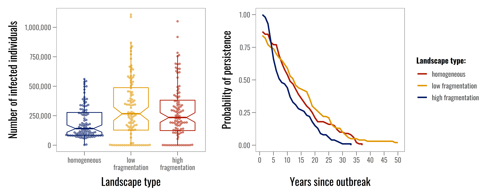
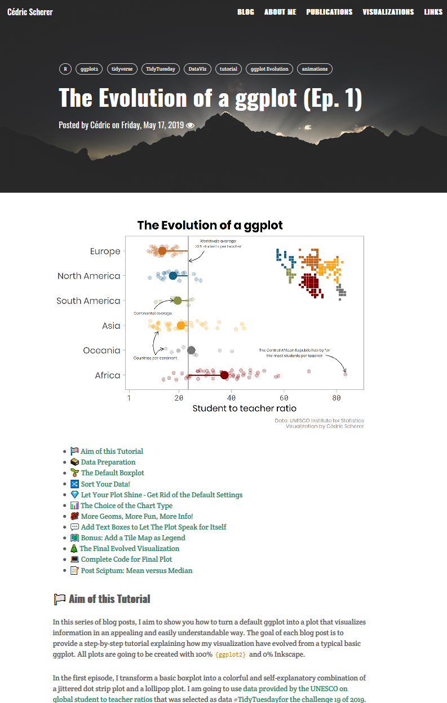
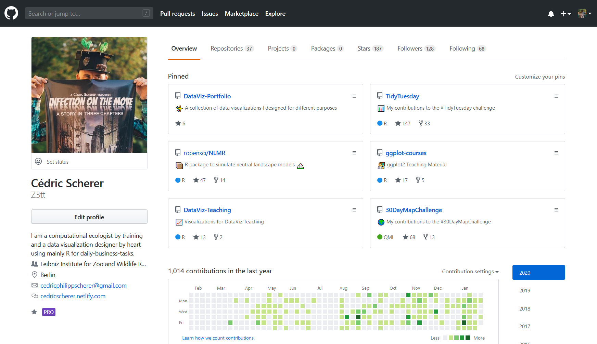
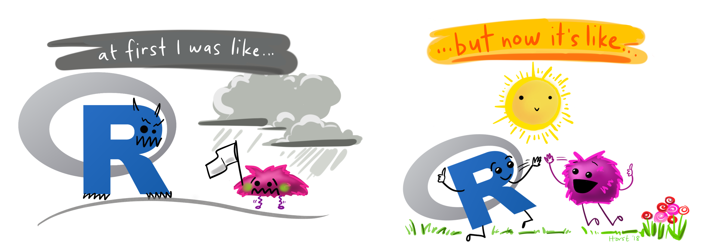
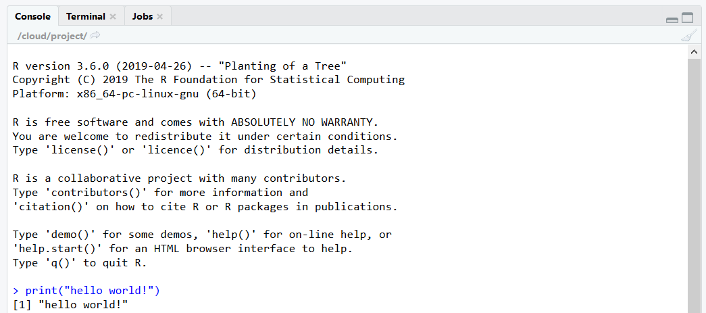
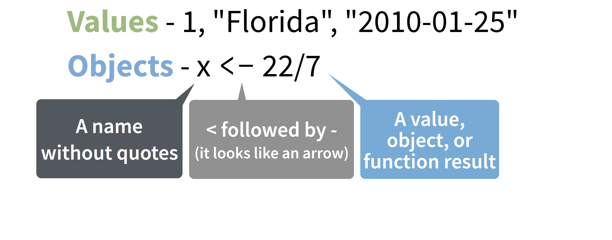
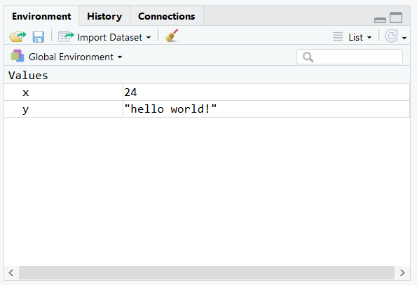
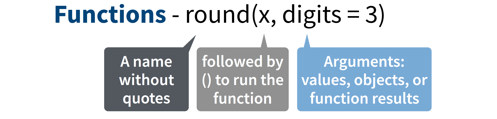
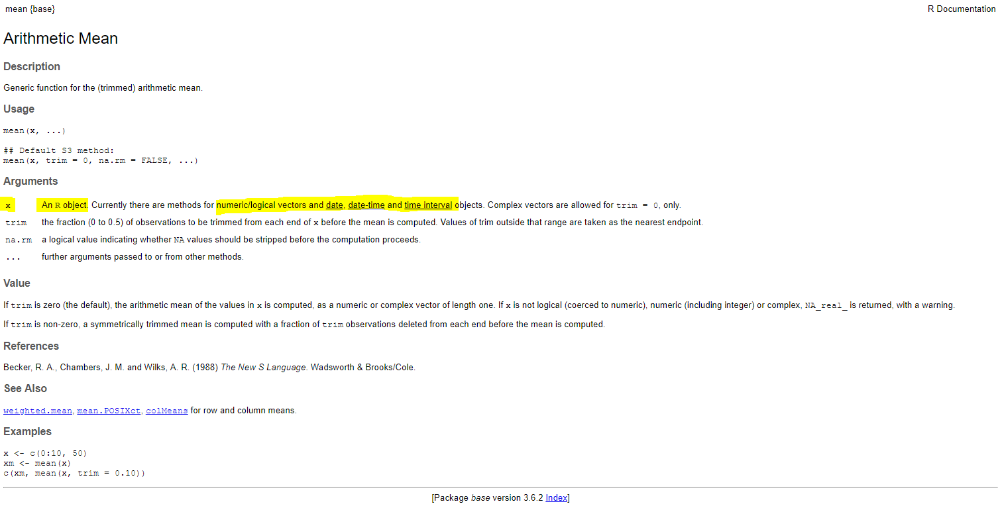

class: inverse, center
background-image: url("img/darklight_RichardStrozynski.jpg")
background-size: contain

```{r options, echo = F}
hook_source <- knitr::knit_hooks$get('source')
knitr::knit_hooks$set(source = function(x, options) {
  x <- stringr::str_replace(x, "^[[:blank:]]?([^*].+?)[[:blank:]]*#<<[[:blank:]]*$", "*\\1")
  hook_source(x, options)
})

knitr::opts_chunk$set(
  echo = TRUE, 
  warning = FALSE, 
  message = FALSE, 
  collapse = TRUE,
  fig.height = 6.3,
  fig.allign = 'center',
  fig.retina = 3.5
)

options(width = 80)
```

<br><br>
## <span style='font-size:40pt;'>Data Visualization in <code style='color:#ebc500;'>R</code> with <code style='color:#ebc500;'>ggplot2</code></span><br><span style='font-size:25pt;color:#a7a7a7;font-weight:400;'>Introduction to R and RStudio</span>
<br><br><br><br><br><br><br>
## <span style='font-size:22pt;'>Cédric Scherer</b><b style='font-size:15pt;color:#ccba56;font-weight:400;'><br>Physalia Courses&nbsp;&nbsp;&nbsp;|&nbsp;&nbsp;&nbsp;March 2-6 2020</b><br><p align='right;'><span style='font-size:9pt;color:#767676;font-weight:400;'></p>

---
class: center, middle


---

## About Me

* <b style='color:#28a87d;'>B.Sc. in <i>Life Sciences</i></b>&nbsp;&nbsp;(2008-2011 in Potsdam)

* <b style='color:#28a87d;'>M.Sc. in <i>Ecology, Evolution & Nature Conservation</i></b>&nbsp;&nbsp;(2011-2014 in Potsdam)

---

## About Me

* <b style='color:#28a87d;'>B.Sc. in <i>Life Sciences</i></b>&nbsp;&nbsp;(2008-2011 in Potsdam)

* <b style='color:#28a87d;'>M.Sc. in <i>Ecology, Evolution & Nature Conservation</i></b>&nbsp;&nbsp;(2011-2014 in Potsdam)

* <b style='color:#28a87d;'>Ph.D. in <i>Ecology</i></b>&nbsp;&nbsp;(2015-2019 in Berlin)

* <b style='color:#28a87d;'>PostDoc in <i>Computational Ecology</i></b>&nbsp;&nbsp;at Leibniz Institute for Zoo and Wildlife Research (IZW) in Berlin

  - movement ecology of animals

  - dynamics of populations and communities

  - ecology of wildlife diseases

---

## About Me

* <b style='color:#28a87d;'>B.Sc. in <i>Life Sciences</i></b>&nbsp;&nbsp;(2008-2011 in Potsdam)

* <b style='color:#28a87d;'>M.Sc. in <i>Ecology, Evolution & Nature Conservation</i></b>&nbsp;&nbsp;(2011-2014 in Potsdam)

* <b style='color:#28a87d;'>Ph.D. in <i>Ecology</i></b>&nbsp;&nbsp;(2015-2019 in Berlin)

* <b style='color:#28a87d;'>PostDoc in <i>Computational Ecology</i></b>&nbsp;&nbsp;at Leibniz Institute for Zoo and Wildlife Research (IZW) in Berlin

  - movement ecology of animals

  - dynamics of populations and communities

  - ecology of wildlife diseases
  
* <b style='color:#28a87d;'>Data Visualization Designer</b> (Practitioner/Engineer/Expert/...)
  
  - own and collaborative research data *(for a living)*
  
  - freelancing client projects *(for a living)*
  
  - data challenges and personal projects *(for fun & training)*

---

## About Me

<p style='text-align:center;'>
  <br>
  <b style='font-size:22pt;'>
  For the preparation and visualization of all these datasets,<br>I use mostly <code>R</code> in combination with the <code>tidyverse</code> and <code>ggplot2</code>.
  </b>
</p>

.left-column[
  <br><br><br>
  
]

.right-column[
  
  <p style='text-align:center;'><i style='font-size:10pt;color:grey;'>Source: dicook.org/files/rstudio/#3</i></p>
]

---
class: center, middle


---
class: inverse, center

### Data Visualizations for Scientific Publications & Talks

.pull-left[
<p style='text-align:center;'><br><i style='color:lightgrey;font-size:10pt;'><i>Scherer et al. 2019 Journal of Animal Ecology</i></p>
]

.pull-right[
<p style='text-align:center;'><br><i style='color:lightgrey;font-size:10pt;'>Scherer et al. 2020 Oikos</i></p>
<p style='text-align:center;'><br><i style='color:lightgrey;font-size:10pt;'>Sciaini et al. 2019 Methods in Ecology & Evolution</i></p>
]

---
class: inverse, center

### Data Visualizations for Client Projects

.pull-left[
<br><br>
<p style='text-align:right;'></p>
]

.pull-right[
<p style='text-align:center;'></p>
<p style='text-align:center;'></p>
]

---
class: inverse, center

### Data Visualizations as Challenge Contributions

.pull-left[
<p style='text-align:center;'><br><i style='color:lightgrey;font-size:10pt;'>Contribution to #TidyTuesday</i></p>
]

.pull-right[
<p style='text-align:center;'><br><i style='color:lightgrey;font-size:10pt;'>Contribution to #30DaymapChallenge</i></p>
]

---
class: inverse, center

### My Blog

<p style='text-align:center;'><br><b style='color:lightgrey;font-size:12pt;'>cedricscherer.netlify.com</b></p>

---
class: inverse, center

### My Blog

.pull-left[
<p style='text-align:center;'></p>
]

.pull-right[
<p style='text-align:center;'></p>
]
---
class: inverse, center

### My GitHub

<p style='text-align:center;'><br><b style='color:lightgrey;font-size:12pt;'>github.com/Z3tt</b>

---
class: inverse, center, middle

# <b style='font-size:70pt;color:#ebc500;'>Introduction to <code style='color:#ebc500;'>R</code></b><br><br><br>

---
class: center
## What is `R` ?

<br>
<b style='font-size:18pt;'>A programming language and free software environment for statistical computing and graphics.</b><br><br>
<span style='font-size:18pt;'><code>R</code>&nbsp;&nbsp;is very popular among, scientists, statisticians, and data miners<br>for developing statistical software and analyse and visualize data</span><br><br>


---

## What is `R`?

<br>
`R` was developed by **Ross Ihaka** and **Robert Gentleman** as an open source implementation<br>of the `S` programming language. `R` was conceived in 1992 and released in 1995.

---

## What is `R`?

<br>
`R` was developed by **Ross Ihaka** and **Robert Gentleman** as an open source implementation<br>of the `S` programming language. `R` was conceived in 1992 and released in 1995.

**Pros:**
* free and open source
* platform-independent
* dedicated packages that provide extra functionality
* highly compatible with many other programming languages
* huge online community
* often experienced as *easy to code*&nbsp;&nbsp;(from a non-programmer perspective)

---

## What is `R`?

<br>
`R` was developed by **Ross Ihaka** and **Robert Gentleman** as an open source implementation<br>of the `S` programming language. `R` was conceived in 1992 and released in 1995.

**Pros:**
* free and open source
* platform-independent
* dedicated packages that provide extra functionality
* highly compatible with many other programming languages
* huge online community
* often experienced as *easy to code*&nbsp;&nbsp;(from a non-programmer perspective)

**Cons:**
* data handling (physical memory storage + speed)
* security issues (relevant for web applications)
* often experienced as *strange to code*&nbsp;&nbsp;(from a programmer perspective)

---
class:center

<br><i style='font-size:10pt;color:grey;'>Illustration by Allison Horst (github.com/allisonhorst/stats-illustrations)</i>

---

## Getting Help with `R`
<br>
* R Foundation Help Page: [r-project.org/help.html](www.r-project.org/help.html)

* RStudio Community: [community.rstudio.com](www.community.rstudio.com)

* R For Data Science Online Learning Community: [rfordatasci.com](www.rfordatasci.com)

* Stack Overflow: [stackoverflow.com](www.stackoverflow.com)

* R User Groups (local): [jumpingrivers.github.io/meetingsR/r-user-groups.html](www.jumpingrivers.github.io/meetingsR/r-user-groups.html)

* R Ladies (global & local): [rladies.org](www.rladies.org)

* Twitter: [#rstats](https://twitter.com/hashtag/rstats?lang=en), [#tidyverse](https://twitter.com/hashtag/tidyverse?lang=en), [#ggplot2](https://twitter.com/hashtag/ggplot2?lang=en)

---
class:center

<br><i style='font-size:10pt;color:grey;'>Illustration by Allison Horst (github.com/allisonhorst/stats-illustrations)</i>

---

## `#rstats` on Twitter
<br>
* [#rstats](https://twitter.com/hashtag/rstats?lang=en), [#tidyverse](https://twitter.com/hashtag/tidyverse?lang=en), [#ggplot2](https://twitter.com/hashtag/ggplot2?lang=en)

* R For Data Science Online Learning Community: [@R4DScommunity](https://twitter.com/R4DScommunity)

* R Weekly: [@rweekly_org](https://twitter.com/rweekly_org)

* ROpenSci: [@rOpenSci](https://twitter.com/rOpenSci)

* TidyTuesday challenge: [@thomas_mock](https://twitter.com/thomas_mock) and [@tidypod](https://twitter.com/tidypod)

* R For The Rest Of Us: [@rfortherest](https://twitter.com/rfortherest)

* R Function A Day: [@Rfunction_a_day](https://twitter.com/Rfunction_a_day)

* Mara Averick: [@dataandme](https://twitter.com/dataandme)

---
class:center

## What is the `tidyverse`?

<br>
The `tidyverse` provides exemplary support for data wrangling and is the  
main reason for the recent popularity of `R`, especially in data-driven environments.

<br><br>
<p style='text-align:center;'><i style='font-size:10pt;color:grey;'>Source: Hadley Wickham's "R for Data Science" (R4DS)</i></p>

---
class: center

### The Typical Data Science Project Flow

<br><i style='font-size:10pt;color:grey;'>Source: www.rviews.rstudio.com/post/2017-06-09-What-is-the-tidyverse_files/tidyverse1.png</i>

---
class: center

### The Typical Data Science Project Flow

<br><i style='font-size:10pt;color:grey;'>Source: www.rviews.rstudio.com/post/2017-06-09-What-is-the-tidyverse_files/tidyverse1.png</i>
---
class: inverse, center

<br>
# <code style='color:#ebc500;;font-weight:400;'>Who is Hadley Wickham?</code>

--


---
class: inverse, center

<br>
# <code style='color:#ebc500;font-weight:400;'>Who is Hadley Wickham?</code>
<br><br>

<b style='font-size:18pt;color:lightgrey;'>
Statistician from New Zealand, living in Houston, TX
<br><br>
Adjunct Professor of Statistics at the University of Auckland,<br>Stanford University, and Rice University
<br><br>
Chief Scientist at **RStudio**
<br><br>
Inventor/Developer of {ggplot2} and the tidyverse
</b>

---
class: inverse, center, middle

# <b style='font-size:70pt;color:#ebc500;'>RStudio IDE</b><br><br><br>

---

## `R` and RStudio

<p style='text-align:center;'><br><i style='font-size:10pt;color:grey;'>Modified from  moderndive.netlify.com/1-getting-started.html<br><br></i></p>

* **RStudio** is an open-source IDE (integrated development environment) for `R`
  
* most popular `R` IDE since several years *(what is `tinnR`?!)*
  
* many features + extensions to facilitate workflows *(projects, notebooks, toc, ...)*
    
* availability of **R projects** and **Rmarkdown** *(later more)*

---
class: bottom
background-image: url("img/rstudio-contribution.png")
background-size: cover

<i style='font-size:10pt;color:white;'>Source: "Remaster the tidyverse" by Garrrett Grolemund</i>

---
class: center, middle

<br><i style='font-size:10pt;color:grey;'>Illustration by Allison Horst (github.com/allisonhorst/stats-illustrations)</i>

---

## Installation of `R` and RStudio

* Download and install `R` via<br>https://cloud.r-project.org/

* Download and install **RStudio Desktop** via<br>https://www.rstudio.com/products/rstudio/download/

---

## Your Turn!

<b style='font-size:18pt;color:#00684a;'>
* Open RStudio and get familiar with its environment.

* Go to *Help > Cheatsheets > RStudio IDE Cheat Sheet*&nbsp;&nbsp;and study the document.

</b>

---
class: center

## RStudio IDE

<br><i style='font-size:10pt;color:grey;'>Source: ourcodingclub.github.io/2016/11/13/intro-to-r.html</i>

---
class: center

## RStudio IDE

<p style='text-align:center;'><br><i style='font-size:10pt;color:grey;'>Source: rstudio.com/resources/cheatsheets/</i></p>

---
class: center

## RStudio IDE

<p style='text-align:center;'><br><i style='font-size:10pt;color:grey;'>Source: rstudio.com/resources/cheatsheets/</i></p>

---
class: center

## RStudio IDE

<p style='text-align:center;'><br><i style='font-size:10pt;color:grey;'>Source: rstudio.com/resources/cheatsheets/</i></p>

---
class: inverse, center, middle

<code style='font-size:70pt;color:#ebc500;'>Hello World!</code><br><br><br>

---

## Your Turn!

<b style='font-size:18pt;color:#00684a;'>
* Open a script by clicking *File > New File > R script*

* Type the classic `print("hello world!")` and hit the *Run*&nbsp;&nbsp;button.  
(alternatively: `Ctrl/Cmd + Enter` ) 

</b>
<b style='font-size:18pt;color:#ea724c;'><br>
* What happens if you just run "hello world!"?

</b>

---

## The Console

`R` code you are running appears here - the line starts with `>` (by default).

If there is anything `R` *returns*, it will also be printed here after your call - here starting with `[1]` .



---

## The Console

`R` code you are running appears here - the line starts with `>` (by default).

If there is anything `R` *returns*, it will also be printed here after your call - here starting with `[1]` .

<br>

*Btw, you can also type code directly in the console and hit <b><code>Enter</code></b> to evaluate it.*

---

## Values

<p style='text-align:center;font-size:40pt;font-family:poppins;'>
  <b>1<br><br>"hello world!"<br><br>"2020-03-02 09:00:00"</b>
</p>

---

## Your Turn!

<b style='font-size:18pt;color:#00684a;'>
* Type `2 + 3` and run it.

* Play around with other calculus operators such as `-`, `*`, `/`, `^`, or `sqrt` .

</b>
<b style='font-size:18pt;color:#ea724c;'><br>
* What is the difference between the first 5 and the `sqrt` calculation?

</b>

---

## `R` is a calculator!

```{r}
2 + 2

(59 + 73 + 2) * 5

1 / 200 * 30

sin(pi / 2)

10^12 * sqrt(4312)

log(exp(5))
```

---

## Your Turn!

<b style='font-size:18pt;color:#00684a;'>
* Run `x <- 1` and afterwards `x` 

* Next, run `x + 2`.

* Now run `x <- 5` and again `x + 2`.

</b>
<b style='font-size:18pt;color:#ea724c;'><br>
* Why is there no output when you run the first command?

* What is the arrow symbol `<-` doing?

* What is the value of x in the end?

* What if you type `y <- x` and what if `y <- x <- 2`

* And what happens if you type `y <- 2 <- x` ? 

</b>

---
class: inverse, center, middle

# <b style='font-size:70pt;color:#ebc500;'>Assignments</b><br><br><br>

---
class: center, middle


---
class: center, middle



---

## Assignments

New objects are created with `<-` and the process is called **assignment**:

```{r}
x <- 24
x
```

---

## Assignments

New objects are created with `<-` and the process is called **assignment**:

```{r}
x <- 24
x
```

---

## Assignments

All `R` statements where you create objects have the same form:

```{r, eval = F}
object_name <- value
```

(When reading that code above say *“object x gets value 24”*&nbsp;&nbsp;in your head.)

---

## Assignments

All `R` statements where you create objects <strike>have the same form:</strike>

```{r, eval = F}
object_name <- value
```

<br>
You can also create them by using the equal sign:

```{r, eval = F}
object_name = value
```

This practice is controversially discussed with many people arguing it can cause confusion.  
However, the `=` way is much more common in other programming languages thus some prefer it.

```{r}
y = "hello world"
y
```

---

## Your Turn!

<p style='text-align:center;font-size:32pt;color:#ea724c;'><b>
<br>Which of these are numbers?
<br><br>
<code>
1&emsp;&emsp;&emsp;&emsp;"1"&emsp;&emsp;&emsp;&emsp;"one"&emsp;&emsp;&emsp;&emsp;one
</code>
</b></p>

---

## The Environment

All assigned objects belong to the *global environment*&nbsp;&nbsp;called `R_GlobalEnv`*.
  
You can find an overview of everything you have defined in the *environment pane*.

<p style='text-align:center;'></p>

<i style='font-size:11pt;color:grey;'>* There are also other types of environments but we do not bother with that. 

---
class: inverse, center, middle

# <b style='font-size:70pt;color:#ebc500;'>Object Names</b><br><br><br>

---

## Object Names

Object names 
* must start with a letter
* can only contain letters, numbers, `_` and `.` 
* should be descriptive
* ideally follow a convention for multiple words
* ideally follow a convention for different classes/types

--

```{r, eval = F}
i_use_snake_case
otherPeopleUseCamelCase
some.people.use.periods
And_aFew.People_RENOUNCEconvention
```

--

```{r, eval = F}
df_us_population <- a
DfUsPopulation <- b
df.us.population <- c
dfUS_population <- d
```

---
class: center

<br><i style='font-size:10pt;color:grey;'>Illustration by Allison Horst (github.com/allisonhorst/stats-illustrations)</i>

---
class: inverse, center, middle

# <b style='font-size:70pt;color:#ebc500;'>Functions</b><br><br><br>

---

## Functions

`R` has a large collection of built-in functions that are called like this:

```{r, eval = F}
function_name(arg1 = val1, arg2 = val2, ...)
```

---

## Functions

`R` has a large collection of built-in functions that are called like this:

```{r, eval = F}
function_name(arg1 = val1, arg2 = val2, ...)
```

We already have seen some functions in the exercise before: `+`, `-`, and `sqrt` all are functions!

---

## Functions

```{r}
`+`

`-`

sqrt

mean
```

---

## Functions 

```{r}
citation
```

---
class: center, middle



---

## Your Turn!

<p style='text-align:center;font-size:32pt;color:#ea724c;'><b>
<br>Which of these will work supposing&nbsp;&nbsp;<code>one <- 1</code> ?
<br><br>
<code>
log(1)&emsp;&nbsp;log("1")&emsp;&nbsp;log("one")&emsp;&nbsp;log(one)
</code>
</b></p>

---

## Functions

```{r, error = T}
one <- 1

log(1)

log("1")

log("one")

log(one)
```

---

## Functions 

```{r}
citation()
```

---

## Functions

```{r}
sqrt(9)
```

---

## Functions

```{r}
sqrt(9)
mean(5, 1, 3)
```

---

## Functions

```{r}
sqrt(9)
mean(5, 1, 3)
```

<p style='text-align:center;'><br><i style='font-size:10pt;color:grey;'>via NBA on GIPHY</i>

---

## Functions

```{r, eval = F}
?mean()
```


---

## Functions

```{r, eval = F}
?mean()
```



---
class: inverse, center, middle

# <b style='font-size:70pt;color:#ebc500;'>Data Types</b><br><br><br>

---

## Data Types: Classes

Atomic classes in `R`:

```{r}
class(1)

class("a")

class(TRUE) ## T is short for 'TRUE', F is short for 'FALSE',

class(1L)

class(1 + 0i)
```

---

## Data Types: Vectors

As in the case of the `mean` function we need a *numerical/logical vector*&nbsp;:

```{r}
v <- c(5, 1)
class(v)

v2 <- c(TRUE, FALSE)
class(v2)
```

---

## Data Types: Vectors

As in the case of the `mean` function we need a *numerical/logical vector*&nbsp;:

```{r}
v <- c(5, 1)
class(v)

v2 <- c(TRUE, FALSE)
class(v2)

v3 <- c(1L, 2L)
class(v3)
```

---

## Data Types: Vectors

As in the case of the `mean` function we need a *numerical/logical vector*&nbsp;:

```{r}
v <- c(5, 1)
class(v)

v2 <- c(TRUE, FALSE)
class(v2)

v3 <- c(1L, 2L)
class(v3)
```

... and there are also *character vectors*&nbsp;:

```{r}
v4 <- c("Physalia", "DataViz")
class(v4)
```

---

## Data Types: Vectors

You create *atomic vectors*&nbsp;&nbsp;by using `c(val1, val2, ...)` .  
Atomic vectors only contain one data type and all values will be *coerced implicitly*&nbsp;&nbsp;to the same data type:

```{r}
(v5 <- c("ggplot", 2020, TRUE))
class(v5)

(v6 <- c(1L, 0.2, 3 + 0i))
class(v6)
```
---

## Data Types: Vectors

You create *atomic vectors*&nbsp;&nbsp;by using `c(val1, val2, ...)` .  
One can *explicitly coerce*&nbsp;&nbsp;atomic vectors to a particular data type:

```{r}
(v5 <- c("ggplot", 2020, TRUE))
class(v5)

(v6 <- c(1L,0.2, 3 + 0i))
class(v6)

as.numeric(v5)

as.character(v6)

as.logical(v6)
```

---

## Your Turn!

<b style='font-size:18pt;color:#00684a;'>
* Fix our calculation of the mean of 5, 1, and 3.

* Guess what the following vectors look like without running them first:

  - `a <- c(1.7, "Physalia")` and `as.numeric(a)`
  
  - `b <- c(TRUE, 2020, 1.375)` and `as.complex(b)`
  
  - `c <- c(TRUE, "TRUE", "T", FALSE, "False", "f")` and `as.logical(c)`
  
  - `as.integer(c(45L, 0.237, 4.9))`
  
</b>
<br>
<b style='font-size:18pt;color:#ea724c;'>
* What does `as.factor(c("red", "blue))` do?

</b>

---
class: inverse, center, middle

# <b style='font-size:70pt;color:#ebc500;'>Function Arguments</b><br><br><br>

---

## Function Arguments

```{r}
mean(x = c(5, 1, 3))
```

---

## Function Arguments

```{r}
mean(x = c(5, 1, 3))

## or:
my_vector <- c(5, 1, 3)
mean(x = my_vector)
```

---

## Function Arguments

```{r}
mean(x = c(5, 1, 3))

max(x = 5)
max(x = c(5, 1, 3))
```

---

## Function Arguments

```{r}
mean(x = c(5, 1, 3))

max(x = 5)
max(x = c(5, 1, 3))

quantile(x = c(5, 1, 3), probs = 0.25)
```

---

## Implicit Matching of Arguments

.pull-left[
```{r}
mean(x = c(5, 1, 3))

max(x = 5)
max(x = c(5, 1, 3))

quantile(x = c(5, 1, 3), probs = 0.25)
```
]

.pull-right[
```{r}
mean(c(5, 1, 3))

max(5)
max(c(5, 1, 3))

quantile(c(5, 1, 3), 0.25)
```
]

---

## Implicit Matching of Arguments

.pull-left[
```{r}
mean(x = c(5, 1, 3))

max(x = 5)
max(x = c(5, 1, 3))

quantile(x = c(5, 1, 3), probs = 0.25)
```
]

.pull-right[
```{r}
mean(c(5, 1, 3))

max(5)
max(c(5, 1, 3))

quantile(c(5, 1, 3), 0.25)
```
]

`BUT:`
```{r, error = T}
quantile(0.25, c(5, 1, 3))
quantile(0.25, c(1, 0.345))
```

---
class: inverse, center, middle

# <b style='font-size:70pt;color:#ebc500;'>Coercion</b><br><br><br>

---

## Implicit and Explicit Coercion

```{r}
(a <- c(1.7, "Physalia"))
  
(b <- c(TRUE, 2020, 1.375))
  
(c <- c(TRUE, "TRUE", "T", FALSE, "False", "f"))
```

---

## Implicit and Explicit Coercion

```{r}
(a <- c(1.7, "Physalia"))
  
(b <- c(TRUE, 2020, 1.375))
  
(c <- c(TRUE, "TRUE", "T", FALSE, "False", "f"))
  
as.numeric(a)
  
as.complex(b)
  
as.logical(c)

as.integer(c(45L, 0.237, 4.9))
```

---

## Implicit Coercion

The coersion rule goes:<br><br>`logical` &rarr; `integer` &rarr; `numeric` &rarr; `complex` &rarr; `character`

```{r}
class(c(TRUE, 1L, 1.2, 1 + 0i, "a"))

class(c(TRUE, 1L, 1.2, 1 + 0i))

class(c(TRUE, 1L, 1.2))

class(c(TRUE, 1L))

class(c(TRUE))
```

---
class: inverse, center, middle

# <b style='font-size:70pt;color:#ebc500;'>Factors</b><br><br><br>

---

## Factors

Conceptually, factors are variables which take only a predefined number of values (i.e. categorical variables). 

Factors are important for *ordered categorical data*, a thing we will need often when working with `ggplot2`:

```{r}
v4
as.factor(v4)
factor(v4)
```

---

## Factors

Conceptually, factors are variables which take only a predefined number of values (i.e. categorical variables). 

Factors are important for *ordered categorical data*, a thing we will need often when working with `ggplot2`:

```{r}
v4
as.factor(v4)
factor(v4)

factor(v4, levels = c("Physalia", "DataViz"))
```

---

## Factors

Conceptually, factors are variables which take only a predefined number of values (i.e. categorical variables). 

Factors are important for *ordered categorical data*, a thing we will need often when working with `ggplot2`:

```{r}
v4
as.factor(v4)
factor(v4)

factor(v4, levels = c("Physalia", "DataViz"))

factor(v4, levels = c("Physalia", "DataViz"),
       labels = c("Physalia Courses Berlin", "Data Visualization"))
```

---

## Factors

Conceptually, factors are variables which take only a predefined number of values (i.e. categorical variables). 

Factors are important for *ordered categorical data*, a thing we will need often when working with `ggplot2`:

```{r}
f <- factor(v4, levels = c("Physalia", "DataViz"),
            labels = c("Physalia Courses Berlin", "Data Visualization"))

class(f)
levels(f)
```

---

## Factors

Conceptually, factors are variables which take only a predefined number of values (i.e. categorical variables). 

Factors are important for *ordered categorical data*, a thing we will need often when working with `ggplot2`:

```{r}
f <- factor(v4, levels = c("Physalia", "DataViz"),
            labels = c("Physalia Courses Berlin", "Data Visualization"))

class(f)
levels(f)

as.character(f)
as.numeric(f)
```

---

## Factors

Conceptually, factors are variables which take only a predefined number of values (i.e. categorical variables). 

Factors are important for *ordered categorical data*, a thing we will need often when working with `ggplot2`:

```{r}
factor(c(0, 0, 1, 0, 1), levels = c("1", "0"), labels = c("no", "yes"))
```

---

## Factors

Conceptually, factors are variables which take only a predefined number of values (i.e. categorical variables). 

Factors are important for *ordered categorical data*, a thing we will need often when working with `ggplot2`:

```{r}
factor(c(0, 0, 1, 0, 1), levels = c("1", "0"), labels = c("no", "yes"))

factor(c(0, 0, 1, 0, 1, 2), levels = c("1", "0"), labels = c("no", "yes"))
```

---
class: inverse, center, middle

# <b style='font-size:70pt;color:#ebc500;'>Missing Data</b><br><br><br>

---

## Missing Values

Missing values are denoted by `NA` *(not available)*&nbsp;,<br>undefined mathematical operations by `NaN` *(not a number)*&nbsp;&nbsp;in `R` .

```{r}
(my_experiment <- c(0.61, 0.43, NA, 0.96))
is.na(my_experiment)
```

---

## Missing Values

Missing values are denoted by `NA` *(not available)*&nbsp;,<br>undefined mathematical operations by `NaN` *(not a number)*&nbsp;&nbsp;in `R` .

```{r}
(my_experiment <- c(0.61, 0.43, NA, 0.96))
is.na(my_experiment)

0 / 0
is.nan(0 / 0)
is.na(0 / 0)
```

---

## Missing Values

Missing values are denoted by `NA` *(not available)*&nbsp;,<br>undefined mathematical operations by `NaN` *(not a number)*&nbsp;&nbsp;in `R` .

```{r}
(my_experiment <- c(0.61, 0.43, NA, 0.96))
is.na(my_experiment)

0 / 0
is.nan(0 / 0)
is.na(0 / 0)

is.nan(my_experiment)
```

---

## Missing Values

Since `NA` values are unknown, most comparisons and calculations will return `NA` as well if there is any missing data:

```{r}
max(my_experiment)
mean(my_experiment)
```

---

## Missing Values

Since `NA` values are unknown, most comparisons and calculations will return `NA` as well if there is any missing data:

```{r}
max(my_experiment)
mean(my_experiment)

max(my_experiment, na.rm = TRUE)
mean(my_experiment, na.rm = TRUE)
```

---

## Missing Values

Since `NA` values are unknown, most comparisons and calculations will return `NA` as well if there is any missing data:

```{r}
max(my_experiment)
mean(my_experiment)

max(my_experiment, na.rm = TRUE)
mean(my_experiment, na.rm = TRUE)

NA == 1
NA == NA
NA == NaN
```

---
class: inverse, center, middle

# <b style='font-size:70pt;color:#ebc500;'>Tabular Data</b><br><br><br>

---

## Data Frames

You can store several vectors (with different data types) as tabular data in so-called *data frames*&nbsp;:

```{r}
(my_df <- data.frame(v, v2, v3, v4))
```
---

## Data Frames

You can store several vectors (with different data types) as tabular data in so-called *data frames*&nbsp;:

```{r}
(my_df <- data.frame(v, v2, v3, v4))

## explicitly declaring column names
(my_df <- data.frame(numeric = v, logical = v2, integer = v3, character = v4))
```

---

## The New Data Frame: Meet the Tibble!

> Tibbles are a modern reimagining of the data.frame, keeping what time has proven to be effective, and throwing out what is not. 

```{r}
(my_tbl <- tibble::tibble(numeric = v, logical = v2, integer = v3, character = v4))
```

<i style='font-size:12pt;color:grey;'>The name comes from the way you originally created these objects: `tbl_df()`, which was most easily pronounced as *“tibble diff”*&nbsp;&nbsp;or *"tibble d. f."*.

---

## The New Data Frame: Meet the Tibble!

**Note:**<br>
Similarly as the functions we have used before, `tibble()` is a function.  
While `mean()` and `+` are *base functions*, `tibble()` belongs to an *add-on package*&nbsp;&nbsp;which is named *tibble*&nbsp;&nbsp;as well.  

To use  use functions from installed packages, you either call them as I did before or by loading the package into your session via another function called `library()`:

```{r, eval = F}
## install the add-on package from the CRAN server
install.packages("tibble")  

## without loading the package but using "namespace"
my_tbl <- tibble::tibble(numeric = v, logical = v2, integer = v3, character = v4)

## loading the package
library(tibble)
## all functions contained in the library are available now
my_tbl <- tibble(numeric = v, logical = v2, integer = v3, character = v4)
```

---

## Data Frame vs Tibble

> Tibbles are a modern reimagining of the data.frame, keeping what time has proven to be effective, and throwing out what is not. 
  
<br>**Main differences in the usage of a data frame vs a tibble:**

* tibbles have a refined print method

  - show only the first 10 rows, and all the columns that fit on screen

  - in addition to its name, each column reports its type
  
  - also, the type of the data and its dimensions are shown

---

## Data Frame vs Tibble
 
```{r, include = F}
options(width = 40)
tbl_flights <- nycflights13::flights[1:100, c(1:3, 5:6, 8:13, 14, 19)]
```
 
 
.pull-left[
```{r}
tbl_flights
```
]

.pull-right[
```{r}
as.data.frame(tbl_flights)
```
]

---

## Data Frame vs Tibble

> Tibbles are a modern reimagining of the data.frame, keeping what time has proven to be effective, and throwing out what is not. 
  
<br>**Main differences in the usage of a data frame vs a tibble:**

* tibbles have a refined print method

  - show only the first 10 rows, and all the columns that fit on screen

  - in addition to its name, each column reports its type
  
  - also, the type of the data and its dimensions are shown

* tibbles are strict about subsetting

---

## Data Frame vs Tibble

Tibbles are strict about subsetting:

```{r}
my_df$integer

my_tbl$integer
```

---

## Data Frame vs Tibble

Tibbles are strict about subsetting:

```{r}
my_df$integer

my_tbl$integer

my_df$int

my_tbl$int
```

---
class: inverse, center, middle

# <b style='font-size:70pt;color:#ebc500;'>Data Import</b><br><br><br>

---

## Data Import

Usually, you create data frames by loading data files such as `.txt`, `.csv`, ...

```{r, eval = F}
## data.frames (base R)
my_data <- read.delim("./data/cool_data.txt", sep = "\t")
my_data <- read.csv("./data/cool_data.csv")
```

---

## Data Import

Usually, you create data frames by loading data files such as `.txt`, `.csv`, ...

```{r, eval = F}
## data.frames (base R)
my_data <- read.delim("./data/cool_data.txt", sep = "\t")
my_data <- read.csv("./data/cool_data.csv")

## tibbles (tidyverse)
my_data <- readr::read_delim("./data/cool_data.txt", quote = "\t")
my_data <- readr::read_csv("./data/cool_data.csv")
```

---

## Data Import

Usually, you create data frames by loading data files such as `.txt`, `.csv`, ...

```{r, eval = F}
## data.frames (base R)
my_data <- read.delim("./data/cool_data.txt", sep = "\t")
my_data <- read.csv("./data/cool_data.csv")

## tibbles (tidyverse)
my_data <- readr::read_delim("./data/cool_data.txt", quote = "\t")
my_data <- readr::read_csv("./data/cool_data.csv")
my_data <- readr::read_csv("https://some_webpage.com/online_data.csv")
my_data <- readr::read_csv2("./data/actually_not_a_csv_but_okay.csv") ## ';' as sep
```

---

## Data Import

Usually, you create data frames by loading data files such as `.txt`, `.csv`, `.xlsx`, ...

```{r, eval = F}
## data.frames (base R)
my_data <- read.delim("./data/cool_data.txt", sep = "\t")
my_data <- read.csv("./data/cool_data.csv")

## tibbles (tidyverse)
my_data <- readr::read_delim("./data/cool_data.txt", quote = "\t")
my_data <- readr::read_csv("./data/cool_data.csv")
my_data <- readr::read_csv("https://some_webpage.com/online_data.csv")
my_data <- readr::read_csv2("./data/actually_not_a_csv_but_okay.csv") ## ';' as sep
my_data <- readxl::read_xls("./data/oh_no_excel_data.xls", sheet = 1)
my_data <- readxl::read_xlsx("./data/oh_no_excel_data.xlsx", sheet = 1)
```

---

## Data Import

Usually, you create data frames by loading data files such as `.txt`, `.csv`, `.xlsx`, `.rds`, ...

```{r, eval = F}
## data.frames (base R)
my_data <- read.delim("./data/cool_data.txt", sep = "\t")
my_data <- read.csv("./data/cool_data.csv")

## tibbles (tidyverse)
my_data <- readr::read_delim("./data/cool_data.txt", quote = "\t")
my_data <- readr::read_csv("./data/cool_data.csv")
my_data <- readr::read_csv("https://some_webpage.com/online_data.csv")
my_data <- readr::read_csv2("./data/actually_not_a_csv_but_okay.csv") ## ';' as sep
my_data <- readxl::read_xls("./data/oh_no_excel_data.xls", sheet = 1)
my_data <- readxl::read_xlsx("./data/oh_no_excel_data.xlsx", sheet = 1)

## one of R's data formats (base R)
my_data <- readRDS("./data/one_of_Rs_data_formats.Rds")
```

---

## Your Turn!

<b style='font-size:18pt;color:#00684a;'>
* Download or create a data set with the software of your choice and import it into R.

* Inspect the imported data using `summary()` , `str()` , `tibble::glimpse()` , and `View()` .

* Also explore other functions such as `dim()` , `length()`,  `unique()` , and `range()` .

* Save your data set as .Rds (use `saveRDS()` and `?saveRDS()` to get help).

</b>

---
class: inverse, center, middle

# <b style='font-size:70pt;color:#ebc500;'>Data Summaries</b><br><br><br>

---

## Data Summaries

```{r, include = F}
options(width = 80)
```

```{r}
summary(tbl_flights[, c(7, 8, 13)])
```

---

## Data Summaries

```{r}
str(tbl_flights)
```

---

```{r, include = F}
options(width = 40)
```

## Data Summaries

.pull-left[
```{r}
str(tbl_flights)
```
]

.pull-right[
```{r}
tibble::glimpse(tbl_flights)
```
]

---

## Data Summaries

```{r}
dim(tbl_flights)
length(tbl_flights)
```

---

## Data Summaries

```{r}
dim(tbl_flights)
length(tbl_flights)

length(tbl_flights$origin)
unique(tbl_flights$origin)
```

---

## Data Summaries

```{r}
dim(tbl_flights)
length(tbl_flights)

length(tbl_flights$origin)
unique(tbl_flights$origin)

range(tbl_flights$dep_delay, na.rm = T)
quantile(tbl_flights$dep_delay, na.rm = T)
var(tbl_flights$dep_delay, na.rm = T)
sd(tbl_flights$dep_delay, na.rm = T)
```

---
class: inverse, center, middle

# <b style='font-size:70pt;color:#ebc500;'>Generate Data in <code style='color:#ebc500;'>R</code></b><br><br><br>

---

## Generate Data Sets in `R`

You can combine vectors to a dataframe or, better, a tibble:

```{r}
name <- c("Brian", "Jason", "Tyler", "Sam")
age <- seq(23, 26, by = 1)  ## or: 23:26 or c(23, 24, 25, 26)
sex <- rep("male", length(name))

my_tbl <- tibble::tibble(name, age, sex)
```

---

## Generate Data Sets in `R`

From scratch, you would create these columns within the `tibble()` call:

```{r}
my_tbl <- tibble::tibble(name, age, sex)

(my_tbl <- tibble::tibble(
  name = c("Brian", "Jason", "Tyler", "Sam"),
  age = seq(23, 26, by = 1),  ## or: 23:26 or c(23, 24, 25, 26)
  sex = rep("male", length(name))
))
```

---

## Generate Data Sets in `R`

You can also create tibbles using an easier to read row-by-row layout - a `tribble`:

```{r}
my_tbl <- tibble::tibble(name, age, sex)

(my_tbl <- tibble::tribble(
  ~name,    ~age,  ~sex,
  "Brian",  23,    "male", 
  "Jason",  24,    "male", 
  "Tyler",  25,    "male", 
  "Sam",    26,    "male"
))
```

---
class: inverse, center, middle

## The `tidyverse`

<br><i style='font-size:10pt;color:grey;'>Illustration by Allison Horst (github.com/allisonhorst/stats-illustrations)</i>

---

## Why <code><i>tidy</i>verse</code>?

<br>
<span style='font-size:22pt;'><b>Tidy data</b> is a standard way of mapping the meaning of a dataset to its structure.</span>

--
<br><br>
<b style='font-size:24pt;color:#28a87d;'>
&nbsp;&nbsp;&nbsp;&nbsp;&nbsp;&nbsp;&rarr;&nbsp;&nbsp;Each variable forms a column.<br><br>
&nbsp;&nbsp;&nbsp;&nbsp;&nbsp;&nbsp;&rarr;&nbsp;&nbsp;Each observation forms a row.<br><br>
&nbsp;&nbsp;&nbsp;&nbsp;&nbsp;&nbsp;&rarr;&nbsp;&nbsp;Each type of observational unit forms a table.<br><br>
</b>

--
<br>
<span style='font-size:22pt;'><b>Messy data</b> is any other arrangement of the data.</span>

---

## *Tidy* Data

&nbsp;&nbsp;&nbsp;&nbsp;&nbsp;&nbsp;&rarr;&nbsp;&nbsp;Each variable forms a column.<br><br>
&nbsp;&nbsp;&nbsp;&nbsp;&nbsp;&nbsp;&rarr;&nbsp;&nbsp;Each observation forms a row.<br><br>
&nbsp;&nbsp;&nbsp;&nbsp;&nbsp;&nbsp;&rarr;&nbsp;&nbsp;Each type of observational unit forms a table.<br>

<p style='text-align:center;'><br><i style='font-size:10pt;color:grey;'>Source: Hadley Wickham's "R for Data Science" (R4DS)</i></p>
---

## Messy Data

Real datasets often violate the three precepts of tidy data in almost every way imaginable:

* Column headers are values, not variable names.

* Multiple variables are stored in one column.

* Variables are stored in both rows and columns.

* Multiple types of observational units are stored in the same table.

* A single observational unit is stored in multiple tables.

---

## Why Should I Care About *Tidy* Data?

<br>
* <span style='font-size:15pt;'>makes it easy for an analyst or a computer to extract needed variables</span>

* <span style='font-size:15pt;'>ensures that values of different variables from the same observation are always paired</span>

* <span style='font-size:15pt;'>a good ordering makes it easier to scan the raw values</span>


---

## Your Turn!

<br>
```{r table2}
#> # A tibble: 12 x 4
#>   country      year type           count
#>   <chr>       <int> <chr>          <int>
#> 1 Afghanistan  1999 cases            745
#> 2 Afghanistan  1999 population  19987071
#> 3 Afghanistan  2000 cases           2666
#> 4 Afghanistan  2000 population  20595360
#> 5 Brazil       1999 cases          37737
#> 6 Brazil       1999 population 172006362
#> # … with 6 more rows
```

---

## Your Turn!

<br>
```{r table3}
#> # A tibble: 6 x 3
#>   country      year rate             
#> * <chr>       <int> <chr>            
#> 1 Afghanistan  1999 745/19987071     
#> 2 Afghanistan  2000 2666/20595360    
#> 3 Brazil       1999 37737/172006362  
#> 4 Brazil       2000 80488/174504898  
#> 5 China        1999 212258/1272915272
#> 6 China        2000 213766/1280428583
```

---

## Your Turn!

<br>
```{r table1}
#> # A tibble: 6 x 4
#>   country      year  cases population
#>   <chr>       <int>  <int>      <int>
#> 1 Afghanistan  1999    745   19987071
#> 2 Afghanistan  2000   2666   20595360
#> 3 Brazil       1999  37737  172006362
#> 4 Brazil       2000  80488  174504898
#> 5 China        1999 212258 1272915272
#> 6 China        2000 213766 1280428583
```

---

## Your Turn!

<br>
```{r table4}
#> # A tibble: 3 x 3
#>   no_cases
#>   country     `1999` `2000`
#> * <chr>        <int>  <int>
#> 1 Afghanistan    745   2666
#> 2 Brazil       37737  80488
#> 3 China       212258 213766

#> # A tibble: 3 x 3
#>   population
#>   country         `1999`     `2000`
#> * <chr>            <int>      <int>
#> 1 Afghanistan   19987071   20595360
#> 2 Brazil       172006362  174504898
#> 3 China       1272915272 1280428583
```

---
