class: inverse, center
background-image: url("img/darklight_RichardStrozynski.jpg")
background-size: contain 

```{r options, echo = F}
hook_source <- knitr::knit_hooks$get('source')
knitr::knit_hooks$set(source = function(x, options) {
  x <- stringr::str_replace(x, "^[[:blank:]]?([^*].+?)[[:blank:]]*#<<[[:blank:]]*$", "*\\1")
  hook_source(x, options)
})

knitr::opts_chunk$set(
  echo = TRUE, 
  warning = FALSE, 
  message = FALSE, 
  collapse = TRUE,
  fig.height = 6.5
)

options(width = 80)
```

<br><br>
## <span style='font-size:40pt;'>Data Visualization in <code style='color:#ebc500;'>R</code> with <code style='color:#ebc500;'>ggplot2</code></span><br><span style='font-size:25pt;color:#a7a7a7;font-weight:400;'>Introduction to Data Visualization</span>
<br><br><br><br><br><br><br>
## <span style='font-size:22pt;'>Cédric Scherer</b><b style='font-size:15pt;color:#ccba56;font-weight:400;'><br>Physalia Courses&nbsp;&nbsp;&nbsp;|&nbsp;&nbsp;&nbsp;March 2-6 2020</b><br><p align='right;'><span style='font-size:9pt;color:#767676;font-weight:400;'></p>

---
class: inverse, center, middle

# <b style='font-size:70pt;color:#ebc500;'>Data Visualization</span></b><br><b style='font-size:40pt;'>is any graphical representation<br>of information and data</b><br><br><br>

---
class: inverse, center, middle
background-image: url("img/computer-science-data-visualization_CS448B.jpg")
background-size: contain

# <b style='font-size:70pt;color:#ebc500;'>Data Visualization</span></b><br><b style='font-size:40pt;'>is any graphical representation<br>of information and data</b><br><br><br>

---
class: inverse, center, middle
background-image: url("img/1200px-Minard.png")
background-size: cover

# <b style='font-size:70pt;color:#ebc500;'>Data Visualization</span></b><br><b style='font-size:40pt;'>is any graphical representation<br>of information and data</b><br><br><br>

---
class: inverse, center, middle
background-image: url("img/a_view_on_despair_cut.jpg")
background-size: contain

# <b style='font-size:70pt;color:#ebc500;'>Data Visualization</span></b><br><b style='font-size:40pt;'>is any graphical representation<br>of information and data</b><br><br><br>

---

.pull-left[
<p style='text-align:center;'><br>
<i style='font-size:10pt;color:grey;'>"A View on Despair" by Sonja Kuijpers/STUDIO TERP
</i></p> 
]

.pull-right[
<br><br><br><br><br><span style='color:darkgrey;font-size:20pt;'>You might be wondering what you are viewing here.</span>
]

---

.pull-left[
<p style='text-align:center;'><br>
<i style='font-size:10pt;color:grey;'>"A View on Despair" by Sonja Kuijpers/STUDIO TERP
</i></p>
]

.pull-right[
<br><br><br><br><br><span style='color:darkgrey;font-size:20pt;'>You might be wondering what you are viewing here.<br><br><br><b style='color:#000000;'>Each element represents a person who<br>committed suicide in the Netherlands in 2017.<b></span>
]

---

.pull-left[
<p style='text-align:center;'><br>
<i style='font-size:10pt;color:grey;'>"A View on Despair" by Sonja Kuijpers/STUDIO TERP
</i></p>
]

.pull-right[
<br><p style='text-align:left;'></p>
]

---

<p style='text-align:center;'><br>
<i style='font-size:10pt;color:grey;'>"Figurative Map of the Successive Losses in Men of the French Army in the Russian Campaign 1812–1813" by Charles Joseph Minard
</i></p>

* shows the path of Napoleon’s troops across the Russian Empire of Alexander I

* displays the progress of the troops in the form of a stream whose width indicates the size of the “Great Army”

---

<p style='text-align:center;'><br>
<i style='font-size:10pt;color:grey;'>"Figurative Map of the Successive Losses in Men of the French Army in the Russian Campaign 1812–1813" by Charles Joseph Minard
</i></p>

* encodes 6 variables in a simple (?) and modern way: 
<br><br><span style='font-size:12pt;color:grey;'>
  - <b>width</b>&nbsp;&nbsp;&rarr;&nbsp;&nbsp;size of Napoleon’s army
  - <b>x-axis</b>&nbsp;&nbsp;&rarr;&nbsp;&nbsp;longitude of the army’s position
  - <b>y-axis</b>&nbsp;&nbsp;&rarr;&nbsp;&nbsp;latitude of the army’s position
  - <b>color</b>&nbsp;&nbsp;&rarr;&nbsp;&nbsp;direction of the army’s movement
  - <b>line chart</b>&nbsp;&nbsp;&rarr;&nbsp;&nbsp;temperature during the army’s retreat
  - <b>annotations</b>&nbsp;&nbsp;&rarr;&nbsp;&nbsp;locations and army size (main chart) + date along retreat path (line chart)
</span>

---

<p style='text-align:center;'><br>
<i style='font-size:10pt;color:grey;'>"Figurative Map of the Successive Losses in Men of the French Army in the Russian Campaign 1812–1813" by Charles Joseph Minard</i>
</p>

* generally considered as **the first data visualization**&nbsp;&nbsp;(1869)

* Edward Tufte calls Minard’s graphic of Napoleon in Russia one of the **“best statistical drawings ever created”**.

---

<p style='text-align:center;'>
<p style='text-align:center;'></p>
<p style='text-align:center;'><i style='font-size:10pt;color:grey;'>The map created by Charles Joseph Minard projected in the geographical reality with the most accurate information on the actual route of different corps by Martin Grandjean</i></p>

---

<p style='text-align:center;'>
<p style='text-align:center;'></p>
<p style='text-align:center;'><i style='font-size:10pt;color:grey;'>The map created by Charles Joseph Minard and a version coded in <code>ggplot2</code> by Andrew Heiss</i></p>

---

<p style='text-align:center;'>The map even made it into the article "A Layered Grammar of Graphics" by Hadley Wickham that introduced <code style='font-weight:bold;'>ggplot2</code></i></p>
<p style='text-align:center;'></p>

---
class: inverse, center, middle

# <b style='font-size:70pt;color:#ebc500;'>Data Visualization</span></b><br><b style='font-size:40pt;'>is part art and part science.</b><br>
<i style='font-size:15pt;color:grey;'><br>Claus O. Wilke, "Fundamentals of Data Visualization"</i><br><br>

---

## <p style='text-align:center;'><b><span style='color:#28a87d;'>Data visualization</span><br>is part art and part science.</b></p>
<br>

<i style='font-size:22pt;'>
&nbsp;&nbsp;&rarr;&nbsp;&nbsp;The challenge is to get the art right without getting the science wrong and vice versa.
<br><br>
&nbsp;&nbsp;&rarr;&nbsp;&nbsp;A data visualization first and foremost has to accurately convey the data.
<br><br>
&nbsp;&nbsp;&rarr;&nbsp;&nbsp;At the same time, a data visualization should be aesthetically pleasing.
<br><br></i>

--

<b style='font-size:22pt;color:#28a87d;'>
&nbsp;&nbsp;&rarr;&nbsp;&nbsp;If a visualization is "good" or "bad" matters for both communication and impact!
</b>

---
class: center, bottom

background-image: url("img/good_vs_bad.jpg")
background-size: cover

<i style='font-size:10pt;color:grey;'>&nbsp;&nbsp;&nbsp;&nbsp;&nbsp;&nbsp;&nbsp;&nbsp;&nbsp;&nbsp;&nbsp;&nbsp;&nbsp;&nbsp;&nbsp;&nbsp;&nbsp;&nbsp;&nbsp;&nbsp;&nbsp;&nbsp;&nbsp;&nbsp;&nbsp;&nbsp;&nbsp;&nbsp;&nbsp;&nbsp;Marvel Characters, Inc</i>

---
background-image: url("img/good_vs_bad2.jpg")
background-size: cover

---

## <p style='text-align:center;'><b>How to Develop an Eye for Good<br><span style='color:#28a87d;'>Data Visualization</span></b></p>

<span style='font-size:23pt;'>
&nbsp;&nbsp;&nbsp;&nbsp;&nbsp;&nbsp;&nbsp;<b style='color:#28a87d;'>&rarr;&nbsp;&nbsp;Information</b>
<br><br>
&nbsp;&nbsp;&nbsp;&nbsp;&nbsp;&nbsp;&nbsp;<b style='color:#28a87d;'>&rarr;&nbsp;&nbsp;Story</b>
<br><br>
&nbsp;&nbsp;&nbsp;&nbsp;&nbsp;&nbsp;&nbsp;<b style='color:#28a87d;'>&rarr;&nbsp;&nbsp;Goal</b>
<br><br>
&nbsp;&nbsp;&nbsp;&nbsp;&nbsp;&nbsp;&nbsp;<b style='color:#28a87d;'>&rarr;&nbsp;&nbsp;Visual Form
</b>
</span>

---

## <p style='text-align:center;'><b>How to Develop an Eye for Good<br><span style='color:#28a87d;'>Data Visualization</span></b></p>

<span style='font-size:23pt;'>
&nbsp;&nbsp;&nbsp;&nbsp;&nbsp;&nbsp;&nbsp;<b style='color:#28a87d;'>&rarr;&nbsp;&nbsp;Information</b>&nbsp;&nbsp;(Integrity)
<br><br>
&nbsp;&nbsp;&nbsp;&nbsp;&nbsp;&nbsp;&nbsp;<b style='color:#28a87d;'>&rarr;&nbsp;&nbsp;Story</b>&nbsp;&nbsp;(Interestingness)
<br><br>
&nbsp;&nbsp;&nbsp;&nbsp;&nbsp;&nbsp;&nbsp;<b style='color:#28a87d;'>&rarr;&nbsp;&nbsp;Goal</b>&nbsp;&nbsp;(Usefulness)
<br><br>
&nbsp;&nbsp;&nbsp;&nbsp;&nbsp;&nbsp;&nbsp;<b style='color:#28a87d;'>&rarr;&nbsp;&nbsp;Visual Form</b>&nbsp;&nbsp;(Beauty)
</span>

---

## <p style='text-align:center;'><b>How to Develop an Eye for Good<br><span style='color:#28a87d;'>Data Visualization</span></b></p>


<span style='font-size:23pt;'>
&nbsp;&nbsp;&nbsp;&nbsp;&nbsp;&nbsp;&nbsp;<b style='color:#28a87d;'>&rarr;&nbsp;&nbsp;Information</b>&nbsp;&nbsp; Understand your data and be accurate
<br><br>
&nbsp;&nbsp;&nbsp;&nbsp;&nbsp;&nbsp;&nbsp;<b style='color:#28a87d;'>&rarr;&nbsp;&nbsp;Story</b>&nbsp;&nbsp; Be clear about the story of your visualization
<br><br>
&nbsp;&nbsp;&nbsp;&nbsp;&nbsp;&nbsp;&nbsp;<b style='color:#28a87d;'>&rarr;&nbsp;&nbsp;Goal</b>&nbsp;&nbsp; Select charts that successfully transport your story
<br><br>
&nbsp;&nbsp;&nbsp;&nbsp;&nbsp;&nbsp;&nbsp;<b style='color:#28a87d;'>&rarr;&nbsp;&nbsp;Visual Form</b>&nbsp;&nbsp; Follow design rules and data visualization principles
</span>

--

<p style='text-align:center;'><i style='font-size:23pt;color:;'>+ inspiration, training and (a bit of) talent</i></p>

---
class: center, middle

<br><br><i style='font-size:10pt;color:grey;'>Visualization by David McCandless (Information is Beautiful)</i>

---
class: center, middle

<br><br><i style='font-size:10pt;color:grey;'>Visualization by David McCandless (Information is Beautiful)</i>

---
class: center, middle

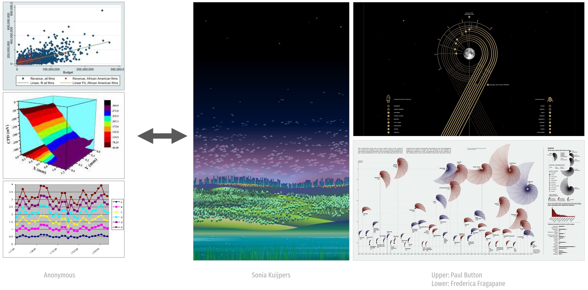

---
class: center, middle


---
class: center, middle

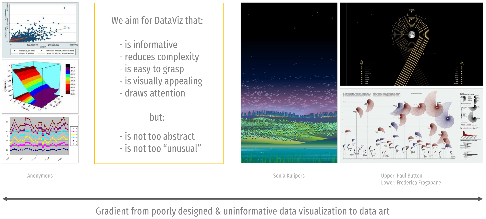

---
class: center, middle


---
class: inverse, center, middle

# <b style='font-size:40pt;'>Know Your</b><br>
# <b style='font-size:70pt;color:#ebc500;'>Types of Data</span></b><br><br><br>

---

## Types of Data

<br>
* <b style='color:#28a87d;'>Quantitative (numerical)</b> versus <b style='color:#28a87d;'>qualitative (categorical)</b> data

* <b style='color:#28a87d;'>Ordered</b> versus <b style='color:#28a87d;'>unordered</b> data

* <b style='color:#28a87d;'>Continuous</b> versus <b style='color:#28a87d;'>discrete</b> data

---

## Types of Data - Your Turn!

<br>
* <b style='color:#28a87d;'>Quantitative (numerical)</b> versus <b style='color:#28a87d;'>qualitative (categorical)</b> data

* <b style='color:#28a87d;'>Ordered</b> versus <b style='color:#28a87d;'>unordered</b> data

* <b style='color:#28a87d;'>Continuous</b> versus <b style='color:#28a87d;'>discrete</b> data

<b style='color:grey;'><br>
* What are the data types of:

  - "female"?

</b>

---

## Types of Data - Your Turn!

<br>
* <b style='color:#28a87d;'>Quantitative (numerical)</b> versus <b style='color:#28a87d;'>qualitative (categorical)</b> data

* <b style='color:#28a87d;'>Ordered</b> versus <b style='color:#28a87d;'>unordered</b> data

* <b style='color:#28a87d;'>Continuous</b> versus <b style='color:#28a87d;'>discrete</b> data

<b style='color:grey;'><br>
* What are the data types of:

  - "female"&nbsp;&nbsp;&nbsp;&rarr;&nbsp;&nbsp;qualitative + discrete + unordered

</b>

---

## Types of Data - Your Turn!

<br>
* <b style='color:#28a87d;'>Quantitative (numerical)</b> versus <b style='color:#28a87d;'>qualitative (categorical)</b> data

* <b style='color:#28a87d;'>Ordered</b> versus <b style='color:#28a87d;'>unordered</b> data

* <b style='color:#28a87d;'>Continuous</b> versus <b style='color:#28a87d;'>discrete</b> data

<b style='color:grey;'><br>
* What are the data types of:

  - "female"&nbsp;&nbsp;&nbsp;&rarr;&nbsp;&nbsp;qualitative + discrete + unordered
  
  - 2019/09/26 "17:01:35"?

</b>

---

## Types of Data - Your Turn!

<br>
* <b style='color:#28a87d;'>Quantitative (numerical)</b> versus <b style='color:#28a87d;'>qualitative (categorical)</b> data

* <b style='color:#28a87d;'>Ordered</b> versus <b style='color:#28a87d;'>unordered</b> data

* <b style='color:#28a87d;'>Continuous</b> versus <b style='color:#28a87d;'>discrete</b> data

<b style='color:grey;'><br>
* What are the data types of:

  - "female"&nbsp;&nbsp;&nbsp;&rarr;&nbsp;&nbsp;qualitative + discrete + unordered
  
  - 2019/09/26 "17:01:35"&nbsp;&nbsp;&nbsp;&rarr;&nbsp;&nbsp;quantitative + continiuous + ordered

</b>

---

## Types of Data - Your Turn!

<br>
* <b style='color:#28a87d;'>Quantitative (numerical)</b> versus <b style='color:#28a87d;'>qualitative (categorical)</b> data

* <b style='color:#28a87d;'>Ordered</b> versus <b style='color:#28a87d;'>unordered</b> data

* <b style='color:#28a87d;'>Continuous</b> versus <b style='color:#28a87d;'>discrete</b> data

<b style='color:grey;'><br>
* What are the data types of:

  - "female"&nbsp;&nbsp;&nbsp;&rarr;&nbsp;&nbsp;qualitative + discrete + unordered
  
  - 2019/09/26 "17:01:35"&nbsp;&nbsp;&nbsp;&rarr;&nbsp;&nbsp;quantitative + continiuous + ordered
  
  - 1?

</b>

---

## Types of Data - Your Turn!

<br>
* <b style='color:#28a87d;'>Quantitative (numerical)</b> versus <b style='color:#28a87d;'>qualitative (categorical)</b> data

* <b style='color:#28a87d;'>Ordered</b> versus <b style='color:#28a87d;'>unordered</b> data

* <b style='color:#28a87d;'>Continuous</b> versus <b style='color:#28a87d;'>discrete</b> data

<b style='color:grey;'><br>
* What are the data types of:

  - "female"&nbsp;&nbsp;&nbsp;&rarr;&nbsp;&nbsp;qualitative + discrete + unordered
  
  - 2019/09/26 "17:01:35"&nbsp;&nbsp;&nbsp;&rarr;&nbsp;&nbsp;quantitative + continiuous + ordered
  
  - 1&nbsp;&nbsp;&nbsp;&rarr;&nbsp;&nbsp;quantitative + continuous + ordered

</b>

---

## Types of Data - Your Turn!

<br>
* <b style='color:#28a87d;'>Quantitative (numerical)</b> versus <b style='color:#28a87d;'>qualitative (categorical)</b> data

* <b style='color:#28a87d;'>Ordered</b> versus <b style='color:#28a87d;'>unordered</b> data

* <b style='color:#28a87d;'>Continuous</b> versus <b style='color:#28a87d;'>discrete</b> data

<b style='color:grey;'><br>
* What are the data types of:

  - "female"&nbsp;&nbsp;&nbsp;&rarr;&nbsp;&nbsp;qualitative + discrete + unordered
  
  - 2019/09/26 "17:01:35"&nbsp;&nbsp;&nbsp;&rarr;&nbsp;&nbsp;quantitative + continiuous + ordered
  
  - 1&nbsp;&nbsp;&nbsp;&rarr;&nbsp;&nbsp;quantitative + continuous + ordered<br>
    &nbsp;&nbsp;&nbsp;&nbsp;&nbsp;&nbsp;&nbsp;&nbsp;&nbsp;&nbsp;&nbsp;&nbsp;&nbsp;or: quantitative + discrete + ordered  
    &nbsp;&nbsp;&nbsp;&nbsp;&nbsp;&nbsp;&nbsp;&nbsp;&nbsp;&nbsp;&nbsp;&nbsp;&nbsp;or: qualitative + discrete + ordered  
    &nbsp;&nbsp;&nbsp;&nbsp;&nbsp;&nbsp;&nbsp;&nbsp;&nbsp;&nbsp;&nbsp;&nbsp;&nbsp;or: qualitative + discrete + unordered

</b>

---
class: center, middle

<br><i style='font-size:10pt;color:grey;'>Illustration by Allison Horst (github.com/allisonhorst/stats-illustrations)</i>

---
class: center, middle

<br><i style='font-size:10pt;color:grey;'>Illustration by Allison Horst (github.com/allisonhorst/stats-illustrations)</i>

---
class: inverse, center, middle

# <b style='font-size:40pt;'>Mapping Data to</b><br>
# <b style='font-size:70pt;color:#ebc500;'>Aesthetics</span></b><br><br><br>

---
class: center

## <b><span style='color:#28a87d;'>Data visualizations</span> map values into quantifiable features <span style='color:#b3b3b3;'>(aesthetics)</span></b>
<br>
<br><i style='font-size:10pt;color:grey;'>Source: "Fundamentals of Data Visualization" by Claus Wilke</i>

---
class: center

## <b><span style='color:#28a87d;'>Data visualizations</span> map values into quantifiable features <span style='color:#b3b3b3;'>(aesthetics)</span></b>

<br><br><i style='font-size:10pt;color:grey;'>Source: Peter Aldhous based on experiments by William Cleveland and Robert McGill</i>

---
class: center

## <b>Scales map data values onto <span style='color:#b3b3b3;'>aesthetics</span></b>
<br><br>
<br><i style='font-size:10pt;color:grey;'>Source: "Fundamentals of Data Visualization" by Claus Wilke</i>

---
class: center

## <b>Scales map data values onto <span style='color:#b3b3b3;'>aesthetics</span></b>
<br>
<br><br><i style='font-size:10pt;color:grey;'>Source: "Fundamentals of Data Visualization" by Claus Wilke</i>

---
class: inverse, center, middle

# <b style='font-size:70pt;color:#ebc500;'>Colors</span></b><br>
# <b style='font-size:40pt;'>and Common Pitfalls</b><br><br><br>

---
class: center

## Color Terminology
<br><br>


---
class: center

## Color Palette Types
<br><br>
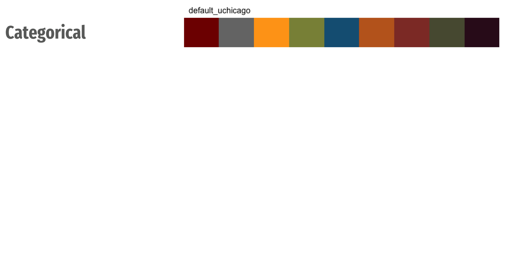

---
class: center

## Color Palette Types
<br><br>


---
class: center

## Color Palette Types
<br><br>
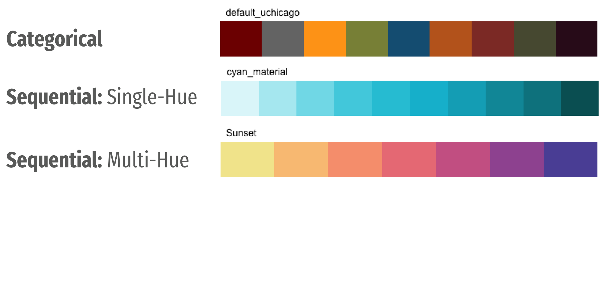

---
class: center

## Color Palette Types
<br><br>


---
class: center

## Color Palette Types
<br><br>
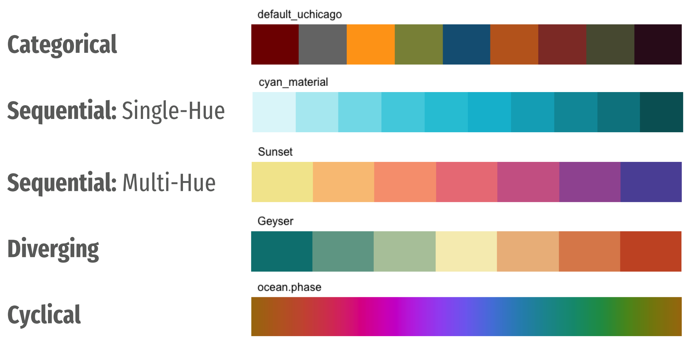

---
class: center, middle


---
class: center, middle


---
class: center, middle

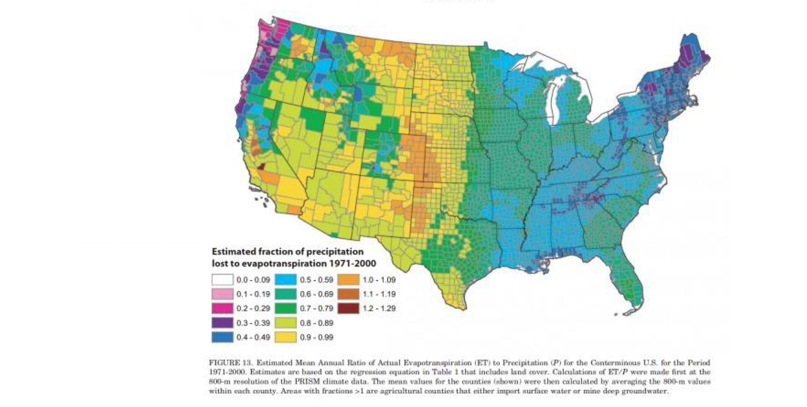<br><i style='font-size:10pt;color:grey;'>Source: eagereyes.org/basicss/rainbow-color-map</i>

---
class: center, middle

<br><i style='font-size:10pt;color:grey;'>Modified from eagereyes.org/basicss/rainbow-color-map</i>

---
class: center, middle

<br><i style='font-size:10pt;color:grey;'>Source: fabiocrameri.ch/batlow</i>

---
class: center, middle

<br><i style='font-size:10pt;color:grey;'>Source: fabiocrameri.ch/batlow</i>

---
class: center, middle

<br><i style='font-size:10pt;color:grey;'>Source: fabiocrameri.ch/batlow</i>

---
class: center

## Choice of Color Palettes

<br><i style='font-size:10pt;color:grey;'>Source: cran.r-project.org/web/packages/viridis/vignettes/intro-to-viridis.html</i>

---
class: center

### Choice of Colors Palettes & Color-Vision Deficiency (CVD)

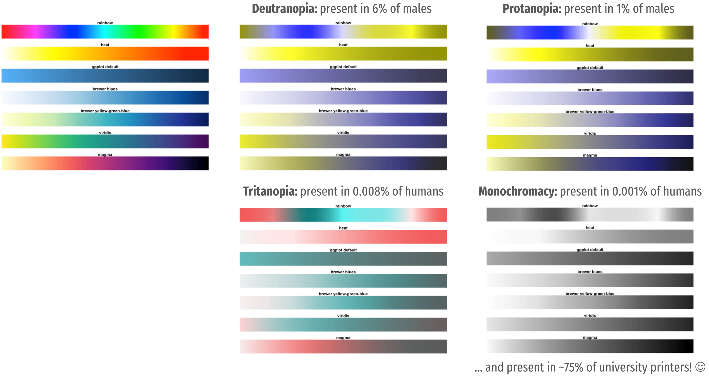<br><i style='font-size:10pt;color:grey;'>Modified from cran.r-project.org/web/packages/viridis/vignettes/intro-to-viridis.html</i>

---
class: inverse, center

<br><br><br><br>

## <b style='font-size:28pt;color:#ebc500;'>To make sure your visualizations work for people with CVD don’t just rely on provided color palettes.</b><br><br>

---
class: inverse, center

<br><br><br><br>

## <b style='font-size:28pt;color:#ebc500;'>To make sure your visualizations work for people with CVD don’t just rely on provided color palettes.</b><br><br>

## <span style='font-size:32pt;color:lightgrey;'>Instead, test your figures in a<br>color-blindness simulator!</span>

---
class: center

## Choice of the Color Palette & Accessibility

<br><br>
<b style='font-size:24pt;color:#7c7c7c;'>
Choose color-blind friendly palettes:<br><span style='color:#28a87d;'>projects.susielu.com/viz-palette</span>
<br><br>
Test your final visualization:<br><span style='color:#28a87d;'>color-blindness.com/coblis-color-blindness-simulator</span>
<br><br>
Create a CVD-version of your ggplot in R:<br><span style='color:#28a87d;'>github.com/clauswilke/colorblindr</span>
</b>

---
class: center

## Choice of the Color Palette & Accessibility

<br><br><i style='font-size:10pt;color:grey;'>Source: "Fundamentals of Data Visualization" by Claus Wilke</i>

---
class: center

## Choice of the Color Palette & Accessibility

<br><br>
<i style='font-size:10pt;color:grey;'>Source: "Fundamentals of Data Visualization" by Claus Wilke</i>

---
class: center

## Choice of the Color Palette & Accessibility

<br><br><br><br>
<br><br>
<i style='font-size:10pt;color:grey;'>Source: "Fundamentals of Data Visualization" by Claus Wilke</i>

---
class: center

## Choice of the Color Palette & Accessibility

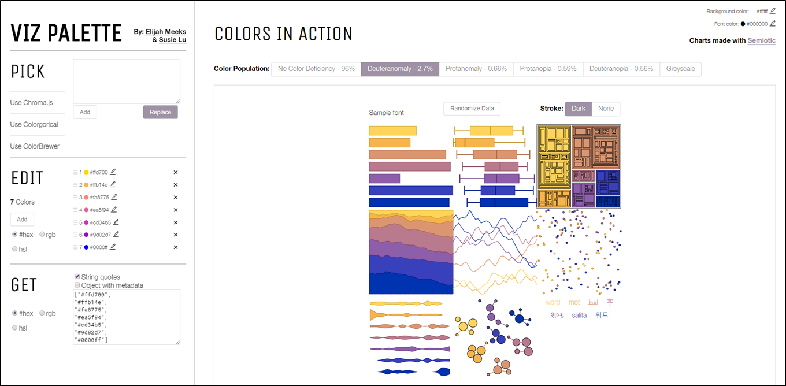<br><i style='font-size:10pt;color:grey;'>projects.susielu.com/viz-palette</i>

---
class: center

## Choice of the Color Palette & Accessibility

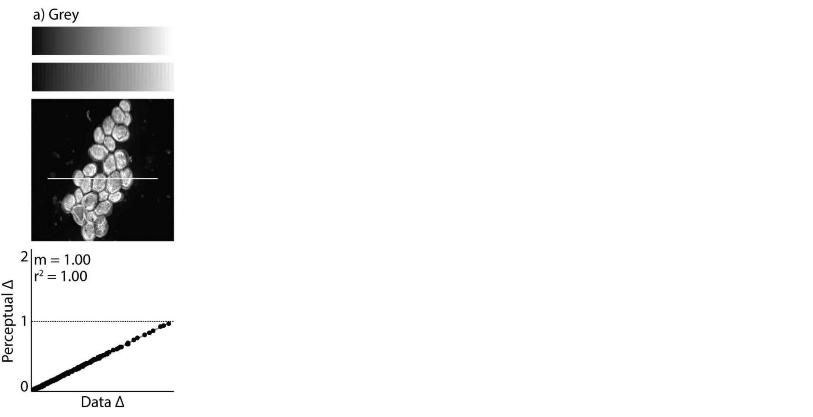<br><i style='font-size:10pt;color:grey;'>Modified from Nuñez, Anderton & Renslow (2018) PLOSone</i>

---
class: center

## Choice of the Color Palette & Accessibility

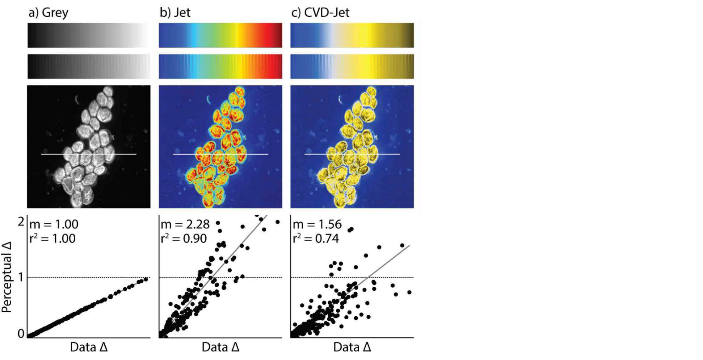<br><i style='font-size:10pt;color:grey;'>Modified from Nuñez, Anderton & Renslow (2018) PLOSone</i>

---
class: center

## Choice of the Color Palette & Accessibility

<br><i style='font-size:10pt;color:grey;'>Modified from Nuñez, Anderton & Renslow (2018) PLOSone</i>

---
class: center

## Choice of the Color Palette & Accessibility

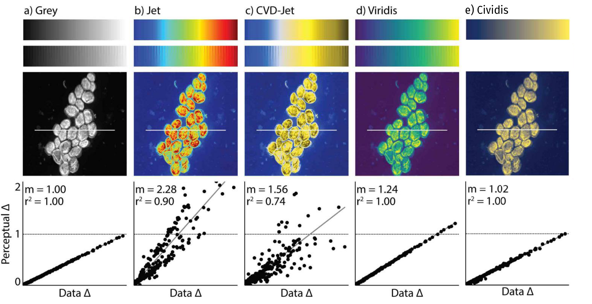<br><i style='font-size:10pt;color:grey;'>Modified from Nuñez, Anderton & Renslow (2018) PLOSone</i>

---
class: center

## Choice of the Color Palette & Accessibility

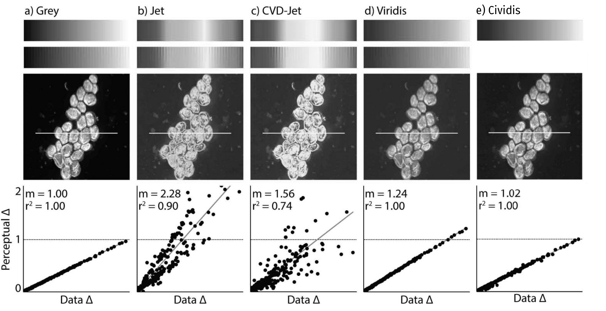<br><i style='font-size:10pt;color:grey;'>Modified from Nuñez, Anderton & Renslow (2018) PLOSone</i>


---
class: right, bottom
background-image: url("img/typography.png")
background-size: cover

# <b style='font-size:52pt;color:#ebc500;'>Typography</span></b><br><br>&nbsp;

---
background-image: url("img/fontsmatter.jpg")
background-size: cover

---
class: center

## The Choice of the <span style='color:#28a87d;'>Font(s)</span>

---
class: center

## How to Visualize <span style='color:#28a87d;'>Hierarchy</span>
<br>
<span style='color:#7c7c7c;font-size:90pt;'>I am important!</span><br><br><br>
<span style='color:#7c7c7c;font-size:40pt;'>I am important, too!</span><br><br><br>
<span style='color:#7c7c7c;font-size:20pt;'>Oh, hi there. Thanks for reading me...</span><br><br><br>
<span style='color:#7c7c7c;font-size:12pt;'>Yeah, I know I am kinda boring. Sorry.</span>

---
class: center

## How to Visualize <span style='color:#28a87d;'>Hierarchy</span>
<br><br>
<u style='color:#7c7c7c;font-size:35pt;font-weight:bolder;'>I am important!</u><br><br>
<span style='color:#7c7c7c;font-size:35pt;font-weight:bold;'>I am important, too!</span><br><br>
<i style='color:#7c7c7c;font-size:35pt;'>Oh, hi there. Thanks for reading me...</i><br><br>
<span style='color:#7c7c7c;font-size:35pt;'>Yeah, I know I am kinda boring. Sorry.</span>

---
class: center

## How to Visualize <span style='color:#28a87d;'>Hierarchy</span>
<br><br>
<span style='color:#eb5d00;font-size:35pt;'>I am important!</span><br><br>
<span style='color:#000000;font-size:35pt;'>I am important, too!</span><br><br>
<span style='color:#adadad;font-size:35pt;'>Oh, hi there. Thanks for reading me...</span><br><br>
<span style='color:#d4d4d4;font-size:35pt;'>Yeah, I know I am kinda boring. Sorry.</span>

---
class: center

## How to Visualize <span style='color:#28a87d;'>Hierarchy</span>
<br><br>
<span style='color:#7c7c7c;font-size:35pt;'>I am important!</span><br><br><br><br>
<span style='color:#7c7c7c;font-size:35pt;'>Oh, hi there. Thanks for reading me...</span><br>
<span style='color:#7c7c7c;font-size:35pt;'>Yeah, I know I am kinda boring. Sorry.</span>

---
class: center

## How to Visualize <span style='color:#28a87d;'>Hierarchy</span>
<br><br><br><br>
<span style='color:#7c7c7c;font-family:poppins;font-size:35pt;'>I am important!</span><br>
<span style='color:#7c7c7c;font-family:merriweather;font-size:27pt;'>Oh, hi there. Thanks for reading me...<br>Yeah, I know I am kinda boring. Sorry.</span><br>

---
class: center

## How to Visualize <span style='color:#28a87d;'>Hierarchy</span>
<br><br><br><br>
<b style='color:#00000;font-family:poppins;font-size:35pt;'>I am important!</b><br><br><br>
<span style='color:#7c7c7c;font-family:merriweather;font-size:17pt;'>Oh, hi there. Thanks for reading me...<br>Yeah, I know I am kinda boring. Sorry.</span><br>

---
class: center

## How to Visualize <span style='color:#28a87d;'>Hierarchy</span>
<br><br><br><br>
<b style='color:#000000;font-family:poppins;font-size:35pt;'>I am important!</b><br>
<span style='color:#000000;font-family:poppins;font-size:22pt;'>I am important, too!</span><br><br><br>
<span style='color:#7c7c7c;font-family:merriweather;font-size:17pt;'>Oh, hi there. Thanks for reading me...<br>Yeah, I know I am kinda boring. Sorry.</span><br>

---
class: center

## How to Visualize <span style='color:#28a87d;'>Hierarchy</span>
<br><br><br><br>
<b style='color:#000000;font-family:poppins;font-size:35pt;'>I am important!</b><br>
<b style='color:#eb5d00;font-family:merriweather;font-size:22pt;'>I am important, too.</b><br><br><br>
<span style='color:#7c7c7c;font-family:merriweather;font-7ze:18pt;'>Oh, hi there. Thanks for reading me...<br>Yeah, I know I am kinda boring. Sorry.</span><br>

---

## <span style='color:#28a87d;'>Allign</span> Your Text!

.left-column[
<br><br>
<ul style='font-weight:bold;font-size:16pt;'>
  <li>Left-align most text<br><br><br></li>
  <li>Title should be left alligned<br><br><br></li>
  <li>Labels and subtitles can be center or right alligned</li>
</ul>
]
.right-column[
  
]

---

## <span style='color:#28a87d;'>Don't Rotate</span> Your Text!

<br>
.pull-left[
  <p style='text-align:center;'></p>
]

.pull-right[
  <p style='text-align:center;'></p>
]

<p style='text-align:center;'><i style='font-size:10pt;color:grey;'>Source: "Fundamentals of Data Visualization" by Claus Wilke</i></p>

---
class: center, middle

<br><i style='font-size:10pt;color:grey;'>Illustration by Allison Horst (github.com/allisonhorst/stats-illustrations)</i>
