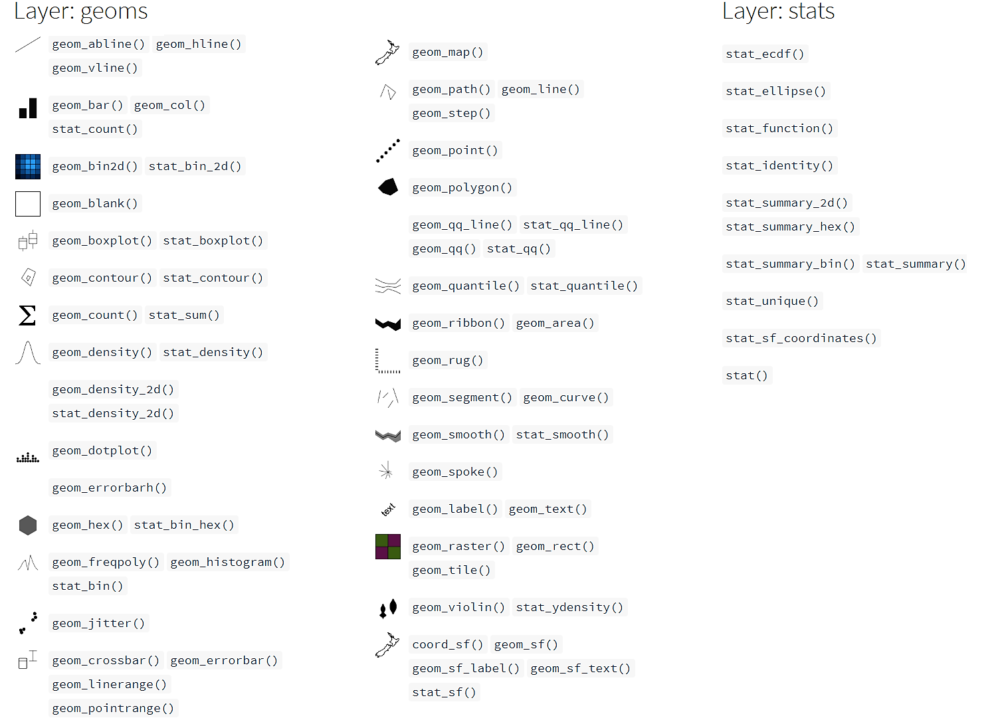
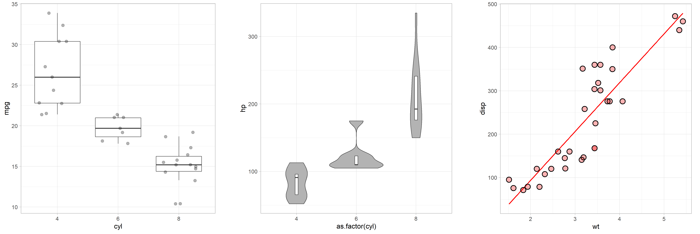

class: inverse, center
background-image: url("img/darklight_RichardStrozynski.jpg")
background-size: contain

```{r options, echo = F}
hook_source <- knitr::knit_hooks$get('source')
knitr::knit_hooks$set(source = function(x, options) {
  x <- stringr::str_replace(x, "^[[:blank:]]?([^*].+?)[[:blank:]]*#<<[[:blank:]]*$", "*\\1")
  hook_source(x, options)
})

knitr::opts_chunk$set(
  echo = TRUE, 
  warning = FALSE, 
  message = FALSE, 
  collapse = TRUE,
  fig.height = 6.3,
  fig.allign = 'center',
  fig.retina = 3.5
)

options(width = 80)
```

<br><br>
## <span style='font-size:40pt;'>Data Visualization in <code style='color:#ebc500;'>R</code> with <code style='color:#ebc500;'>ggplot2</code></span><br><span style='font-size:25pt;color:#a7a7a7;font-weight:400;'>The Structure of <code style='color:#a7a7a7;font-weight:400;'>ggplot2</code> (Part 1: A Basic ggplot)</span>
<br><br><br><br><br><br><br>
## <span style='font-size:22pt;'>Cédric Scherer</b><b style='font-size:15pt;color:#ccba56;font-weight:400;'><br>Physalia Courses&nbsp;&nbsp;&nbsp;|&nbsp;&nbsp;&nbsp;March 2-6 2020</b><br><p align='right;'><span style='font-size:9pt;color:#767676;font-weight:400;'></p>

---
class: inverse, center, middle

<br><br>
# <b style='font-size:60pt'> The <code style='color:#ebc500'>ggplot2</code> Package

---
class: center, middle, inverse

<p style="text-align:center;">
<br><br>

<b style='font-size:30pt'><code style='color:#ebc500'>ggplot2</code> is a system for declaratively creating graphics,<br>based on "The Grammar of Graphics" (Wilkinson, 2005).</b>
<br><br>
<span style='font-size:22pt'>You provide the data, tell <code style='color:#ebc500;font-weight:700'>ggplot2</code> how to map variables to aesthetics,<br>what graphical primitives to use, and it takes care of the details.</span><br>
<br>
<i style='font-size:12pt;color:grey'>ggplot2 package description</i>

---
class: center, middle

<br><i style='font-size:10pt;color:grey'>Illustration by Allison Horst (github.com/allisonhorst/stats-illustrations)</i>

---
class: middle

# Advantages of `ggplot2`

<br>
<ul style='font-size:22pt;color:#28a87d;font-weight:700'>
<li>consistent underlying grammar of graphics (Wilkinson, 2005)</li>
<br>
<li>very flexible, layered plot specification</li> 
<br>
<li>theme system for polishing plot appearance</li>
<br>  
<li>active and helpful community</li>
</ul>

---
class: inverse, center, middle

# <b style='font-size:70pt'>The <code style='color:#ebc500'>ggplot2</code> Showcase</b><br><br>

---
class: inverse, center, middle

<p style='text-align:center;'><br><i style='color:lightgrey;font-size:10pt'>Collection of BBC Graphics<br><span style='color:grey;font-size:8pt'>(modified from bbc.github.io/rcookbook)</span></i></p>

---
class: inverse, center, middle

<p style='text-align:center;'><br><i style='color:lightgrey;font-size:10pt'>Contribution to #SWDchallenge</i></p>

---
class: inverse, center, middle

<p style='text-align:center;'><br><i style='color:lightgrey;font-size:10pt'>European Elections by Torsten Sprenger<br><span style='color:grey;font-size:8pt'>(twitter.com/spren9er/status/1138000009306234880)</span></i></p>

---
class: inverse, center, middle

<p style='text-align:center;'>
<br><i style='color:lightgrey;font-size:10pt'>#TidyTuesday Contribution by Jake Kaupp<br><span style='color:grey;font-size:8pt'>(github.com/jkaupp/tidytuesdays)</span></i></p>

---
class: inverse, center, middle

<p style='text-align:center;'><br><i style='color:lightgrey;font-size:10pt'>#TidyTuesday Contribution by Georgos Karamanis<br><span style='color:grey;font-size:8pt'>(github.com/gkaramanis/tidytuesday)</span></i></p>

---
class: inverse, center, middle

<p style='text-align:center;'><br><i style='color:lightgrey;font-size:10pt'>Bivariate Map by Timo Gossenbacher<br><span style='color:grey;font-size:8pt'>(timogrossenbacher.ch/2019/04/bivariate-maps-with-ggplot2-and-sf)</span></i></p>

---
class: inverse, center, middle

<p style='text-align:center;'><br><i style='color:lightgrey;font-size:10pt'>Contribution to the #30DayMapChallenge<br></p>

---
class: inverse, center, middle

<p style='text-align:center;'><br><i style='color:lightgrey;font-size:10pt'>Contribution to the #30DayMapChallenge<br></p>

---
class: inverse, center, middle

.pull-left[
<p style='text-align:center;'><br><i style='color:lightgrey;font-size:10pt'>Example of the {gganimate} Package<br><span style='color:grey;font-size:8pt'>(github.com/thomasp85/gganimate/wiki)</span></i></p>
]

.pull-right[
<p style='text-align:center;'><br><i style='color:lightgrey;font-size:10pt'>Contribution to #TidyTuesday</i></p>
]

---
class: inverse, center, middle

# <b style='font-size:70pt;color:#ebc500'>The Setup</b><br><br>

---
## The package

<span style='font-size:18pt'>`ggplot2` is a **data visualization package** for the programming language `R` created by Hadley Wickham in 2005.</span>

```{r ggplot-package, eval = F}
install.packages("ggplot2")
library(ggplot2)
```

--

<span style='font-size:15pt'>`ggplot2` is part of the [`tidyverse`](https://blog.rstudio.org/2016/09/15/tidyverse-1-0-0/), a set of packages that work in harmony to manipulate and explore data.</span>

```{r tidyverse-package, eval = F}
install.packages("tidyverse")
library(tidyverse)
```

<p style="text-align:right;"><font color="grey" size=2><i>Source: dicook.org/files/rstudio/#3</i></font></p>

---

## The package 

We are going to use the development version of `ggplot2`.<br>
You can install the most recent version on GitHub using the package `devtools`:

```{r ggplot-package-dev, eval = F}
install.packages("devtool")
devtools::install_github("tidyverse/ggplot2")
```

---

```{r libraries, echo = F, warning = F, message = F}
library(tidyverse)
```

## The data

We use data from the *National Morbidity and Mortality Air Pollution Study*&nbsp;&nbsp;(NMMAPS), filtered for the city of **Chicago** and<br>the timespan  **from January 1997 to December 2000**.

```{r data}
chic <- readr::read_csv("https://raw.githubusercontent.com/Z3tt/ggplot-courses/master/data/chicago-nmmaps.csv",
                  col_types = cols(season = col_factor(), year = col_factor()))
tibble::glimpse(chic)
```

---
class: inverse, center, middle

# <b style='font-size:70pt;'>The Structure of<br><code style='color:#ebc500'>ggplot2</code></b><br>
# <b style='font-size:40pt;color:#a7a7a7;font-weight:400;'>"The Grammar of Graphics"</b><br><br><br>

---

## The Structure of `ggplot2`

<br>
<table style='width:100%;font-size:16pt'>
  <tr>
    <th>Layer</th>
    <th>Function</th>
    <th>Explanation</th>
  </tr>
  <tr>
    <td><b style='color:grey'>Data</b></td>
    <td><code style=font-weight:700>ggplot(data)</code></td>
    <td>The raw data that you want to visualise.</td>
  </tr>
  <tr>
    <td><b style='color:grey'>Aesthetics&nbsp;&nbsp;&nbsp;&nbsp;&nbsp;&nbsp;&nbsp;&nbsp;&nbsp;&nbsp;&nbsp;&nbsp;&nbsp;&nbsp;&nbsp;&nbsp;</b></td>
    <td><code style=font-weight:700>aes()</code></td>
    <td>Aesthetic mappings of the geometric and statistical objects.</td>
  </tr>
  <tr>
    <td><b style='color:grey'>Layers</b></td>
    <td><code style=font-weight:700>geom_*()</code> and&nbsp;&nbsp;<code style=font-weight:700>stat_*()</code></td>
    <td>The geometric shapes and statistical summaries representing the data.</td>
  </tr>
</table>

---

## The Structure of `ggplot2`

<br>
<table style='width:100%;font-size:16pt'>
  <tr>
    <th>Layer</th>
    <th>Function</th>
    <th>Explanation</th>
  </tr>
  <tr>
    <td><b style='color:grey'>Data</b></td>
    <td><code style=font-weight:700>ggplot(data)</code></td>
    <td>The raw data that you want to visualise.</td>
  </tr>
  <tr>
    <td><b style='color:grey'>Aesthetics&nbsp;&nbsp;&nbsp;&nbsp;&nbsp;&nbsp;&nbsp;&nbsp;&nbsp;&nbsp;&nbsp;&nbsp;&nbsp;&nbsp;&nbsp;&nbsp;</b></td>
    <td><code style=font-weight:700>aes()</code></td>
    <td>Aesthetic mappings of the geometric and statistical objects.</td>
  <tr>
    <td><b style='color:grey'>Layers</b></td>
    <td><code style=font-weight:700>geom_*()</code> and&nbsp;&nbsp;<code style=font-weight:700>stat_*()</code></td>
    <td>The geometric shapes and statistical summaries representing the data.</td>
  </tr>
  <tr>
    <td><b style='color:grey'>Scales</b></td>
    <td><code style=font-weight:700>scale_*()</code></td>
    <td>Maps between the data and the aesthetic dimensions.</td>
  </tr>
  <tr>
    <td><b style='color:grey'>Coordinate System</b></td>
    <td><code style=font-weight:700>coord_*()</code></td>
    <td>Maps data into the plane of the data rectangle.</td>
  </tr>
  <tr>
    <td><b style='color:grey'>Facets</b></td>
    <td><code style=font-weight:700>facet_*()</code></td>
    <td>The arrangement of the data into a grid of plots.</td>
  </tr>
  <tr>
    <td><b style='color:grey'>Visual Themes</b></td>
    <td><code style=font-weight:700>theme()</code> and&nbsp;&nbsp;<code style=font-weight:700>theme_*()</code></td>
    <td>The overall visual defaults of a plot.</td>
  </tr>
</table>

---

## The Structure of `ggplot2`

<br>
<table style='width:100%;font-size:16pt'>
  <tr>
    <th>Layer</th>
    <th>Function</th>
    <th>Explanation</th>
  </tr>
  <tr>
    <td><b style='color:grey'>Data</b></td>
    <td><code style=font-weight:700>ggplot(data)</code></td>
    <td>The raw data that you want to visualise.</td>
  </tr>
  <tr>
    <td><b style='color:grey'>Aesthetics&nbsp;&nbsp;&nbsp;&nbsp;&nbsp;&nbsp;&nbsp;&nbsp;&nbsp;&nbsp;&nbsp;&nbsp;&nbsp;&nbsp;&nbsp;&nbsp;</b></td>
    <td><code style=font-weight:700>aes()</code></td>
    <td>Aesthetic mappings of the geometric and statistical objects.</td>
  </tr>
  <tr>
    <td><b style='color:grey'>Layers</b></td>
    <td><code style=font-weight:700>geom_*()</code> and&nbsp;&nbsp;<code style=font-weight:700>stat_*()</code></td>
    <td>The geometric shapes and statistical summaries representing the data.</td>
  </tr>
  <tr>
    <td><b style='color:grey'>Scales</b></td>
    <td><code style=font-weight:700>scale_*()</code></td>
    <td>Maps between the data and the aesthetic dimensions.</td>
  </tr>
  <tr>
    <td><b style='color:grey'>Coordinate System</b></td>
    <td><code style=font-weight:700>coord_*()</code></td>
    <td>Maps data into the plane of the data rectangle.</td>
  </tr>
  <tr>
    <td><b style='color:grey'>Facets</b></td>
    <td><code style=font-weight:700>facet_*()</code></td>
    <td>The arrangement of the data into a grid of plots.</td>
  </tr>
  <tr>
    <td><b style='color:grey'>Visual Themes</b></td>
    <td><code style=font-weight:700>theme()</code> and&nbsp;&nbsp;<code style=font-weight:700>theme_*()</code></td>
    <td>The overall visual defaults of a plot.</td>
  </tr>
  <tr>
    <td><b style='color:grey'>Annotations</b></td>
    <td><code style=font-weight:700>annotate()</code></td>
    <td>Add additional labels, geometries or images to a plot.</td>
  </tr>
</table>

---
class: inverse, center, middle

# <b style='font-size:70pt'>Data</b><br>
# <code style='font-size:40pt;color:#ebc500;font-weight:700'>ggplot(data)</code><br><br><br>

---

## <code style='color:#28a87d;font-weight:700'>ggplot2::ggplot()</code>

<br>
```{r}
ggplot
```

---

## <code style='color:#28a87d;font-weight:700'>ggplot(data)</code>

We need to specify data in the `ggplot()` call:

.pull-left[
```{r structure-data, eval = F}
ggplot(data = chic) #<<
```

There is only an empty panel because `ggplot2`<br>doesn't know **what** of the data it should plot.
]

.pull-right[
```{r plot-structure-data, ref.label="structure-data", echo = F}
```
]

---

## <code style='color:#28a87d;font-weight:700'>ggplot(data, aes(x, y))</code>

We need to specify data and the two variables we want to plot as `aes`tethics of the `ggplot()` call:

.pull-left[
```{r structure-data-vars, eval = F}
ggplot(data = chic,
       mapping = #<<
         aes( #<<
          x = date, #<<
          y = temp #<<
        ) #<<
      ) 
```
There is only an empty panel because `ggplot2`<br>doesn't know **how** it should plot the data.
]

.pull-right[
```{r plot-structure-data-vars, ref.label="structure-data-vars", echo = F}
```
]

---

## <code style='color:#28a87d;font-weight:700'>ggplot(data, aes(x, y))</code>

We need to specify data and the two variables we want to plot as `aes`tethics of the `ggplot()` call:

.pull-left[
Thanks to implicit matching of arguments in `ggplot(data, mapping)` and `aes(x, y)`, we can also write:

```{r structure-data-vars2, eval = F}
ggplot(chic, aes(date, temp)) #<<
```
]

.pull-right[
```{r plot-structure-data-vars2, ref.label="structure-data-vars2", echo = F}
```
]

---

## <code style='color:#28a87d;font-weight:700'>ggplot(data) + aes(x, y)</code>

We need to specify data and the two variables we want to plot as `aes`tethics of the `ggplot()` call:

.pull-left[
Since almost every `ggplot()` takes the same arguments<br>(`data, mapping = aes(x, y)`), we can also write:

```{r structure-data-vars3, eval = F}
ggplot(chic, aes(date, temp))
```

... or add the `aes`thetics outside the `ggplot()` function:

```{r structure-data-vars4, eval = F}
ggplot(chic) + #<<
  aes(date, temp) #<<
```
]

.pull-right[
```{r plot-structure-data-vars4, ref.label="structure-data-vars4", echo = F}
```
]

---
class: inverse, center, middle

# <b style='font-size:70pt'>Layers</b><br>
# <b style='font-size:40pt;color:grey'><code style='color:#ebc500'>geom\_\*()</code>&nbsp;&nbsp;and&nbsp;&nbsp;&nbsp;<code style='color:#ebc500'>stat\_\*()</code></b><br><br><br>

---

## <b><code>geom\_\*()</code>&nbsp;&nbsp;and&nbsp;&nbsp;<code>stat_*()</code></b>

By adding one or multiple layers we can tell `ggplot2` *how*&nbsp;&nbsp;to represent the data.<br>
There are lots of build-in geometric elements (`geom's`) and statistical transformations (`stat's`):

<p style="text-align:center;"><i style='font-size:10pt;color:grey'>Adapted from ggplot2.tidyverse.org/reference</i></p>

<span style='font-size:11pt'>... and several more in extension packages, e.g. `{ggforce}`, `{ggalt}`, `{ggridges}`, `{ggrepel}`, `{ggcorrplot}`, `{ggraph}`, `{ggdendro}` & `{ggalluvial}`.</span>

---
class: inverse, center, middle

# <b style='font-size:70pt'>2. Layers</b><br>
# <b style='font-size:40pt;color:grey'>Geometric Layers: <code style='color:#ebc500'>geom\_\*()</code></b><br><br><br>

---

## <code style='color:#28a87d;font-weight:700'>geom_point()</code>

We can tell `ggplot2` to represent the data for example as a **scatter plot**:

.pull-left[
```{r structure-geom-point, eval = F}
ggplot(chic, aes(date, temp)) +
  geom_point() #<<
```
]

.pull-right[
```{r plot-structure-geom-point, ref.label="structure-geom-point", echo = F}
```
]

---

## <code style='color:#28a87d;font-weight:700'>geom_area()</code>

## ... or turn it for example into an **area plot**:

.pull-left[
```{r structure-geom-area, eval = F}
ggplot(chic, aes(date, temp)) +
  geom_area() #<<
```
]

.pull-right[
```{r plot-structure-geom-area, ref.label="structure-geom-area", echo = F}
```
]

---

## Spoiler: Themes!

The default theme of `ggplot2` is well known for it's beauty.
<br><br>
Even though Hadley ensures the design defaults were a 

> "deliberate choice because it puts the data forward while still making grid lines visible"

one of the first things I do is getting rid of it because I can't see it anymore.

--
<br><br>
Also, I do not really agree with the reasoning:

> "The white **grid lines are visible** (which is important because they significantly aid position judgements), but they have **little visual impact** and we can easily tune them out.  
> The **grey background** gives the plot a **similar typographic colour to the text**, ensuring that the graphics fit in the with the flow of a document without jumping out wit a bright white background.
> Finally, the grey background **creates a continuous field of colour** which ensures that the plot is perceived as single visual entity.

---

## Spoiler: Themes!

Luckily, there are several built-in themes in `ggplot2` (and many many more in extension packages):

.pull-left[
```{r theme-a, echo = F}
ggplot(chic, aes(date, temp)) +
  geom_point() +
  theme_classic() +
  ggtitle("theme_classic()") +
  theme(plot.title = element_text(hjust = .5, face = "bold", size = 25))
```
]

.pull-right[
```{r theme-b, echo = F}
ggplot(chic, aes(date, temp)) +
  geom_point() +
  theme_minimal() +
  ggtitle("theme_minimal()") +
  theme(plot.title = element_text(hjust = .5, face = "bold", size = 25))
```
]

---

## Spoiler: Themes!

Luckily, there are several built-in themes in `ggplot2` (and many many more in extension packages):

.pull-left[
```{r theme-c, echo = F}
ggplot(chic, aes(date, temp)) +
  geom_point() +
  theme_dark() +
  ggtitle("theme_dark()") +
  theme(plot.title = element_text(hjust = .5, face = "bold", size = 25))
```
]

.pull-right[
```{r theme-d, echo = F}
ggplot(chic, aes(date, temp)) +
  geom_point() +
  theme_linedraw() +
  ggtitle("theme_linedraw()") +
  theme(plot.title = element_text(hjust = .5, face = "bold", size = 25))
```
]

---

## Spoiler: Themes!

```{r, echo = F}
extrafont::loadfonts()
theme_set(theme_light(base_size = 16, base_family = "Open Sans"))
```


You can change the theme via `theme_set(theme_name())` - I am going to use `theme_light()` from now on:

.pull-left[
```{r set-theme, eval = F}
theme_set(theme_light())

ggplot(chic, aes(date, temp)) +
  geom_point()
```
]

.pull-right[
```{r plot-set-theme, ref.label="set-theme", echo = F, eval = -1}
```
]

---

## Your Turn!

<b style='font-size:18pt;color:#00684a'>
* Turn our scatter plot into a line chart and into a bar chart!

* What’s the difference between `geom_path()` and `geom_line()`?

* Create a box plot of temperature per date.

* What is the problem? How could you find out why this is happening?

* Try to create box plots as you would expect them.

* Bonus: Choose the built-in theme you like the most!

</b>

---

## Your Turn!

<b style='font-size:18pt;color:#00684a'>
* Turn our scatter plot into a line chart and into a bar chart!

* What’s the difference between `geom_path()` and `geom_line()`?

* Create a box plot of temperature per date.

* What is the problem? How could you find out why this is happening?

* Try to create box plots as you would expect them.

* Hint: You need to specify one categorical variable!

* Bonus: Choose the built-in theme you like the most!

</b>

---

## <code style='color:#28a87d;font-weight:700'>geom_line()</code>

Our scatter plot as a **line plot**:

.pull-left[
```{r structure-geom-line, eval = F}
ggplot(chic, aes(date, temp)) +
  geom_line() #<<
```
]

.pull-right[
```{r plot-structure-geom-line, ref.label="structure-geom-line", echo = F}
```
]

---

## <code style='color:#28a87d;font-weight:700'>geom_line()</code>

... or as a **bar plot**:

.pull-left[
```{r structure-geom-bar, eval = F}
ggplot(chic, aes(date, temp)) +
  geom_bar(stat = "identity") #<<
```
]

.pull-right[
```{r plot-structure-geom-bar, ref.label="structure-geom-col", echo = F}
```
]

---

## <code style='color:#28a87d;font-weight:700'>geom_line()</code>

... or as a **bar plot**:

.pull-left[
```{r structure-geom-col, eval = F}
ggplot(chic, aes(date, temp)) +
  geom_col() #<<
```
]

.pull-right[
```{r plot-structure-geom-col, ref.label="structure-geom-col", echo = F}
```
]

---

## <code style='color:#28a87d;font-weight:700'>geom_boxplot()</code>

... or a **box and whiskers plot**:

.pull-left[
```{r structure-geom-box, eval = F}
ggplot(chic, aes(date, temp)) +
  geom_boxplot() #<<
```
]

.pull-right[
```{r plot-structure-geom-box, ref.label="structure-geom-box", echo = F}
```
]

---

## <code style='color:#28a87d;font-weight:700'>geom_boxplot()</code>

... or a **box and whiskers plot**:

.pull-left[
```{r structure-geom-box2, eval = F}
ggplot(chic, aes(date, temp)) +
  geom_boxplot() #<<
```

<br><b style='font-size:22pt'>What's going on here?!</b>
]

.pull-right[
```{r plot-structure-geom-box2, ref.label="structure-geom-box2", echo = F}
```
]

---

## <code style='color:#28a87d;font-weight:700'>geom_boxplot()</code>

We need to specify the variable as **categorial** (`as.factor(date)`), not as **continuous** (`date`):

.pull-left[
```{r structure-geom-box-fct, eval = F}
ggplot(chic, aes(as.factor(date), temp)) + #<<
    geom_boxplot() 
```
]

.pull-right[
```{r plot-structure-geom-box-fct, ref.label="structure-geom-box-fct", echo = F}
```
]

---

## <code style='color:#28a87d;font-weight:700'>geom_boxplot()</code>

We need to specify the variable as **categorial** (`as.factor(date)`), not as **continuous** (`date`):

.pull-left[
```{r structure-geom-box-fct2, eval = F}
ggplot(chic, aes(as.factor(date), temp)) + #<<
    geom_boxplot() 
```

<br><b style='font-size:22pt'>But - why are there no box plots?</b>
]

.pull-right[
```{r plot-structure-geom-box-fct2, ref.label="structure-geom-box-fct", echo = F}
```
]

---

## <code style='color:#28a87d;font-weight:700'>geom_boxplot()</code>

We need to specify the variable as **categorial** (e.g. `year` or `season`), not as **continuous** (`date`):

.pull-left[
```{r structure-geom-box-fct-year, eval = F}
ggplot(chic, aes(year, temp)) + #<<
    geom_boxplot() 
```
]

.pull-right[
```{r plot-structure-geom-box-fct-year, ref.label="structure-geom-box-fct-year", echo = F}
```
]

---

## <code style='color:#28a87d;font-weight:700'>geom_boxplot()</code>

We need to specify the variable as **categorial** (e.g. `year` or `season`), not as **continuous** (`date`):

.pull-left[
```{r structure-geom-box-fct-season, eval = F}
ggplot(chic, aes(season, temp)) + #<<
    geom_boxplot() 
```
]

.pull-right[
```{r plot-structure-geom-box-fct-season, ref.label="structure-geom-box-fct-season", echo = F}
```
]

---

## Box-and-Whisker Plots
<br>
<p style='text-align:center'></p>

---

## <b>Multiple <code style='color:#28a87d'>geom_*()</code>'s</b>

Other layers can be added to an existing plot - a line and a rug representation for example:

.pull-left[
```{r structure-geom-rug, eval = F}
ggplot(chic, aes(date, temp)) +
  geom_point() +
  geom_line() + #<<
  geom_rug(sides = "r") #<<
```
]

.pull-right[
```{r plot-structure-geom-rug, ref.label="structure-geom-rug", echo = F}
```
]

---

## Add Labels

.pull-left[
```{r axes-labels, eval = F}
ggplot(chic, aes(date, temp)) +
  geom_point() +
  xlab("Day of the Year") + #<<
  ylab("Temperature (°F)") #<<
```
]

.pull-right[
```{r plot-axes-labels, ref.label="axes-labels", echo = F}
```
]

---

## Add Labels

.pull-left[
```{r title, eval = F}
ggplot(chic, aes(date, temp)) +
  geom_point() +
  xlab("Day of the Year") + 
  ylab("Temperature (°F)") +
  ggtitle("Seasonal Change of Temperatures in Chicago") #<<
```
]

.pull-right[
```{r plot-title, ref.label="title", echo = F}
```
]

---

## Add Labels

.pull-left[
```{r labs, eval = F}
ggplot(chic, aes(date, temp)) +
  geom_point() +
  labs( #<<
    x = "Day of the Year", #<< 
    y = "Temperature (°F)", #<<
    title = "Seasonal Change of Temperatures in Chicago",#<<
    subtitle = "Daily temperatures (°F) in the city of Chicago, IL,\nmeasured between 1997 and 2001",#<<
    caption = "Data: National Morbidity and Mortality Air Pollution Study (NMMAPS)"#<<
  ) #<<
```
]

.pull-right[
```{r plot-labs, ref.label="labs", echo = F}
```
]

---

## Add Labels

.pull-left[
```{r labs-2, eval = F}
ggplot(chic, aes(date, temp)) +
  geom_point() +
  labs( #<<
    x = "Day of the Year",
    y = "Temperature (°F)", 
    title = "Seasonal Change of Temperatures in Chicago",
    subtitle = "Daily temperatures (°F) in the city of Chicago, IL,\nmeasured between 1997 and 2001",
    caption = "\nData: National Morbidity and Mortality Air Pollution Study (NMMAPS)" #<<
  )
```
]

.pull-right[
```{r plot-labs-2, ref.label="labs-2", echo = F}
```
]

---

## `ggplot`s as Object

You can assign ggplot to an object name:

.pull-left[
```{r ggplot-object, eval = F}
g <- ggplot(chic, aes(date, temp)) +
  geom_point()

g
```
]

.pull-right[
```{r plot-ggplot-object, ref.label="ggplot-object", echo = F}
```
]

---

## `ggplot`s as Object

... and add layers afterwards:

.pull-left[
```{r ggplot-object-2, eval = F}
g <- ggplot(chic, aes(date, temp)) +
  geom_point()

g +
  geom_line() +
  geom_rug(sides = "r")
```
]

.pull-right[
```{r plot-ggplot-object-2, ref.label="ggplot-object-2", echo = F}
```
]

---

## Saving a `ggplot`

You can export your plot via the `ggsave()` function:

```{r ggsave, eval = F}
ggsave(filename = "my_first_ggplot.pdf", fig.width = 10, fig.height = 7, device = cairo_pdf)
ggsave(filename = "my_first_ggplot.png", fig.width = 10, fig.height = 7, dpi = 300)
```

---
class: center, middle

<br><i style='font-size:10pt;color:grey;'>Source: canva.com</i>

---

## Saving a `ggplot`

You can export your plot via the `ggsave()` function:

```{r ggsave-2, eval = F}
ggsave(filename = "my_first_ggplot.pdf", plot = g, fig.width = 10, fig.height = 7, device = cairo_pdf)
ggsave(filename = "my_first_ggplot.png", plot = g, fig.width = 10, fig.height = 7, dpi = 300)
```

---

## Your Turn!

<b style='font-size:18pt;color:#00684a'>
* Import the data on password strength from *Information is Beautiful* via the #TidyTuesday repository<br><span style='font-size:15pt;'>(https://raw.githubusercontent.com/rfordatascience/tidytuesday/master/data/2020/2020-01-14/passwords.csv)

* Have a look at the raw data (both in the browser and `R`)

* Investigate the data set via summary functions.

* Create two plots with geom's of your choice to answer the following:

  - Which password category is ranked the lowest and which the highest?

  - Is there a password category that is more common than others?

</b> 

---

## Your Turn!

```{r data-passwords}
passwords <- read_csv("https://raw.githubusercontent.com/rfordatascience/tidytuesday/master/data/2020/2020-01-14/passwords.csv")

glimpse(passwords)
```

---

## Your Turn!

```{r summary-passwords}
#View(passwords)

summary(passwords[,c(1:6, 8)])
```

---

## Your Turn!

```{r ranges-passwords}
range(passwords$rank)
```

---

## Your Turn!

```{r ranges-passwords-2}
range(passwords$rank)

range(passwords$rank, na.rm = T)
```

---

## Your Turn!

```{r categories-passwords}
unique(passwords$category)
```

---

## Your Turn!

```{r categories-passwords-2}
unique(passwords$password)
```

---

## Your Turn!

```{r passwords-ranks-box, fig.width = 15, fig.height = 6}
ggplot(passwords, aes(category, rank)) +
  geom_boxplot()
```

---

## Your Turn!

```{r passwords-ranks-box-rev, fig.width = 15, fig.height = 6}
ggplot(passwords, aes(category, -rank)) +
  geom_boxplot()
```

---

## Your Turn!

```{r passwords-ranks-point, fig.width = 15, fig.height = 6}
ggplot(passwords, aes(category, rank)) +
  geom_point()
```

---

## Your Turn!

```{r passwords-ranks-jitter, fig.width = 15, fig.height = 6}
ggplot(passwords, aes(category, rank)) +
  geom_jitter()
```

---

## Your Turn!

```{r passwords-ranks-jitter-2, fig.width = 15, fig.height = 6}
ggplot(passwords, aes(category, rank)) +
  geom_jitter(width = .2)
```

---

## Your Turn!

```{r passwords-ranks-jitter-seed1, fig.width = 15, fig.height = 6}
ggplot(passwords, aes(category, rank)) +
  geom_jitter(position = position_jitter(width = .2, seed = 1))
```

---

## Your Turn!

```{r passwords-ranks-jitter-seed2020, fig.width = 15, fig.height = 6}
ggplot(passwords, aes(category, rank)) +
  geom_jitter(position = position_jitter(width = .2, seed = 2020))
```

---

## Your Turn!

```{r passwords-ranks-min, fig.width = 15, fig.height = 6}
ggplot(passwords, aes(category, rank)) +
  stat_summary(fun = min)
```

---

## Your Turn!

```{r passwords-ranks-min-2, fig.width = 15, fig.height = 6}
ggplot(passwords, aes(category, rank)) +
  stat_summary(fun = min, geom = "col")
```

---
class: inverse, center, middle

# <b style='font-size:70pt'>Layers</b><br>
# <b style='font-size:40pt;color:grey'>Statistical Layers: <code style='color:#ebc500'>stat\_\*()</code></b><br><br><br>

---

## <code style='color:#28a87d;font-weight:700'>stat_*()</code>

A handful of layers with attention to the statistical transformation rather than the visual appearance:

.pull-left[
```{r structure-scale-stats-sum, eval = F}
ggplot(chic, aes(year, temp)) +
  geom_boxplot() +
  stat_summary(fun = mean) #<<
  ## fun.y in the current CRAN version
```
]

.pull-right[
```{r plot-structure-scale-stats-sum, ref.label="structure-scale-stats-sum", echo = F}
```
]

---

## <code style='color:#28a87d;font-weight:700'>stat_function()</code>

`stat_function()` makes it easy to add a function to a plot, either continuous or discrete:

.pull-left[
```{r structure-stats-function, eval = F}
ggplot(tibble(x = c(-8, 8)), aes(x)) +
  stat_function(fun = dnorm) + #<<
  stat_function( #<<
    fun = dcauchy, #<<
    color = "red", #<<
    n = 75 #<<
  )  #<<
```
]

.pull-right[
```{r plot-structure-stats-function, ref.label="structure-stats-function", echo = F}
```
]

---

## <code style='color:#28a87d;font-weight:700'>stat_ecdf()</code>

You can also easily plot the empirical cumulative distribution function (ECDF) of a variable:

.pull-left[
```{r structure-stats-ecdf, eval = F}
ggplot(chic, aes(temp)) +
  stat_ecdf() #<< 
```
]

.pull-right[
```{r plot-structure-stats-ecdf, ref.label="structure-stats-ecdf", echo = F}
```
]

---

## <code style='color:#28a87d;font-weight:700'>stat_smooth()</code>

You can directly add smoothed conditional means:

.pull-left[
```{r structure-stats-smooth2, eval = F}
ggplot(chic, aes(date, temp)) +
  geom_point() +
  stat_smooth() #<< 
```

By default this adds a **LOESS** (locally weighted scatter plot smoothing,<br>`method = "loess"`) or a **GAM** (generalized additive model,<br>`method = "gam"`) depending on the number of data points<br>(GAM in case of ≥ 1000 observations).
]

.pull-right[
```{r plot-structure-stats-smooth2, ref.label="structure-stats-smooth2", echo = F}
```
]

---

## <code style='color:#28a87d;font-weight:700'>stat_smooth()</code>

You can specify the fitting method and the formula:

.pull-left[
```{r structure-stats-smooth-polynom, eval = F}
ggplot(chic, aes(date, temp)) +
  geom_point() +
  stat_smooth( #<<
    method = "lm", #<<
    formula = y ~ x + I(x^2) +  #<<
                  I(x^3) + I(x^4), #<<
    se = F #<<
  ) #<<
```

Other methods such as `method = "lm"` (without an explicit<br>formula) for simple linear regressions and `method = "glm"`<br>for generalized linear models are available as well.
]

.pull-right[
```{r plot-structure-stats-smooth-polynom, ref.label="structure-stats-smooth-polynom", echo = F}
```
]

---

## Your Turn!

<b style='font-size:18pt;color:#00684a'>
A famous example datat set is `mtcars` which is pre-loaded in `R`.

* Have a look at the data set.

* Create the following three visualizations:

</b>

<p style='text-align:center;'></p>

---
class: inverse, center

## Your Turn: Create this Box Plot!

```{r exercise-plot-mtcars-box-mean, echo = F, fig.height = 7.5}
ggplot(mtcars, aes(as.factor(cyl), mpg)) + 
  geom_boxplot(outlier.alpha = 0) + 
  geom_jitter(size = 3, alpha = .3, position = position_jitter(width = .2, seed = 2020)) +
  xlab("cyl")
```

---
class: inverse, center

## Your Turn: Create this Box Plot! (Less Mean)

```{r exercise-plot-mtcars-box, echo = F, fig.height = 7.5}
ggplot(mtcars, aes(as.factor(cyl), mpg)) + 
  geom_boxplot(outlier.alpha = 0) + 
  geom_jitter(size = 3, alpha = .3, position = position_jitter(width = .2, seed = 2020)) 
```

---

## Your Turn: Box Plots with Raw Data

.pull-left[
```{r mtcars-box, eval = F}
ggplot(
  mtcars, 
  aes(cyl, mpg)
  ) +
  geom_boxplot() #<<
```
]

.pull-right[
```{r plot-mtcars-box, ref.label="mtcars-box", echo = F, fig.height = 7.5}
```
]

---

## Your Turn: Box Plots with Raw Data

.pull-left[
```{r mtcars-box-2, eval = F}
ggplot(
  mtcars, 
  aes(as.factor(cyl), mpg) #<<
  ) + 
  geom_boxplot()
```
]

.pull-right[
```{r plot-mtcars-box-2, ref.label="mtcars-box-2", echo = F, fig.height = 7.5}
```
]

---

## Your Turn: Box Plots with Raw Data

.pull-left[
```{r mtcars-box-3, eval = F}
ggplot(
  mtcars, 
  aes(as.factor(cyl), mpg)
  ) + 
  geom_boxplot() + 
  geom_point() #<<
```
]

.pull-right[
```{r plot-mtcars-box-3, ref.label="mtcars-box-3", echo = F, fig.height = 7.5}
```
]

---

## Your Turn: Box Plots with Raw Data

.pull-left[
```{r mtcars-box-4, eval = F}
ggplot(
  mtcars, 
  aes(as.factor(cyl), mpg)
  ) + 
  geom_boxplot() + 
  geom_jitter() #<<
```
]

.pull-right[
```{r plot-mtcars-box-4, ref.label="mtcars-box-4", echo = F, fig.height = 7.5}
```
]

---

## Your Turn: Box Plots with Raw Data

.pull-left[
```{r mtcars-box-5, eval = F}
ggplot(
  mtcars, 
  aes(as.factor(cyl), mpg)
  ) + 
  geom_boxplot() + 
  geom_jitter(
    size = 3 #<<
  )
```
]

.pull-right[
```{r plot-mtcars-box-5, ref.label="mtcars-box-5", echo = F, fig.height = 7.5}
```
]

---

## Your Turn: Box Plots with Raw Data

.pull-left[
```{r mtcars-box-5b, eval = F}
ggplot(
  mtcars, 
  aes(as.factor(cyl), mpg)
  ) + 
  geom_boxplot() + 
  geom_jitter(
    size = 3,
    alpha = .3 #<<
  )
```
]

.pull-right[
```{r plot-mtcars-box-5b, ref.label="mtcars-box-5b", echo = F, fig.height = 7.5}
```
]

---

## rur Turn: Box Plots with Raw Data

.pull-left[
```{r mtcars-box-6, eval = F}
ggplot(
  mtcars, 
  aes(as.factor(cyl), mpg)
  ) + 
  geom_boxplot() + 
  geom_jitter(
    size = 3,
    alpha = .3,
    width = .2  #<<
  )
```
]

.pull-right[
```{r plot-mtcars-box-6, ref.label="mtcars-box-6", echo = F, fig.height = 7.5}
```
]

---

## Your Turn: Box Plots with Raw Data

.pull-left[
```{r mtcars-box-7, eval = F}
ggplot(
  mtcars, 
  aes(as.factor(cyl), mpg)
  ) + 
  geom_boxplot() + 
  geom_jitter(
    size = 3,
    alpha = .3,
    position = position_jitter( #<<
      width = .2,  #<<
      seed = 2020 #<<
    ) #<<
  )
```
]

.pull-right[
```{r plot-mtcars-box-7, ref.label="mtcars-box-7", echo = F, fig.height = 7.5}
```
]

---

## Your Turn: Box Plots with Raw Data

.pull-left[
```{r mtcars-box-8, eval = F}
ggplot(
  mtcars, 
  aes(as.factor(cyl), mpg)
  ) + 
  geom_boxplot(outlier.alpha = 0) +  #<<
  geom_jitter(
    size = 3,
    alpha = .3,
    position = position_jitter(
      width = .2,
      seed = 2020
    )
  )
```
]

.pull-right[
```{r plot-mtcars-box-8, ref.label="mtcars-box-8", echo = F, fig.height = 7.5}
```
]

---
class: inverse, center

## Your Turn: Create this Violin Plot!

```{r exercise-plot-mtcars-violin, echo = F, fig.height = 7.5}
ggplot(mtcars, aes(as.factor(cyl), hp)) + 
  geom_violin(fill = "grey70") +
  geom_boxplot(outlier.shape = NA, coef = 0, width = .05)
```

---

## Your Turn: Violin Plot

.pull-left[
```{r mtcars-violin-basic, eval = F}
ggplot(
  mtcars, 
  aes(as.factor(cyl), hp)
  ) + 
  geom_violin() #<<
```
]

.pull-right[
```{r plot-mtcars-violin-basic, ref.label="mtcars-violin-basic", echo = F, fig.height = 7.5}
```
]

---

## Your Turn: Violin Plot

.pull-left[
```{r mtcars-violin, eval = F}
ggplot(
  mtcars, 
  aes(as.factor(cyl), hp)
  ) + 
  geom_violin(
    fill = "grey70" #<<
  ) 
```
]

.pull-right[
```{r plot-mtcars-violin, ref.label="mtcars-violin", echo = F, fig.height = 7.5}
```
]

---

## Your Turn: Violin Plot

.pull-left[
```{r mtcars-violin-2, eval = F}
ggplot(
  mtcars,
  aes(as.factor(cyl), hp)
  ) + 
  geom_violin(
    fill = "grey70"
  ) +
  geom_boxplot() #<<
```
]

.pull-right[
```{r plot-mtcars-violin-2, ref.label="mtcars-violin-2", echo = F, fig.height = 7.5}
```
]

---

## Your Turn: Violin Plot

.pull-left[
```{r mtcars-violin-3, eval = F}
ggplot(
  mtcars, 
  aes(as.factor(cyl), hp)
  ) + 
  geom_violin(
    fill = "grey70"
  ) +
  geom_boxplot(width = .05) #<<
```
]

.pull-right[
```{r plot-mtcars-violin-3, ref.label="mtcars-violin-3", echo = F, fig.height = 7.5}
```
]

---

## Your Turn: Violin Plot

.pull-left[
```{r mtcars-violin-4, eval = F}
ggplot(
  mtcars, 
  aes(as.factor(cyl), hp)
  ) + 
  geom_violin(
    fill = "grey70"
  ) +
  geom_boxplot(
    width = .05, 
    coef = 0
  )
```
]

.pull-right[
```{r plot-mtcars-violin-4, ref.label="mtcars-violin-4", echo = F, fig.height = 7.5}
```
]

---

## Your Turn: Violin Plot

.pull-left[
```{r mtcars-violin-5, eval = F}
ggplot(
  mtcars, 
  aes(as.factor(cyl), hp)
  ) + 
  geom_violin(
    fill = "grey70"
  ) +
  geom_boxplot(
    width = .05, 
    coef = 0,
    outlier.shape = NA #<<
  )
```
]

.pull-right[
```{r plot-mtcars-violin-5, ref.label="mtcars-violin-5", echo = F, fig.height = 7.5}
```
]

---

## Your Turn: Violin Plot

.pull-left[
```{r mtcars-violin-6, eval = F}
ggplot(
  mtcars, 
  aes(as.factor(cyl), hp)
  ) + 
  geom_violin(
    fill = "grey70"
  ) +
  geom_boxplot(
    width = .05, 
    coef = 0,
    #outlier.shape = NA
    outlier.alpha = 0 #<<
  )
```
]

.pull-right[
```{r plot-mtcars-violin-6, ref.label="mtcars-violin-6", echo = F, fig.height = 7.5}
```
]

---
class: inverse, center

## Your Turn: Create this Scatter Plot!

```{r exercise-plot-mtcars-point-fitting, echo = F, fig.height = 7.5}
ggplot(mtcars, aes(wt, disp)) + 
  stat_smooth(method = "lm", color = "red", se = F) +
  geom_point(shape = 21, fill = "red", color = "transparent", stroke = 1.25, size = 5, alpha = .3) +
  geom_point(shape = 21, fill = NA, color = "black", stroke = 1.25, size = 5)
```

---

## Your Turn: Scatter Plot with Linear Fitting

.pull-left[
```{r mtcars-point, eval = F}
ggplot(mtcars, aes(wt, disp)) + 
  geom_point() #<<
```
]

.pull-right[
```{r plot-mtcars-point, ref.label="mtcars-point", echo = F, fig.height = 7.5}
```
]

---

## Your Turn: Scatter Plot with Linear Fitting

.pull-left[
```{r mtcars-point-fitting, eval = F}
ggplot(mtcars, aes(wt, disp)) + 
  geom_point() +
  stat_smooth() #<<
```
]

.pull-right[
```{r plot-mtcars-point-fitting, ref.label="mtcars-point-fitting", echo = F, fig.height = 7.5}
```
]

---

## Your Turn: Scatter Plot with Linear Fitting

.pull-left[
```{r mtcars-point-fitting-2, eval = F}
ggplot(mtcars, aes(wt, disp)) + 
  geom_point() +
  stat_smooth(
    method = "lm" #<<
  )
```
]

.pull-right[
```{r plot-mtcars-point-fitting-2, ref.label="mtcars-point-fitting-2", echo = F, fig.height = 7.5}
```
]

---

## Your Turn: Scatter Plot with Linear Fitting

.pull-left[
```{r mtcars-point-fitting-3, eval = F}
ggplot(mtcars, aes(wt, disp)) + 
  geom_point() +
  stat_smooth(
    method = "lm",
    se = FALSE #<<
  )
```
]

.pull-right[
```{r plot-mtcars-point-fitting-3, ref.label="mtcars-point-fitting-3", echo = F, fig.height = 7.5}
```
]

---

## Your Turn: Scatter Plot with Linear Fitting

.pull-left[
```{r mtcars-point-fitting-red, eval = F}
ggplot(mtcars, aes(wt, disp)) + 
  geom_point(
    color = "red" #<<
  ) +
  stat_smooth(
    method = "lm",
    se = FALSE,
    color = "red" #<<
  )
```
]

.pull-right[
```{r plot-mtcars-point-fitting-red, ref.label="mtcars-point-fitting-red", echo = F, fig.height = 7.5}
```
]

---

## Your Turn: Scatter Plot with Linear Fitting

.pull-left[
```{r mtcars-point-fitting-red-2, eval = F}
ggplot(mtcars, aes(wt, disp)) + 
  geom_point(
    color = "red", 
    size = 5 #<<
  ) + 
  stat_smooth(
    method = "lm",
    se = FALSE,
    color = "red"
  )
```
]

.pull-right[
```{r plot-mtcars-point-fitting-red-2, ref.label="mtcars-point-fitting-red-2", echo = F, fig.height = 7.5}
```
]

---

## Your Turn: Scatter Plot with Linear Fitting

.pull-left[
```{r mtcars-point-fitting-red-3, eval = F}
ggplot(mtcars, aes(wt, disp)) + 
  geom_point(
    color = "red", 
    size = 5, 
    alpha = .3 #<<
  ) +
  stat_smooth(
    method = "lm",
    se = FALSE,
    color = "red"
  )
```
]

.pull-right[
```{r plot-mtcars-point-fitting-red-3, ref.label="mtcars-point-fitting-red-3", echo = F, fig.height = 7.5}
```
]

---

## Your Turn: Scatter Plot with Linear Fitting

.pull-left[
```{r mtcars-point-fitting-red-4, eval = F}
ggplot(mtcars, aes(wt, disp)) + 
  geom_point(
    shape = 21, #<<
    fill = "red", #<< 
    size = 5, 
    alpha = .3
  ) +
  stat_smooth(
    method = "lm",
    se = FALSE,
    color = "red"
  )
```
]

.pull-right[
```{r plot-mtcars-point-fitting-red-4, ref.label="mtcars-point-fitting-red-4", echo = F, fig.height = 7.5}
```
]

---

## Your Turn: Scatter Plot with Linear Fitting

.pull-left[
```{r mtcars-point-fitting-red-5, eval = F}
ggplot(mtcars, aes(wt, disp)) + 
  geom_point(
    shape = 21,
    fill = "red",
    color = "black", #<<
    stroke = 1.25, #<<
    size = 5, 
    alpha = .3
  ) +
  stat_smooth(
    method = "lm",
    se = FALSE,
    color = "red"
  )
```
]

.pull-right[
```{r plot-mtcars-point-fitting-red-5, ref.label="mtcars-point-fitting-red-5", echo = F, fig.height = 7.5}
```
]

---

## Your Turn: Scatter Plot with Linear Fitting

.pull-left[
```{r mtcars-point-fitting-red-6, eval = F}
ggplot(mtcars, aes(wt, disp)) +
  stat_smooth( #<<
    method = "lm", #<<
    se = FALSE, #<<
    color = "red" #<<
  ) + #<<
  geom_point(
    shape = 21,
    fill = "red",
    color = "black",
    stroke = 1.25,
    size = 5, 
    alpha = .3
  )
```
]

.pull-right[
```{r plot-mtcars-point-fitting-red-6, ref.label="mtcars-point-fitting-red-6", echo = F, fig.height = 7.5}
```
]

---

## Your Turn: Scatter Plot with Linear Fitting

.pull-left[
```{r mtcars-point-fitting-red-7, eval = F}
ggplot(mtcars, aes(wt, disp)) +
  stat_smooth(
    method = "lm",
    se = FALSE,
    color = "red"
  ) +
  geom_point(
    shape = 21,
    fill = "red",
    color = "transparent", #<<
    size = 5, 
    alpha = .3
  ) +
  geom_point( #<<
    shape = 21, #<<
    fill = "transparent", #<<
    color = "black", #<<
    stroke = 1.25, #<<
    size = 5 #<<
  ) #<<
```
]

.pull-right[
```{r plot-mtcars-point-fitting-red-7, ref.label="mtcars-point-fitting-red-7", echo = F, fig.height = 7.5}
```
]
---
class: inverse, center, middle

# <b style='font-size:70pt'>Aesthetics</b><br>
# <b style='font-size:40pt;color:grey'><code style='color:#ebc500'>aes()</code></b><br><br><br>

---

## <b><code>aes()</code></b>

Aesthetics of the geometric and statistical objects, such as 

* **position** via `x`, `y`, `xmin`, `xmax`, `ymin`, `ymax`, ...

--

* **color** via `color` and `fill`

* **transparency** via `alpha`

--

* **size** via `size` and `width`

* **shape** via `shape` and `linetype`

--

<br> In general, everything which maps to the data needs to be wrapped in `aes()` (such as `x` and `y` in our previous examples)<br>while static arguments are placed outside the `aes()` (such as `color` and `alpha` in our previous examples).

--

e.g.<br>
`geom_point(color = "red")` to color all points in the same color<br>
`geom_point(aes(color = season))` to color points based on the variable `season`

---

## <b><code>aes(color/fill/alpha/size/shape)</code></b>

This way, we can enlarge all points and add some transparency:

.pull-left[
```{r structure-aes-size-alpha, eval = F}
ggplot(chic, aes(date, temp)) +
  geom_point(
    size = 4, #<<
    alpha = .2 #<<
  )
```
]

.pull-right[
```{r plot-structure-aes-size-alpha, ref.label="structure-aes-size-alpha", echo = F}
```
]

---

## <b><code>aes(color/fill/alpha/size/shape)</code></b>

This way, we can enlarge all points and add some transparency:

.pull-left[
```{r structure-aes-size-alpha2, eval = F}
ggplot(chic, aes(date, temp)) +
  geom_point(
    size = 4, #<<
    alpha = .2 #<<
  )
```

**The changes in aesthetics are applied to all data points.**

]

.pull-right[
```{r plot-structure-aes-size-alpha2, ref.label="structure-aes-size-alpha2", echo = F}
```
]

---

## <b><code>aes(color/fill/alpha/size/shape)</code></b>

... and change the color and the shape based on `season` and `year`:

.pull-left[
```{r structure-aes-col-shape, eval = F}
ggplot(chic, aes(date, temp)) +
  geom_point(
    aes( #<<
      color = season, #<<
      shape = year #<<
    ), #<<
    size = 4,
    alpha = .2
  )
```
]

.pull-right[
```{r plot-structure-aes-col-shape, ref.label="structure-aes-col-shape", echo = F}
```
]

---

## <b><code>aes(color/fill/alpha/size/shape)</code></b>

... and change the color and the shape based on `season` and `year`:

.pull-left[
```{r structure-aes-col-shape2, eval = F}
ggplot(chic, aes(date, temp)) +
  geom_point(
    aes( #<<
      color = season, #<<
      shape = year #<<
    ), #<<
    size = 4,
    alpha = .2
  )
```

**The changes in aesthetics are applied to each group.**
]

.pull-right[
```{r plot-structure-aes-col-shape2, ref.label="structure-aes-col-shape2", echo = F}
```
]

---

## <b>Global <code>aes()</code></b>

Alternatively, all aesthetics can be grouped together (and are then applied to all `geom_*()` and `stats_*()`):

.pull-left[
```{r structure-aes-col-shape-global, eval = F}
ggplot(
  chic, 
  aes(date, 
      temp,
      color = season, #<<
      shape = year) #<<
  ) +
  geom_line() + #<<
  geom_point(
    size = 4,
    alpha = .2
  ) 
```
]

.pull-right[
```{r plot-structure-aes-col-shape-global, ref.label="structure-aes-col-shape-global", echo = F}
```
]

---

## <b><code>aes(group)</code></b>

You can create subsets of the data by specifying a grouping variable via `group`:

.pull-left[
```{r structure-aes-group, eval = F}
ggplot(chic, aes(temp)) +
  stat_ecdf(aes(group = year)) #<< 
```

<br>However, for most applications you can simply specify the grouping using visual aesthetics (`color`, `fill`, `size`, `alpha`, `shape`, `linetype`).
]

.pull-right[
```{r plot-structure-aes-group, ref.label="structure-aes-group", echo = F}
```
]

---

## Your Turn!

<b style='font-size:18pt;color:#00684a'>
* Run the same code without the grouping. Guess first what's going to happen.

* Replace the<br><br>`stat_ecdf(aes(grouop = year))` by `geom_boxplot(aes(group = year))`<br><br>and run the code.How does this plot differ from previous ones?

* Replace the `group` argument by `color`, `linetype`, `shape` and `alpha`. What happens?

</b>

---

## <b><code>aes(color)</code></b>

However, for most applications you can simply specify the grouping using visual aesthetics.

.pull-left[
```{r structure-aes-group-col, eval = F}
ggplot(chic, aes(temp)) +
  stat_ecdf(aes(color = year)) #<< 
```
]

.pull-right[
```{r plot-structure-aes-group-col, ref.label="structure-aes-group-col", echo = F}
```
]

---

## <b><code>aes(linetype)</code></b>

However, for most applications you can simply specify the grouping using visual aesthetics.

.pull-left[
```{r structure-aes-group-linetype, eval = F}
ggplot(chic, aes(temp)) +
  stat_ecdf(aes(linetype = year)) #<< 
```
]

.pull-right[
```{r plot-structure-aes-group-linetype, ref.label="structure-aes-group-linetype", echo = F}
```
]

---

## <b><code>aes(shape)</code></b>

However, for most applications you can simply specify the grouping using visual aesthetics.

.pull-left[
```{r structure-aes-group-shape, eval = F}
ggplot(chic, aes(temp)) +
  stat_ecdf(aes(shape = year)) #<< 
```
]

.pull-right[
```{r plot-structure-aes-group-shape, ref.label="structure-aes-group-shape", echo = F}
```
]

---

## <b><code>aes(alpha)</code></b>

However, for most applications you can simply specify the grouping using visual aesthetics.

.pull-left[
```{r structure-aes-group-alpha, eval = F}
ggplot(chic, aes(temp)) +
  stat_ecdf(aes(alpha = year)) #<< 
```
]

.pull-right[
```{r plot-structure-aes-group-alpha, ref.label="structure-aes-group-alpha", echo = F}
```
]

---

## Your Turn!

<b style='font-size:18pt;color:#00684a'>
Another training data set focussing on cars comes with `ggplot2` and is called `mpg`:

* Create the following visualizations:

</b>

<p style='text-align:center;'></p>

---
class: inverse, center

## Your Turn: Create this Scatter Plot!

```{r exercise-plot-mpg-points, echo = F, fig.height = 7.5}
ggplot(mpg, aes(hwy, displ, fill = class)) +
  geom_point(shape = 23, size = 3)
```

---

## Your Turn: Scatter Plot with Diamonds

.pull-left[
```{r scatter-mpg-class, eval = F}
ggplot(mpg, aes(hwy, displ)) +
  geom_point()
```
]

.pull-right[
```{r plot-scatter-mpg-class, ref.label="scatter-mpg-class", echo = F, fig.height = 7.5}
```
]

---

## Your Turn: Scatter Plot with Diamonds

.pull-left[
```{r scatter-mpg-class-2, eval = F}
ggplot(mpg, aes(hwy, displ)) +
  geom_point(
    shape = 23 #<<
  )
```
]

.pull-right[
```{r plot-scatter-mpg-class-2, ref.label="scatter-mpg-class-2", echo = F, fig.height = 7.5}
```
]

---

## Your Turn: Scatter Plot with Diamonds

.pull-left[
```{r scatter-mpg-class-3, eval = F}
ggplot(mpg, aes(hwy, displ)) +
  geom_point(
    shape = 23,
    size = 3 #<<
  )
```
]

.pull-right[
```{r plot-scatter-mpg-class-3, ref.label="scatter-mpg-class-3", echo = F, fig.height = 7.5}
```
]

---

## Your Turn: Scatter Plot with Diamonds

.pull-left[
```{r scatter-mpg-class-4, eval = F}
ggplot(mpg, aes(hwy, displ)) +
  geom_point(
    mapping = aes(fill = class), #<<
    shape = 23,
    size = 3
  )
```
]

.pull-right[
```{r plot-scatter-mpg-class-4, ref.label="scatter-mpg-class-4", echo = F, fig.height = 7.5}
```
]

---

## Your Turn: Scatter Plot with Diamonds

.pull-left[
```{r scatter-mpg-class-4b, eval = F}
ggplot(mpg, aes(hwy, displ)) +
  geom_point(
    aes(fill = class), #<<
    shape = 23,
    size = 3
  )
```
]

.pull-right[
```{r plot-scatter-mpg-class-4b, ref.label="scatter-mpg-class-4b", echo = F, fig.height = 7.5}
```
]

---

## Your Turn: Scatter Plot with Diamonds

.pull-left[
```{r scatter-mpg-class-4c, eval = F}
ggplot(
  mpg, 
  aes(
    hwy, 
    displ,
    fill = class #<<
  )) +
  geom_point(
    shape = 23,
    size = 3
  )
```
]

.pull-right[
```{r plot-scatter-mpg-class-4c, ref.label="scatter-mpg-class-4c", echo = F, fig.height = 7.5}
```
]

---
class: inverse, center

## Your Turn: Create this Scatter Plot!

```{r exercise-plot-mpg-highlight, echo = F, fig.height = 7.5}
ggplot(mpg, aes(hwy, displ)) +
  geom_smooth(color = "black") +
  geom_point(aes(color = hwy <= 30), size = 3)
```

---

## Your Turn: Scatter Plot with Highlights

.pull-left[
```{r scatter-mpg-highlight, eval = F}
ggplot(mpg, aes(hwy, displ)) +
  geom_point(
    size = 3 #<<
  )
```
]

.pull-right[
```{r plot-scatter-mpg-highlight, ref.label="scatter-mpg-highlight", echo = F, fig.height = 7.5}
```
]

---

## Your Turn: Scatter Plot with Highlights

.pull-left[
```{r scatter-mpg-highlight-2, eval = F}
ggplot(
  mpg, 
  aes(
    hwy, 
    displ,
    color = hwy <= 30 #<<
  )) +
  geom_point(
    size = 3
  )
```
]

.pull-right[
```{r plot-scatter-mpg-highlight-2, ref.label="scatter-mpg-highlight-2", echo = F, fig.height = 7.5}
```
]

---

## Your Turn: Scatter Plot with Highlights

.pull-left[
```{r scatter-mpg-highlight-3, eval = F}
ggplot(
  mpg, 
  aes(
    hwy, 
    displ,
    color = hwy <= 30
  )) +
  stat_smooth() + #<<
  geom_point(
    size = 3
  )
```
]

.pull-right[
```{r plot-scatter-mpg-highlight-3, ref.label="scatter-mpg-highlight-3", echo = F, fig.height = 7.5}
```
]

---

## Your Turn: Scatter Plot with Highlights

.pull-left[
```{r scatter-mpg-highlight-4, eval = F}
ggplot(
  mpg, 
  aes(
    hwy, 
    displ
  )) +
  stat_smooth() +
  geom_point(
    aes( #<<
      color = hwy <= 30 #<<
    ), #<<
    size = 3
  )
```
]

.pull-right[
```{r plot-scatter-mpg-highlight-4, ref.label="scatter-mpg-highlight-4", echo = F, fig.height = 7.5}
```
]

---

## Your Turn: Scatter Plot with Highlights

.pull-left[
```{r scatter-mpg-highlight-5, eval = F}
ggplot(
  mpg, 
  aes(
    hwy, 
    displ
  )) +
  stat_smooth(
    color = "black"
  ) +
  geom_point(
    aes(
      color = hwy <= 30 #<<
    ),
    size = 3
  )
```
]

.pull-right[
```{r plot-scatter-mpg-highlight-5, ref.label="scatter-mpg-highlight-5", echo = F, fig.height = 7.5}
```
]

---
class: center, middle

<br><i style='font-size:10pt;color:grey'>Illustration by Allison Horst (github.com/allisonhorst/stats-illustrations)</i>
