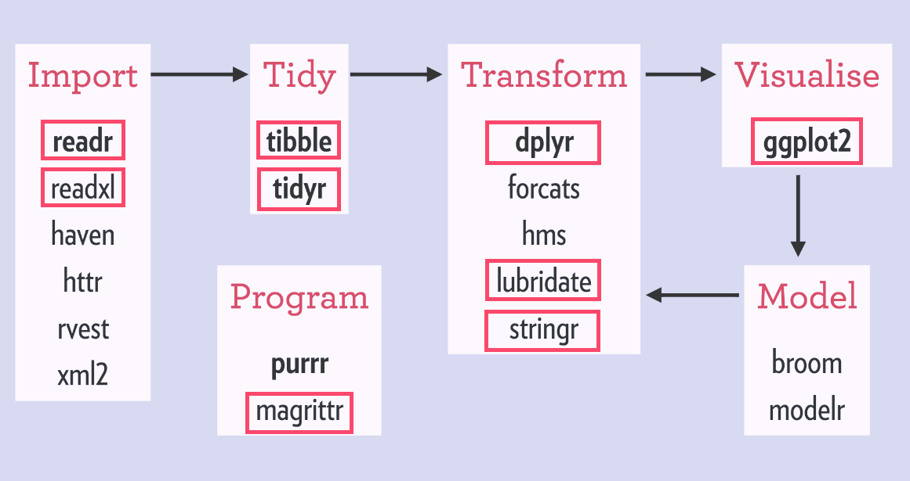
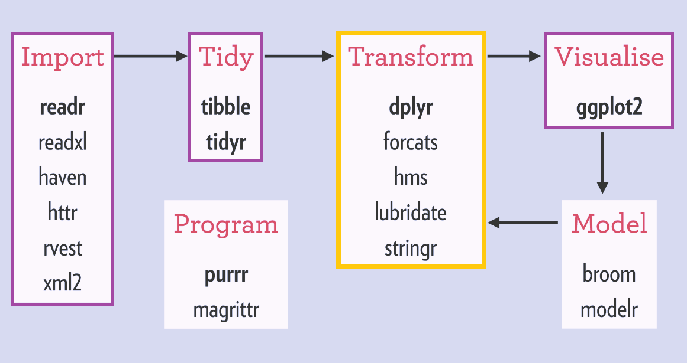
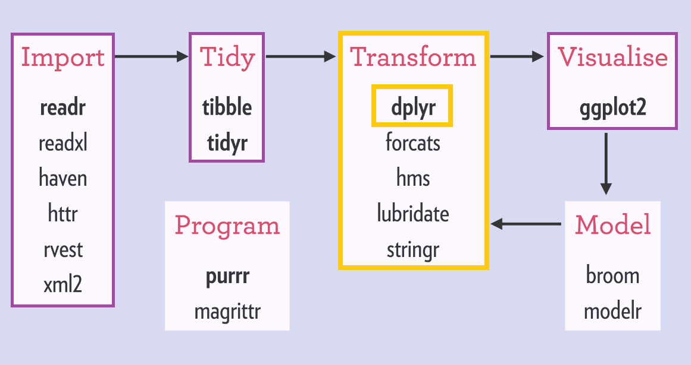

class: inverse, center
background-image: url("img/darklight_RichardStrozynski.jpg")
background-size: contain

```{r options, echo = F}
hook_source <- knitr::knit_hooks$get('source')
knitr::knit_hooks$set(source = function(x, options) {
  x <- stringr::str_replace(x, "^[[:blank:]]?([^*].+?)[[:blank:]]*#<<[[:blank:]]*$", "*\\1")
  hook_source(x, options)
})

knitr::opts_chunk$set(
  echo = TRUE,
  warning = FALSE,
  message = FALSE,
  collapse = TRUE,
  fig.height = 6.3,
  fig.allign = 'center',
  fig.retina = 3.5
)

options(width = 80)
```

<br><br>
## <span style='font-size:40pt;'>Data Visualization in <code style='color:#ebc500;'>R</code> with <code style='color:#ebc500;'>ggplot2</code></span><br><span style='font-size:25pt;color:#a7a7a7;font-weight:400;'>Data Transformation with <code style='color:#a7a7a7;font-weight:400;'>dplyr</code></span>
<br><br><br><br><br><br><br>
## <span style='font-size:22pt;'>Cédric Scherer</b><b style='font-size:15pt;color:#ccba56;font-weight:400;'><br>Physalia Courses&nbsp;&nbsp;&nbsp;|&nbsp;&nbsp;&nbsp;March 2-6 2020</b><br><p align='right;'><span style='font-size:9pt;color:#767676;font-weight:400;'></p>

---
class: center, middle

<br><i style='font-size:10pt;color:grey'>Illustration by Allison Horst (github.com/allisonhorst/stats-illustrations)</i>

---
class:center

## The `tidyverse`

<br>
The `tidyverse` provides exemplary support for data wrangling and is the
main reason for the recent popularity of `R`, especially in data-driven environments.

<br><br>
<p style='text-align:center;'><i style='font-size:10pt;color:grey;'>Source: Hadley Wickham's "R for Data Science" (R4DS)</i></span></p>

---
class: center

### The Typical Data Science Project Flow

<br><i style='font-size:10pt;color:grey;'>Source: www.rviews.rstudio.com/post/2017-06-09-What-is-the-tidyverse_files/tidyverse1.png</i>

---
class: center

### The Typical Data Science Project Flow

<br><i style='font-size:10pt;color:grey;'>Source: www.rviews.rstudio.com/post/2017-06-09-What-is-the-tidyverse_files/tidyverse1.png</i>

---
class: center

### The Typical Data Science Project Flow

<br><i style='font-size:10pt;color:grey;'>Source: www.rviews.rstudio.com/post/2017-06-09-What-is-the-tidyverse_files/tidyverse1.png</i>

---
class: center

### The Typical Data Science Project Flow

<br><i style='font-size:10pt;color:grey;'>Source: www.rviews.rstudio.com/post/2017-06-09-What-is-the-tidyverse_files/tidyverse1.png</i>

---
class: center

### The Typical Data Science Project Flow

<br><i style='font-size:10pt;color:grey;'>Source: www.rviews.rstudio.com/post/2017-06-09-What-is-the-tidyverse_files/tidyverse1.png</i>


---

## Our Example Data

* Count and proportional data of baby names used for at least five children in the US per sex and year from 1880 to 2017

* 1,924,665 rows (observations) and 4 columns (variables)

* Data source: [US  Social Security Administration (SSA)](http://www.ssa.gov/oact/babynames/limits.html)

* Available as data set `babynames` in the package `babynames`:<br>
`install.packages("babynames")` (includes 3 more data sets)

* See also `??babynames`

---

```{r prep, echo = F}
library(tidyverse)
library(conflicted)
filter <- dplyr::filter

extrafont::loadfonts()
theme_set(theme_light(base_size = 16, base_family = "Open Sans"))
```

## Our Example Data: `babynames`

```{r babynames-data}
library(babynames)

glimpse(babynames)
```

---
class: inverse, center

## Your Turn!

```{r exercise-bars-babynames-sex-mean, echo = F, fig.height = 7.5, fig.width = 10}
ggplot(babynames, aes(year %/% 10 * 10, fill = sex)) +
  geom_bar(position = "dodge", stat = "count") +
  xlab("decade")
```

---
class: inverse, center

## Your Turn! (Less Mean)

```{r bars-babynames-sex, echo = F, fig.height = 7.5, fig.width = 10}
ggplot(babynames, aes(year %/% 10 * 10, fill = sex)) +
  geom_bar(position = "dodge", stat = "count")
```

---

## Excourse: Integer Division

```{r modulo-examples}
1 %/% 10
2 %/% 10
11 %/% 10
12 %/% 10
```

---

## Excourse: Integer Division

```{r modulo-examples-2}
1 %/% 10
2 %/% 10
11 %/% 10
12 %/% 10

2019 %/% 10
2020 %/% 10
```

---

## Excourse: Integer Division

```{r modulo-decades}
1 %/% 10
2 %/% 10
11 %/% 10
12 %/% 10

2019 %/% 10
2020 %/% 10

2019 %/% 10 * 10
2020 %/% 10 * 10
```

---

## Your Turn: Dodged Bar Plots

.pull-left[
```{r dodged-bars, eval = F}
ggplot(
  babynames,
  aes(
    year %/% 10 * 10,  #<<
    fill = sex
  )) +
  geom_bar(  #<<
    stat = "count" #<<
  ) ## default: position = "dodge"  #<<
```
]

.pull-right[
```{r plot-dodged-bars, ref.label="dodged-bars", echo = F, fig.height = 6.3}
```
]

---

## Your Turn: Dodged Bar Plots

.pull-left[
```{r stacked-bars, eval = F}
ggplot(
  babynames,
  aes(
    year %/% 10 * 10,
    fill = sex
  )) +
  geom_bar(
    stat = "count",
    position = "dodge" #<<
  )
```
]

.pull-right[
```{r plot-stacked-bars, ref.label="stacked-bars", echo = F, fig.height = 6.3}
```
]

---

```{r chic-data, echo = F}
chic <- readr::read_csv("https://raw.githubusercontent.com/Z3tt/ggplot-courses/master/data/chicago-nmmaps.csv",
                  col_types = cols(season = col_factor(), year = col_factor()))
```


## `geom_bar()`

.pull-left[
```{r geom-bar-a, fig.height = 5}
ggplot(chic, aes(temp)) +
  geom_bar()
```
]

.pull-right[
```{r geom-bar-b, fig.height = 5}
ggplot(chic, aes(date, temp)) +
  geom_bar(stat = "identity")
```
]

---

## `geom_bar()` versus `geom_col()`

.pull-left[
```{r geom-col, fig.height = 5}
ggplot(chic, aes(date, temp)) +
  geom_col()
```
]

.pull-right[
```{r geom-bar, fig.height = 5}
ggplot(chic, aes(date, temp)) +
  geom_bar(stat = "identity")
```
]

---
class: center, inverse

## Your Turn!

```{r exercise-density-babynames-sex, echo = F, fig.height = 7.5, fig.width = 10}
ggplot(babynames, aes(year, fill = sex, color = sex)) +
  geom_density(alpha = .2, size = 1)
```

---

## Your Turn: Density Plots

.pull-left[
```{r density-babynames-sex, eval = F}
ggplot(
  babynames,
  aes(
    year, #<<
    fill = sex
  )) +
  geom_density() #<<
```
]

.pull-right[
```{r density-babynames-sex, ref.label="density-babynames-sex", echo = F, fig.height = 6.3}
```
]

---

## Your Turn: Density Plots

.pull-left[
```{r density-babynames-sex-2, eval = F}
ggplot(
  babynames,
  aes(
    year,
    fill = sex
  )) +
  geom_density(
    alpha = .1 #<<
  )
```
]

.pull-right[
```{r density-babynames-sex-2, ref.label="density-babynames-sex-2", echo = F, fig.height = 6.3}
```
]

---

## Your Turn: Density Plots

.pull-left[
```{r density-babynames-sex-3, eval = F}
ggplot(
  babynames,
  aes(
    year,
    fill = sex,
    color = sex #<<
  )) +
  geom_density(
    alpha = .1,
    size = 1 #<<
  )
```
]

.pull-right[
```{r density-babynames-sex-3, ref.label="density-babynames-sex-3", echo = F, fig.height = 6.3}
```
]

---
class: center

### The Rise of Unique Baby Names in the Post-WWII Era

```{r babynames-post-wii, echo = F, fig.height = 7.6, fig.width = 11}
babynames %>%
  filter(year > 1945) %>%
  mutate(sex = if_else(sex == "M", "male", "female")) %>%
  group_by(year, sex) %>%
  summarize(unique_names = n_distinct(name)) %>%
  ggplot(aes(year, unique_names, color = sex)) +
    geom_line(size = 1.3)
```

---

## Your Turn!

<b style='font-size:18pt;color:#00684a;'>
* Instead of coding, discuss what would be a way to create this plot.

  - Which geom did I use here?

  - What are details you notice but we can't do unitl now?

  - What can you already achieve with your current knowledge?<br>If you like, give it a try afterwards!

</b>

---
class: inverse, center, middle

<br><br>
# <b style='font-size:60pt'> The <code style='color:#ebc500'>dplyr</code> Package<br><br>

---

## Why should I care about `dplyr`?

<br>

* contains a set of convinient functions to perform common transformation and summary operations

* compared to base `R`:

      + syntax is more consistent

      + constrained options

      + always return a `data.frame` (actually, a `tibble`)

      + uses efficient data storage backends

      + can work with databases and data tables

---

## The Main Verbs of `dplyr`

<br>
<table style='width:100%;font-size:21pt'>
  <tr>
    <th>Function</th>
    <th>Explanation</th>
  </tr>
  <tr>
    <td><code style=font-weight:700>filter()</code></td>
    <td>Pick <b>rows</b> with matching criteria</td>
  </tr>
  <tr>
    <td><code style=font-weight:700>select()</code></td>
    <td>Pick <b>columns</b> with matching criteria</td>
  </tr>
  <tr>
    <td><code style=font-weight:700>arrange()</code></td>
    <td>Reorder rows</td>
  <tr>
    <td><code style=font-weight:700>mutate()</code></td>
    <td>Create new variables</td>
  </tr>
  <tr>
    <td><code style=font-weight:700>summarize()</code> (or <code style=font-weight:700>summarise()</code>)</td>
    <td>Sum up variables</td>
  </tr>
  <tr>
    <td><code style=font-weight:700>group_by()</code></td>
    <td>Create subsets</td>
  </tr>

</table>

---

## Consistent Syntax of `dplyr`

<br><br>
<p style='text-align:center;'>
<b style='font-size:30pt;'>All functions take the same main arguments:</b>

<br><br><code style='font-size:54pt;'>verb(data, condition)</code><br><br>

<span style='font-size:25pt;color:grey'>The first argument is your data, subsequent arguments say<br>what to do with the data frame, using the variable names.</span>
</p>

---
class: inverse, center, middle

# <code style='font-size:70pt;color:#ebc500'>filter()</code><br>
# <b style='font-size:25pt;color:#a7a7a7;font-weight:400;'>Pick Rows with Matching Criteria</b><br><br>

<br>

---

## Pick Rows with Matching Criteria

`filter(data, condition)` allows you to select a subset of **rows**:

```{r dplyr-filter}
filter(babynames, year == 2000, n > 25000)
```

---

## Pick Rows with Matching Criteria

`filter(data, condition)` allows you to select a subset of **rows**:

```{r dplyr-filter-2, eval = F}
filter(babynames, year == 2000, n > 25000)
```

Equivalent code in base `R`:
```{r base-filter}
babynames[babynames$year == 2000 & babynames$n > 25000, ]
```

---

## Pick Rows with Matching Criteria

`filter(data, condition)`&nbsp;&nbsp;&rarr;&nbsp;&nbsp;join filtering conditions with `&` and `|`:

```{r dplyr-filter-or}
filter(babynames, (name == "Cedric" | name == "Robert"))
```

---

## Pick Rows with Matching Criteria

`filter(data, condition)`&nbsp;&nbsp;&rarr;&nbsp;&nbsp;join filtering conditions with `&` and `|`:

```{r dplyr-filter-in}
filter(babynames, (name == "Cedric" | name == "Robert") & year %in% 1900:1905)
```

---
class: inverse, center, middle

# <code style='font-size:70pt;color:#ebc500'>select()</code><br>
# <b style='font-size:25pt;color:#a7a7a7;font-weight:400;'>Pick Columns with Matching Criteria</b><br><br>

<br>

---

## Pick Columns with Matching Criteria

`select(data, condition)` allows you to select a subset of **rows**:

```{r dplyr-select}
select(babynames, name, year, n)
```

---

## Pick Columns with Matching Criteria

`select(data, condition)` allows you to select a subset of **columns**:

```{r dplyr-select-2, eval = F}
select(babynames, name, year, n)
```

Equivalent code in base `R`:
```{r base-select}
babynames[, c("name", "year", "n")]
```

---

## Pick Columns with Matching Criteria

`select(data, condition)` allows you to select a subset of **columns**:

.pull-left[
```{r dplyr-select-3}
select(babynames, name, year, n)
```
]

.pull-right[
```{r dplyr-select-4}
select(babynames, -prop, -sex)
```
]

---
class: inverse, center, middle

# <code style='font-size:70pt;color:#ebc500'>arrange()</code><br>
# <b style='font-size:25pt;color:#a7a7a7;font-weight:400;'>Reorder Rows</b><br><br>

<br>

---

## Reorder Rows

`arrange(data, condition)` allows you to order rows by variables:

```{r dplyr-arrange}
arrange(babynames, prop)
```

---

## Reorder Rows

`arrange(data, condition)` allows you to order rows by variables:

```{r dplyr-arrange-2, eval = F}
arrange(babynames, prop)
```

Equivalent code in base `R`:
```{r base-arrange}
babynames[order(babynames$prop), ]
```

---

## Reorder Rows

`arrange(data, condition)` allows you to order rows by variables:

```{r dplyr-arrange-3}
arrange(babynames, year, sex, -prop)
```

---
class: inverse, center, middle

# <code style='font-size:70pt;color:#ebc500'>mutate()</code><br>
# <b style='font-size:25pt;color:#a7a7a7;font-weight:400;'>Create New Variables</b><br><br>

<br>

---
class: center, middle

<br><i style='font-size:10pt;color:grey'>Illustration by Allison Horst (github.com/allisonhorst/stats-illustrations)</i>

---

## Create New Variables

`mutate(data, condition)` allows you to create new variables (columns) based or not based on other variables:

```{r dplyr-mutate}
mutate(babynames, decade = year %% 10 * 10)
```

---

## Create New Variables

`mutate(data, condition)` allows you to create new variables (columns) based or not based on other variables:

```{r dplyr-mutate-2, eval = F}
mutate(babynames, decade = year %% 10 * 10)
```

Equivalent code in base `R`:
```{r base-mutate}
transform(babynames, decade = year %% 10 * 10)
```

---

## Create New Variables

`mutate(data, condition)` allows you to create new variables (columns) based or not based on other variables:

```{r dplyr-mutate-3}
mutate(babynames, name = str_to_lower(name))
```

---

## Create New Variables

`mutate(data, condition)` allows you to create new variables (columns) based or not based on other variables:

```{r dplyr-mutate-4}
mutate(babynames, note = "Please check!")
```

---

## Create New Variables

`mutate(data, condition)` allows you to create new variables (columns) based or not based on other variables:

```{r dplyr-mutate-5}
mutate(babynames, id = row_number())
```

---

## Create New Variables

`mutate(data, condition)` allows you to create new variables (columns) based or not based on other variables:

```{r dplyr-mutate-multi}
mpg2 <- select(mpg, model, hwy, cty) ## only for visualization
mutate(mpg2, diff = hwy - cty, perc = diff / hwy)
```

---

## Create New Variables

`mutate(data, condition)` allows you to create new variables (columns) based or not based on other variables:

```{r dplyr-mutate-multi-2, eval = F}
mpg2 <- select(mpg, model, hwy, cty) ## only for visualization
mutate(mpg2, diff = hwy - cty, perc = diff / hwy)
```

Equivalent code in base `R`:
```{r base-mutate-multi}
mpg_diff <- transform(mpg2, diff = hwy - cty)
transform(mpg_diff, perc = diff / hwy)
```

---

## Create New Variables

`mutate_if(data, condition)` allows you to conditionally create several new columns in one step:

```{r dplyr-mutate-if}
mutate_if(mpg2, is.numeric, as.character)
```

---

## Create New Variables

`mutate_if(data, condition)` allows you to conditionally create several new columns in one step:

```{r dplyr-mutate-if-2}
mutate_if(mpg2, is.numeric, list(avg = mean, log_2 = log2))
```

---

## Create New Variables

`mutate_if(data, condition)` allows you to conditionally create several new columns in one step:

```{r dplyr-mutate-if-3}
mutate_if(mpg2, is.numeric, list(~mean(., na.rm = T), ~log2(.)))
```

---

## Create New Variables

`mutate_at(data, condition)` allows you to conditionally transform several columns in one step:

```{r dplyr-mutate-at}
mutate_at(mpg2, c("hwy", "cty"), mean, na.rm = TRUE)
```

---

## Create New Variables

`mutate_all(data, condition)` allows you to transform all columns in one step:

```{r dplyr-mutate-all}
mutate_all(mpg2, mean, na.rm = TRUE)
```

---

## Create New Variables

`mutate_all(data, condition)` allows you to transform all columns in one step:

```{r dplyr-mutate-all-2}
mutate_all(mpg2, list(~mean(., na.rm = T), ~nchar(.)))
```

---
class: inverse, center, middle

# <code style='font-size:70pt;color:#ebc500'>summarize()</code><br>
# <b style='font-size:25pt;color:#a7a7a7;font-weight:400;'>Sum Up Variables</b><br><br>

<br>

---

## Sum Up Variables

`summarize(data, condition)` allows you to calculate summary statistics for particular variables:

```{r dplyr-summarize}
summarize(babynames, unique_children = sum(n, na.rm = TRUE))
```

---

## Sum Up Variables

`summarize(data, condition)` allows you to create new variables (columns) based or not based on other variables:

```{r dplyr-summarize-2}
summarize(babynames, unique_children = sum(n, na.rm = TRUE))
```

Equivalent code in base `R`:
```{r base-summarize}
sum(babynames$n, na.rm = TRUE)
```

---
class: inverse, center, middle

# <code style='font-size:70pt;color:#ebc500'>group_by()</code><br>
# <b style='font-size:25pt;color:#a7a7a7;font-weight:400;'>Create Subsets</b><br><br>

<br>


---

## Create Subsets

`group_by(data, condition)` allows you to break down your data into specified groups based on variables:

```{r dplyr-group-by}
group_by(babynames, sex)
```

---

## Create Subsets

`group_by(data, condition)` allows you to break down your data into specified groups based on variables:

```{r dplyr-group-by-2}
group_by(babynames, sex, year)
```

---

## Remove Subsets

... and `ungroup()` lets you remove any subsets:

```{r dplyr-ungroup}
grouped <- group_by(babynames, sex, year)
ungroup(grouped)
```

---
class: center, bottom, inverse
background-image: url("img/superpower_mod.png")
background-size: cover

# <b style='font-size:55pt;'>THE SUPERPOWER OF </b><code style='font-size:60pt;color:#ebc500;line-height:0.5;'>group_by()<br><br></code>
# <b style='font-size:28pt;color:lightgrey;line-height:0.5;'>Verbs will be automatically applied "by group"!</b>

---

## `group_by()` SUPERPOWER!

`group_by()` in combination with other `dplyr` verbs allows you to calculate summary statistics for specified groups:

```{r dplyr-group-by-summarize}
names_group <- group_by(babynames, sex)
names_group
```

---

## `group_by()` SUPERPOWER!

`group_by()` in combination with other `dplyr` verbs allows you to calculate summary statistics for specified groups:

```{r dplyr-group-by-summarize-2}
names_group <- group_by(babynames, sex)
summarize(names_group, sum = sum(n))
```

---

## `group_by()` SUPERPOWER!

`group_by()` in combination with other `dplyr` verbs allows you to calculate summary statistics for specified groups:

```{r dplyr-group-by-mutate-summarize}
names_1900 <- filter(babynames, year == 1900)
names_1900 <- group_by(names_1900, sex, year)
names_1900
```

---

## `group_by()` SUPERPOWER!

`group_by()` in combination with other `dplyr` verbs allows you to calculate summary statistics for specified groups:

```{r dplyr-group-by-mutate-summarize-2}
names_1900 <- filter(babynames, year == 1900)
names_1900 <- group_by(names_1900, sex, year)
names_1900 <- mutate(names_1900, sum = sum(n))
names_1900 <- group_by(names_1900, sex, year, name)
names_1900
```

---

## `group_by()` SUPERPOWER!

`group_by()` in combination with other `dplyr` verbs allows you to calculate summary statistics for specified groups:

```{r dplyr-group-by-mutate-summarize-3}
names_1900 <- filter(babynames, year == 1900)
names_1900 <- group_by(names_1900, sex, year)
names_1900 <- mutate(names_1900, sum = sum(n))
names_1900 <- group_by(names_1900, sex, year, name)
names_1900_sum <- summarize(names_1900, prop = prop, prop_check = sum(n) / unique(sum))
arrange(names_1900_sum, desc(sex), -prop_check)
```

---
class: inverse, center, middle

<br><br>
# <b style='font-size:60pt'> The <code style='color:#ebc500'>magrittr</code> Package<br><br>

---
class: center

### The Typical Data Science Project Flow

<br><i style='font-size:10pt;color:grey;'>Source: www.rviews.rstudio.com/post/2017-06-09-What-is-the-tidyverse_files/tidyverse6.png</i>

---

## Readability of Code

Have a look again at this chunk of code:

```{r dplyr-group-by-mutate-summarize-x, eval = F}
names_1900 <- filter(babynames, year == 1900)
names_1900 <- group_by(names_1900, sex, year)
names_1900 <- mutate(names_1900, sum = sum(n))
names_1900 <- group_by(names_1900, sex, year, name)
names_1900_sum <- summarize(names_1900, prop = prop, prop_check = sum(n) / unique(sum))
names_1990_sum <- ungroup(names_1900_sum)
names_1900_sum <- arrange(names_1900_sum, desc(sex), -prop_check)
```

--

<br>
**There is a lot redundancy and also no need to save each step as an object.**

---

## Readability of Code

One could rewrite the code like this:

```{r, wrapped-code}
names_1900 <-
  group_by(mutate(group_by(filter(babynames, year == 1900), sex, year), sum = sum(n)), sex, year, name)

names_1900_sum <-
  ungroup(arrange(summarize(names_1900, prop = prop, prop_check = sum(n) / unique(sum)), desc(sex), -prop_check))

names_1900_sum
```

---

## Readability of Code

One could rewrite the code like this:

```{r, wrapped-code-2, eval = F}
names_1900 <-
  group_by(
    mutate(
      group_by(
        filter(
          babynames,
          year == 1900
        ),
        sex, year
        ),
      sum = sum(n)
    ),
    sex, year, name
  )
```

---

## Readability of Code

One could rewrite the code like this:

```{r, wrapped-code-3, eval = F}
names_1900_sum <-
  ungroup(
    arrange(
      summarize(
        names_1900,
        prop = prop,
        prop_check = sum(n) / unique(sum)
      ),
      desc(sex), -prop_check
    )
  )
```
---
class: middle

<style>
  .left-column{
    width: 18%;
  }
  .right-column{
    width: 82%;
  }
</style>

.left-column[]

.right-column[
<p style='font-size:16pt;'>
<code>
physalia(<br>
&nbsp;&nbsp;bvg(<br>
&nbsp;&nbsp;&nbsp;&nbsp;breakfast(<br>
&nbsp;&nbsp;&nbsp;&nbsp;&nbsp;&nbsp;shower(<br>
&nbsp;&nbsp;&nbsp;&nbsp;&nbsp;&nbsp;&nbsp;&nbsp;wake_up(<br>
&nbsp;&nbsp;&nbsp;&nbsp;&nbsp;&nbsp;&nbsp;&nbsp;&nbsp;&nbsp;Cedric, <br>
&nbsp;&nbsp;&nbsp;&nbsp;&nbsp;&nbsp;&nbsp;&nbsp;&nbsp;&nbsp;7.0<br>
&nbsp;&nbsp;&nbsp;&nbsp;&nbsp;&nbsp;&nbsp;&nbsp;),<br>
&nbsp;&nbsp;&nbsp;&nbsp;&nbsp;&nbsp;&nbsp;&nbsp;temp == 38<br>
&nbsp;&nbsp;&nbsp;&nbsp;&nbsp;&nbsp;), <br>
&nbsp;&nbsp;&nbsp;&nbsp;&nbsp;&nbsp;c("cornflakes", "tea"), <br>
&nbsp;&nbsp;&nbsp;&nbsp;),<br>
&nbsp;&nbsp;&nbsp;&nbsp;price = "EUR2.80", <br>
&nbsp;&nbsp;&nbsp;&nbsp;delay = 10<br>
&nbsp;&nbsp;),<br>
&nbsp;&nbsp;course = "Data Visualization in R with ggplot2"<br>
)
</code>
</p>
]

---
class: middle

<p style='font-size:22pt;'>
<code>
Cedric %>%  <br>
&nbsp;&nbsp;wake_up(7.0) %>%  <br>
&nbsp;&nbsp;shower(temp == 38) %>%  <br>
&nbsp;&nbsp;breakfast(c("cereals", "tea")) %>%  <br>
&nbsp;&nbsp;bvg( <br>
&nbsp;&nbsp;&nbsp;&nbsp;price = "EUR2.90",<br>
&nbsp;&nbsp;&nbsp;&nbsp;delay = 10<br>
&nbsp;&nbsp;) %>%  <br>
&nbsp;&nbsp;physalia(  <br>
&nbsp;&nbsp;&nbsp;&nbsp;course = "Data Visualization in R with ggplot2"  <br>
&nbsp;&nbsp;)</code>
</p>

---
class: middle

<p style='font-size:22pt;'>
<code>
Cedric %>%  <br>
&nbsp;&nbsp;wake_up(., 7.0) %>%  <br>
&nbsp;&nbsp;shower(., temp == 38) %>%  <br>
&nbsp;&nbsp;breakfast(., c("cereals", "tea")) %>%  <br>
&nbsp;&nbsp;bvg( <br>
&nbsp;&nbsp;&nbsp;&nbsp;., <br>
&nbsp;&nbsp;&nbsp;&nbsp;price = "EUR2.90",<br>
&nbsp;&nbsp;&nbsp;&nbsp;delay = 10<br>
&nbsp;&nbsp;) %>%  <br>
&nbsp;&nbsp;physalia(  <br>
&nbsp;&nbsp;&nbsp;&nbsp;.,  <br>
&nbsp;&nbsp;&nbsp;&nbsp;course = "Data Visualization in R with ggplot2"  <br>
&nbsp;&nbsp;)</code>
</code>
</p>

---

## Readability of Code:&nbsp;&nbsp;`%>%`&nbsp;&nbsp;(The Pipe)

With the pipe one can rewrite the code like this:

```{r, code-pipes, eval = F}
names_1900 <-
  babynames %>%
  filter(year == 1900) %>%
  group_by(sex, year) %>%
  mutate(sum = sum(n)) %>%
  group_by(sex, year, name)

names_1900_sum <-
  names_1900 %>%
  summarize(
    prop = prop,
    prop_check = sum(n) / unique(sum)
  ) %>%
  arrange(desc(sex), -prop_check) %>%
  ungroup()
```

---

## Readability of Code:&nbsp;&nbsp;`%>%`&nbsp;&nbsp;(The Pipe)

With the pipe one can rewrite the code like this:

```{r, code-pipes-once}
names_1900_sum <-
  babynames %>%
  filter(year == 1900) %>%
  group_by(sex, year) %>%
  mutate(sum = sum(n)) %>%
  group_by(sex, year, name) %>%
  summarize(
    prop = prop,
    prop_check = sum(n) / unique(sum)
  ) %>%
  arrange(desc(sex), -prop_check) %>%
  ungroup()
```

---

## Readability of Code:&nbsp;&nbsp;`%>%`&nbsp;&nbsp;(The Pipe)

With the pipe one can rewrite the code like this:

```{r, code-pipes-once-output}
names_1900_sum
```

---

## Readability of Code:&nbsp;&nbsp;`%>%`&nbsp;&nbsp;(The Pipe)

You can easily inactivate verbs or single conditions:

```{r, code-pipes-once-comm}
names_1900_sum <-
  babynames %>%
  filter(year == 1900) %>%
  group_by(sex, year) %>%
  mutate(sum = sum(n)) %>%
  group_by(sex, year, name) %>%
  summarize(
    #prop = prop,
    prop_check = sum(n) / unique(sum)
  ) %>%
  arrange(desc(sex), -prop_check) %>%
  ungroup()
```

---

## Readability of Code:&nbsp;&nbsp;`%>%`&nbsp;&nbsp;(The Pipe)

You can easily inactivate verbs or single conditions:

```{r, code-pipes-once-comm-2}
names_1900_sum <-
  babynames %>%
  filter(year == 1900) %>%
  group_by(sex, year) %>%
  mutate(sum = sum(n)) %>%
  group_by(sex, year, name) %>%
  summarize(
    #prop = prop,
    prop_check = sum(n) / unique(sum)
  ) %>%
  #arrange(desc(sex), -prop_check) %>%
  ungroup()
```

---

## Readability of Code:&nbsp;&nbsp;`%>%`&nbsp;&nbsp;(The Pipe)

You can easily inactivate verbs or single conditions:

```{r, code-pipes-once-comm-3, eval = F}
names_1900_sum <-
  babynames %>%
  filter(year == 1900) %>%
  group_by(sex, year) %>%
  mutate(sum = sum(n)) %>%
  group_by(sex, year, name) %>%
  summarize(
    #prop = prop,
    prop_check = sum(n) / unique(sum)
  ) %>%  ## expecting another verb! #<<
  #arrange(desc(sex), -prop_check) %>%
  #ungroup()
```

---

## Readability of Code:&nbsp;&nbsp;`%>%`&nbsp;&nbsp;(The Pipe)

You can easily inactivate verbs or single conditions:

```{r, code-pipes-once-comm-4}
names_1900_sum <-
  babynames %>%
  filter(year == 1900) %>%
  group_by(sex, year) %>%
  mutate(sum = sum(n)) %>%
  group_by(sex, year, name) %>%
  summarize(
    #prop = prop,
    prop_check = sum(n) / unique(sum)
  ) #%>% #<<
  #arrange(desc(sex), -prop_check) %>%
  #ungroup()
```

---

## Readability of Code:&nbsp;&nbsp;`%>%`&nbsp;&nbsp;(The Pipe)

You can easily inactivate verbs or single conditions:

```{r, code-pipes-once-comm-5}
names_1900_sum <-
  babynames %>%
  filter(year == 1900) %>%
  group_by(sex, year) %>%
  mutate(sum = sum(n)) %>%
  group_by(sex, year, name) %>%
  summarize(
    #prop = prop,
    prop_check = sum(n) / unique(sum)
  ) %>%
  #arrange(desc(sex), -prop_check) %>%
  #ungroup() %>%
  {} ##<<
```


---

## Your Turn!

<b style='font-size:18pt;color:#00684a'>
* Inspect the `flights` data set from the `nycflights13` package.

* Count the number of flights in June and July 2013.

* Find out how many flights did catch up their departure delay.

* Create a table that contains the average delays per origin and month, ordered by maximum arrival delay. (Bonus: Delays with 1 digit only.)

* Explore the relationship between the average distance and average delay per season and destination. 

</b>

---

## Flights in June and July 2013

```{r exercise-june-july, echo = -1}
library(nycflights13)
filter(flights, month == 11 | month == 12)
```

---

## Flights in June and July 2013

```{r flights-june-july-2}
filter(flights, month %in% c(11, 12))
```

---

## Catch-Up Delay

```{r flights-catch-up-delay}
filter(flights, dep_delay > 0, arr_delay <= 0)
```

---

## Average Delays per Origin and Month

```{r flights-avg-delay}
flights %>% 
  group_by(month, origin) %>% 
  summarize(
    dep_delay_avg = round(mean(dep_delay, na.rm = T), 1),
    arr_delay_avg = round(mean(arr_delay, na.rm = T), 1)
  ) %>% 
  arrange(-arr_delay_avg)
```
---

## Average Delays per Origin and Month

```{r flights-avg-delay-2}
flights %>% 
  select(month, origin, ends_with("delay")) %>% 
  group_by(month, origin) %>% 
  summarize_all(funs(avg = round(mean(., na.rm = T), 1))) %>% 
  arrange(-arr_delay_avg)
```

---

## Distance versus Delay

.pull-left[
```{r flights-distance-delay, eval = F}
flights %>% 
  mutate(
    season = if_else(month %in% 4:9, 
                     "summer", 
                     "winter")
  ) %>% 
  group_by(season, dest) %>% 
  summarize(
    delay_avg = mean(arr_delay, na.rm = T),
    dist_avg = mean(distance, na.rm = T),
    n = n()
  ) %>% 
  ggplot(aes(dist_avg, delay_avg, color = season)) +
    geom_point(aes(size = n), alpha = .25) +
    geom_smooth(se = F)
```
]

.pull-right[
```{r plot-flights-distance-delay, ref.label="flights-distance-delay", echo = F}
```
]

---
class: center, inverse

## Your Turn: Create this Line Plot!

```{r exercise-babynames-wii-line, echo = F, fig.height = 7.4, fig.width = 11}
babynames %>%
  filter(year > 1945) %>%
  mutate(sex = if_else(sex == "M", "male", "female")) %>%
  group_by(year, sex) %>%
  summarize(unique_names = n_distinct(name)) %>%
  ggplot(aes(year, unique_names, color = sex)) +
    geom_line(size = 1.3)
```

---

## Your Turn: Post-WWII Line Plot

```{r babynames-wii-line}
babynames %>%
  group_by(year, sex) %>%
  summarize(unique_names = n_distinct(name))
```

---

## Your Turn: Post-WWII Line Plot

.pull-left[
```{r babynames-wii-line-2, eval = F}
babynames %>%
  group_by(year, sex) %>%
  summarize(
    unique_names = n_distinct(name)
  ) %>%
  ggplot(
    aes(
      year, 
      unique_names, 
      color = sex
    )) +
    geom_line(size = 1.3)
```
]

.pull-right[
```{r plot-babynames-wii-line-2, ref.label="babynames-wii-line-2", echo = F, fig.height = 7.5}
```
]

---

## Your Turn: Post-WWII Line Plot

.pull-left[
```{r babynames-wii-line-3, eval = F}
babynames %>%
  filter(year > 1945) %>%
  group_by(year, sex) %>%
  summarize(
    unique_names = n_distinct(name)
  ) %>%
  ggplot(
    aes(
      year, 
      unique_names, 
      color = sex
    )) +
    geom_line(size = 1.3)
```
]

.pull-right[
```{r plot-babynames-wii-line-3, ref.label="babynames-wii-line-3", echo = F, fig.height = 7.5}
```
]

---

## Your Turn: Post-WWII Line Plot

.pull-left[
```{r babynames-wii-line-4, eval = F}
babynames %>%
  filter(year > 1945) %>%
  mutate(
    sex = if_else(sex == "M", 
                  "male", 
                  "female")
  ) %>%
  group_by(year, sex) %>%
  summarize(
    unique_names = n_distinct(name)
  ) %>%
  ggplot(
    aes(
      year, 
      unique_names, 
      color = sex
    )) +
    geom_line(size = 1.3)
```
]

.pull-right[
```{r plot-babynames-wii-line-4, ref.label="babynames-wii-line-4", echo = F, fig.height = 7.5}
```
]

---

## Other Helpful Functions of `dplyr`

<br>
<table style='width:100%;font-size:18pt'>
  <tr>
    <th>Function</th>
    <th>Explanation</th>
  </tr>
  <tr>
    <td><code style=font-weight:700>slice()</code></td>
    <td>Extract rows by ordinal position</td>
  </tr>
  <tr>
    <td><code style=font-weight:700>distinct()</code> and <code style=font-weight:700>n_distinct()</code></td>
    <td>Find and count unique values</td>
  </tr>
  <tr>
    <td><code style=font-weight:700>sample_n()</code> and <code style=font-weight:700>sample_frac()</code></td>
    <td>Select rows randomly</td>
  </tr>
  <tr>
    <td><code style=font-weight:700>top_n()</code> and <code style=font-weight:700>top_frac()</code></td>
    <td>Pick top or bottom values by variable</td>
  </tr>
  <tr>
    <td><code style=font-weight:700>count()</code> and <code style=font-weight:700>top_frac()</code></td>
    <td>Count number of observations</td>
  </tr>
  <tr>
    <td><code style=font-weight:700>complete()</code></td>
    <td>Create all possible combinations of two variables</td>
  </tr>
</table>

---

## Extract Rows by Ordinal Position

`slice()` allows you to filter rows based on their row value:

```{r slice}
slice(mpg, 100:120)
```

---

## Extract Rows by Ordinal Position

`slice()` allows you to filter rows based on their row value - works also per group:

```{r slice-group}
mpg %>% group_by(manufacturer) %>% slice(1)
```

---

## Find Unique Values

`distinct()` allows you to retain only unique values (as `unique()` does):

```{r distinct}
distinct(mpg, manufacturer)
```

---

## Find Unique Values

`distinct()` allows you to retain only unique values (as `unique()` does):

```{r distinct-2}
distinct(mpg, hwy)
```

---

## Count Unique Values

`n_distinct()` allows you to calculate the number of unique values (as `length(unique())` does):

```{r ndistinct}
n_distinct(mpg$model)
```

---

## Select Rows Randomly

`sample_n()` allows you to create random subsets based on a number of rows:

```{r sample-n}
sample_n(mpg, 5)
```

---

## Select Rows Randomly

`sample_n()` allows you to create random subsets based on a number of rows - also works woith groups:

```{r sample-n-group}
mpg %>% group_by(year, manufacturer) %>% sample_n(1)
```

---

## Select Rows Randomly

`sample_frac()` allows you to create random subsets based on a fraction:

```{r sample-frac}
sample_frac(mpg, .05)
```

---

## Pick Top or Bottom Values

`top_n()` allows you to filter the **top** or bottom values, ranked by a specified variable:

```{r top-n}
top_n(mpg, 5, hwy)
```

---

## Pick Top or Bottom Values

`top_n()` allows you to filter the top or **bottom** values, ranked by a specified variable:

```{r top-n-2}
top_n(mpg, 5, -hwy)
```

---

## Pick Top or Bottom Values

`top_n()` allows you to filter the top or bottom values, ranked by a specified variable:

```{r top-n-group}
mpg %>% group_by(manufacturer) %>% top_n(1, hwy)
```

---

## Pick Top or Bottom Values

`top_frac()` allows you to filter the top or bottom values, ranked by a specified variable:

```{r top-frac}
top_frac(mpg, .01, displ)
```

---

## Count Observations

`count()` calculates the sample size of your data as summary statistics:

```{r count}
count(mpg)
```

---

## Count Observations

`count()` calculates the sample size of your data as summary statistics:

```{r count-2}
#count(mpg)
summarize(mpg, n = n())
```

---

## Count Observations

`count()` calculates the sample size of your data as summary statistics - also per group:

```{r count-group}
mpg %>% group_by(manufacturer) %>% count()
```

---

## Count Observations

`count()` calculates the sample size of your data as summary statistics - also per group:

```{r count-group-2}
mpg %>% group_by(manufacturer) %>% count(sort = TRUE)
```

---

## Count Observations

`add_count()` adds the sample size of your data as additional column:

```{r add-count}
add_count(mpg2)
```

---

## Count Observations

`add_count()` adds the sample size of your data as additional column:

```{r add-count-2}
#add_count(mpg2)
mutate(mpg2, n = n())
```

---

## Count Observations

`tally()` does basically the same as `count()`:

```{r tally}
tally(mpg)
```

---

## Create all possible combinations of two variables

`complete()` turns missing values into explicit missing values:

```{r complete}
mpg3 <- mpg %>% group_by(manufacturer, class) %>% count() %>% ungroup()
complete(mpg3, manufacturer, nesting(class))
```

---

## Create all possible combinations of two variables

`complete()` turns missing values into explicit missing values:

```{r complete-2}
mpg3 <- mpg %>% group_by(manufacturer, class) %>% count() %>% ungroup()
complete(mpg3, manufacturer, nesting(class), fill = list(n = 0))
```

---
class: center, middle


